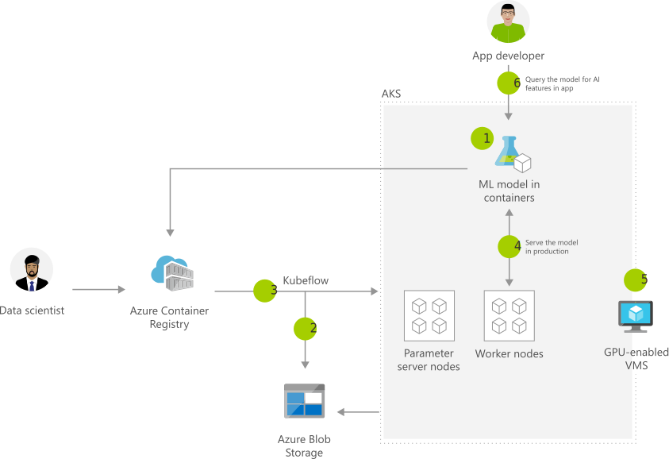

[!INCLUDE [header_file](../../../includes/sol-idea-header.md)]

This article presents a solution for real-time inferencing on [Azure Kubernetes Service (AKS)](/azure/aks/intro-kubernetes).

## Architecture

*Download a [Visio file](https://arch-center.azureedge.net/machine-learning-model-deployment-to-aks.vsdx) of this architecture.*

### Dataflow

1. A machine learning model is packaged into a container and published to Azure Container Registry.
1. Azure Blob Storage hosts training data sets and the trained model.
1. Kubeflow is used to deploy training jobs to AKS, including parameter servers and worker nodes.
1. Kubeflow is used to make a production model available. This step promotes a consistent environment across testing, control, and production.
1. AKS supports GPU-enabled VMs.
1. Developers build features to query the model that runs in an AKS cluster.

### Components

- [Blob Storage](https://azure.microsoft.com/services/storage/blobs) is a service that's part of [Azure Storage](https://azure.microsoft.com/products/category/storage). Blob Storage offers optimized cloud object storage for large amounts of unstructured data.
- [Container Registry](https://azure.microsoft.com/services/container-registry) builds, stores, and manages container images and can store containerized machine learning models.
- [AKS](https://azure.microsoft.com/services/container-registry) is a highly available, secure, and fully managed Kubernetes service. AKS makes it easy to deploy and manage containerized applications.
- [Machine Learning](https://azure.microsoft.com/services/machine-learning) is a cloud-based environment that you can use to train, deploy, automate, manage, and track machine learning models. You can use the models to forecast future behavior, outcomes, and trends.

## Scenario details

AKS is useful when you need high-scale production deployments of your machine learning models. A high-scale deployment involves a fast response time, autoscaling of the deployed service, and logging. For more information, see [Deploy a model to an Azure Kubernetes Service cluster](/azure/machine-learning/how-to-deploy-azure-kubernetes-service).

This solution uses [Kubeflow](https://www.kubeflow.org/docs/about/kubeflow) to manage the deployment to AKS. The machine learning models run on AKS clusters that are backed by GPU-enabled virtual machines (VMs).

### Potential use cases

This solution applies to scenarios that use AKS and GPU-enabled VMs for machine learning. Examples include:

- Image classification systems.
- Natural language processing algorithms.
- Predictive maintenance systems.

## Next steps

- [What is Azure Machine Learning?](/azure/machine-learning/overview-what-is-azure-ml)
- [Azure Kubernetes Service (AKS)](/azure/aks/intro-kubernetes)
- [Deploy a model to an Azure Kubernetes Service cluster](/azure/machine-learning/how-to-deploy-azure-kubernetes-service)
- [Kubeflow on Azure](https://www.kubeflow.org/docs/distributions/azure)
- [What is Azure Blob Storage?](/azure/storage/blobs/storage-blobs-overview)
- [Introduction to container registries in Azure](/azure/container-registry/container-registry-intro)

## Related resources

- [Artificial intelligence (AI) - Architectural overview](../../data-guide/big-data/ai-overview.md)
- [Distributed training of deep learning models on Azure](../../reference-architectures/ai/training-deep-learning.yml)
- [Training Python models on Azure](/azure/architecture/example-scenario/ai/training-python-models)
