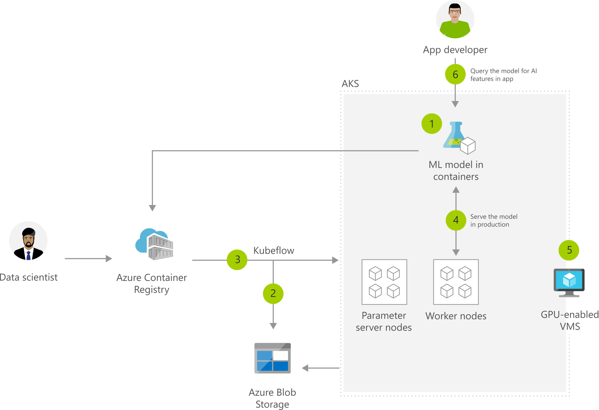

[!INCLUDE [header_file](../../../includes/sol-idea-header.md)]

Training of models using large datasets is a complex and resource intensive task. Use familiar tools such as TensorFlow and Kubeflow to simplify training of Machine Learning models. Your ML models will run in AKS clusters backed by GPU enabled VMs.

## Architecture

*Download an [SVG](../media/machine-learning-with-aks.svg) of this architecture.*

## Data Flow

1. Package ML model into a container and publish to ACR
1. Azure Blob storage hosts training data sets and trained model
1. Use Kubeflow to deploy training job to AKS, distributed training job to AKS includes Parameter servers and Worker nodes
1. Serve production model using Kubeflow, promoting a consistent environment across test, control and production
1. AKS supports GPU enabled VM
1. Developer can build features querying the model running in AKS cluster

## Components

* [Azure Blob Storage](/azure/storage/blobs/)
* [Azure Container Registry](/azure/container-registry/)
* [Azure Kubernetes Service](https://azure.microsoft.com/services/container-registry/)
* [Azure Machine Learning](https://azure.microsoft.com/en-us/services/machine-learning/)
* [Azure Data Science Virtual Machine](/azure/machine-learning/data-science-virtual-machine/)

## Next steps

* [Artificial intelligence (AI) - Architectural overview](../../data-guide/big-data/ai-overview.md)
* [Azure Machine Learning documentation](/azure/machine-learning/)
* [Azure Kubernetes Service (AKS) documentation](/azure/aks)
* [Distributed training of deep learning models on Azure](/azure/architecture/reference-architectures/ai/training-deep-learning)
* [Training Python models on Azure](/azure/architecture/reference-architectures/ai/training-python-models)