Artificial intelligence (AI) and machine learning (ML) offer unique opportunities and challenges for operations that span the virtual and physical worlds. AI and ML can recognize correlations between real-world input data and outcomes and make decisions that automate complex physical industrial systems. But AI machine learning systems can't perform higher-level cognitive functions like exploration, improvisation, creative thinking, or determination of causation.

*Machine teaching* is a new paradigm for machine learning systems that:

- Infuses *subject matter expertise* into automated AI systems models.
- Uses [deep reinforcement learning](#reinforcement-learning) to identify patterns in the learning process and adopt positive behaviors in its own methods.
- Leverages [simulated environments](#simulations) to generate large amounts of synthetic data for domain-specific use cases and scenarios.

Machine learning focuses on developing novel learning algorithms or improving existing algorithms. Machine teaching focuses on the efficacy of the teachers themselves. Abstracting away AI complexity to focus on subject matter expertise and real-world conditions creates powerful AI and ML models that turn automated control systems into *autonomous systems*.

This article discusses historical AI developments and concepts used in machine teaching. A related article discusses [autonomous systems](./autonomous-systems.yml) in detail.

## History of automation

Humans have been designing physical tools and machines to perform tasks more efficiently for thousands of years. These technologies aim to achieve output more consistently, at a lower cost, and with less direct manual labor.

The First Industrial Revolution, late 1700s to mid-1800s, introduced machines to replace hand production methods in manufacturing. The Industrial Revolution increased production efficiency through automation with steam power, and through consolidation by moving production from homes to organized factories. The Second Industrial Revolution, mid-1800s to early 1900s, advanced production capability through electrification and production lines.

World Wars I and II brought major advances in information theory, communications, and signal processing. Development of the transistor allowed information theory to be easily applied to controlling physical systems. This Third Industrial Revolution allowed computer systems to make inroads in the hard-coded control of physical systems like production, transport, and healthcare. The benefits of programmed automation included consistency, reliability, and security.

The Fourth Industrial Revolution introduced the notion of cyber-physical systems and the industrial *Internet of Things (IoT)*. The systems humans wish to control have become too large and complex to write fully prescribed rules. Artificial intelligence lets smart machines perform tasks that typically required human intelligence. Machine learning lets machines automatically learn and improve from experience without being explicitly programmed.

### AI and ML

AI and ML aren't new concepts, and many of the theories have been unchanged for decades, but recent technological advances in storage, bandwidth, and computing enable more accurate and useful algorithm predictions. Increased device processing capacity, miniaturization, storage capacity, and network capacity allow further automation of systems and equipment. These advances also allow collection and collation of vast quantities of real-time sensor data.

*Cognitive automation* is the application of software and AI to information-intensive processes and systems. Cognitive AI can augment manual workers for increased productivity, replace human workers in monotonous or hazardous fields, and allow for new insights because of the huge volumes of data it can process. Cognitive technologies like computer vision, natural language processing, chatbots, and robotics can perform tasks that previously only humans could do.

Many current production systems automate and accomplish impressive feats of engineering and manufacturing using industrial robots. The use and evolution of industrial automation in manufacturing industries produces higher-quality, safer products with more efficient use of energy and raw materials. However, in most cases, robots can only operate in highly structured environments. They're typically inflexible to change and highly specialized toward immediate tasks. Robots may also be expensive to develop because of the hardware and software rules that govern their behaviors.

The *paradox of automation* claims that the more efficient an automated system becomes, the more crucial the human component is to operations. The role of humans changes from mundane per-unit-of-work labor to improving and managing the automated system and contributing essential domain expertise. While an automated system can produce output more efficiently, it can also create waste and problems if it's poorly designed or running incorrectly. Efficiently using automation makes humans more important, not less.

### AI use cases

In the preceding diagram, the **Control** and **Optimization** categories relate to automation of work. On this side of the AI spectrum, there are practically infinite problem spaces. Subject matter expertise is a strategic asset, simulations are the most doable training option, and explainability is paramount.

Orchestrators include [smart manufacturing](https://en.wikipedia.org/wiki/Smart_manufacturing) and the [Bonsai machine teaching platform](https://azure.microsoft.com/services/project-bonsai/). Use cases include advanced robotics, autonomous vehicles, dark factories, smart sensors, route optimization, inventory optimization, and virtual assistants.

## Reinforcement learning

Machine teaching depends on *reinforcement learning (RL)* to train models, and to identify patterns in the learning process and adopt positive behaviors in its own methods. *Deep reinforcement learning (DRL)* applies reinforcement learning to complex [deep learning](https://en.wikipedia.org/wiki/Deep_learning) neural networks.

RL in machine learning concerns how software agents learn to maximize rewards and desired outcomes in their environments. RL is one of the three basic machine learning paradigms:

- *Supervised learning* generalizes from tagged or structured data.
- *Unsupervised learning* compresses unlabeled or unstructured data.
- *Reinforcement learning* acts through trial and error.

While supervised learning is learning by example, reinforcement learning is learning from experience. Unlike supervised learning, which focuses on finding and labeling suitable datasets, RL concentrates on designing models of how to perform tasks.

The key RL components are:

- **Agent**: the entity that can make a decision to change the current environment.
- **Environment**: the physical or simulated world in which the agent operates.
- **State**: the current situation of the agent and its environment.
- **Action**: an interaction by the agent on its environment.
- **Reward**: the feedback from the environment, following from an action of the agent.
- **Policy**: the method or function to map the current state of the agent and its environment to actions.

RL uses reward functions and policies to assess agent actions and provide feedback. Through sequential decision making based on the current environment, agents learn to maximize reward over time and to predict the best possible actions in specific situations.

RL teaches the agent to complete an objective by rewarding desired behavior and not rewarding undesired behavior. The following diagram illustrates the conceptual flow of RL and how the key components interact:

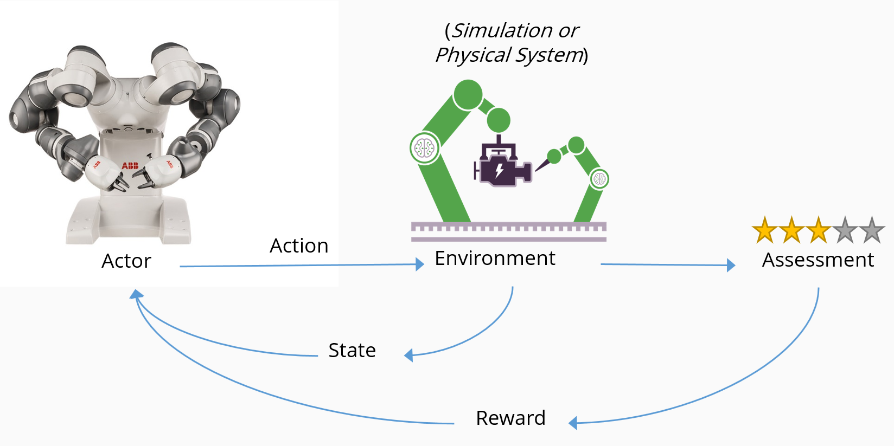

1. An *agent*, in this case a robot, takes an *action* in an *environment*, in this case a smart manufacturing line.
1. The action causes the environment to change *state*, and return its changed state to the agent.
1. An assessment mechanism applies a *policy* to determine what consequence to deliver to the agent.
1. The *reward* mechanism encourages beneficial actions by delivering a positive reward, and may discourage negative actions by delivering a penalty.
1. Rewards cause desired actions to increase, while penalties cause undesired actions to decrease.

A problem can be stochastic (random) in nature, or deterministic. Although one agent is most common, there can also be multiple agents in the environment. The agent senses the environment by observation. The environment can be fully or partially observable, as determined by the agent's sensors, and observations can be discrete or continuous.

Each observation is followed by an action, which causes the environment to change. This cycle repeats until a terminal state is reached. Typically, the system has no memory, and the algorithm simply cares about the state it comes from, the state it arrives at, and the reward it receives.

As the agent learns through trial and error, it needs large quantities of data to evaluate its actions. RL is most applicable to domains that have large historical bodies of data, or that can easily produce simulated data.

### Reward functions

A *reward function* determines how much and when to reward a particular action. The reward structure is normally left to the system owner to define. Adjusting this parameter can significantly affect results.

The agent uses the reward function to learn about the physics and dynamics of the world around it. The fundamental process by which an agent learns to maximize its reward, at least initially, is trial and error.

#### Exploration versus exploitation trade-off

Depending on the goal and reward function, the agent must balance exploration versus maximizing its reward. This choice is called the *exploration versus exploitation trade-off*. As with many aspects of the real world, the agent must balance the merits of further exploration of the environment, which may lead to better decisions in the future, with exploitation of the environment, using all the knowledge the agent currently has about the world to maximize reward. Taking different actions can offer a fresh perspective, especially if the actions haven't been tried before.

The following training dashboard shows the exploration versus exploitation trade-off. The chart shows both the smoothed rewards and episode rewards, with the episode rewards on the y-axis and the training iterations on the x-axis. The episode reward density rises to 400 in the first 50,000 iterations, then keeps steady until 400,000 iterations, when it rises to 1,500 and remains steady.

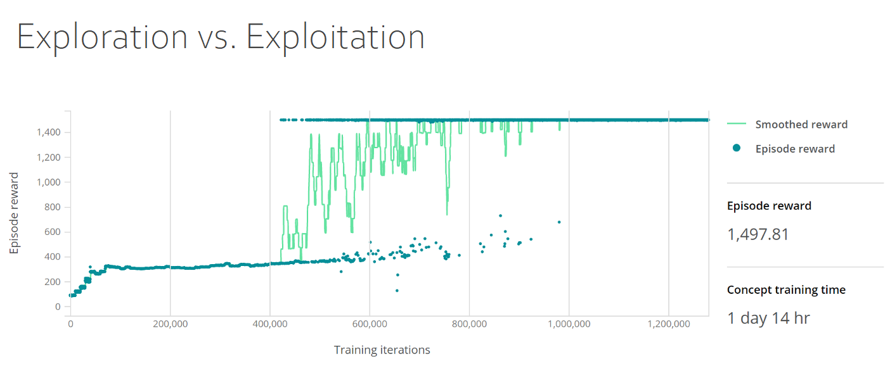

#### Cobra effect

Rewards are subject to what is known in economics as the *cobra effect*. During the British rule of colonial India, the government decided to cull the large wild cobra snake population by offering a reward for every dead cobra. Initially, this policy succeeded, as large numbers of the snakes were killed to claim the reward. However, it didn't take long for people to start gaming the system, and breeding cobras deliberately to collect the reward. Eventually, the authorities noticed this behavior and canceled the program. With no further incentive, the cobra breeders set their snakes free, with the result that the wild cobra population actually increased compared to what it was at the start of the incentive.

The well-intentioned incentivization had made the situation worse, not better. The learning from this is that the agents learn the behavior you incentivize, which may not produce the result you intended.

#### Shaped rewards

Creating a reward function with a particular *shape* can allow the agent to learn an appropriate policy more easily and quickly.

A step function is an example of a *sparse reward function* that doesn't tell the agent much about how good its action was. In the following step reward function, only a distance action between 0.0 and 0.1 generates a full reward of 1.0. When distance is greater than 0.1, there is no reward.

In contrast, a *shaped reward function* gives the agent a sign of how close the action is to the desired response. The following shaped reward function gives a greater reward depending on how close the response is to the desired 0.0 action. The curve of the function is a hyperbola. The reward is 1.0 for distance 0.0 and gradually drops to 0.0 as distance approaches 1.0.

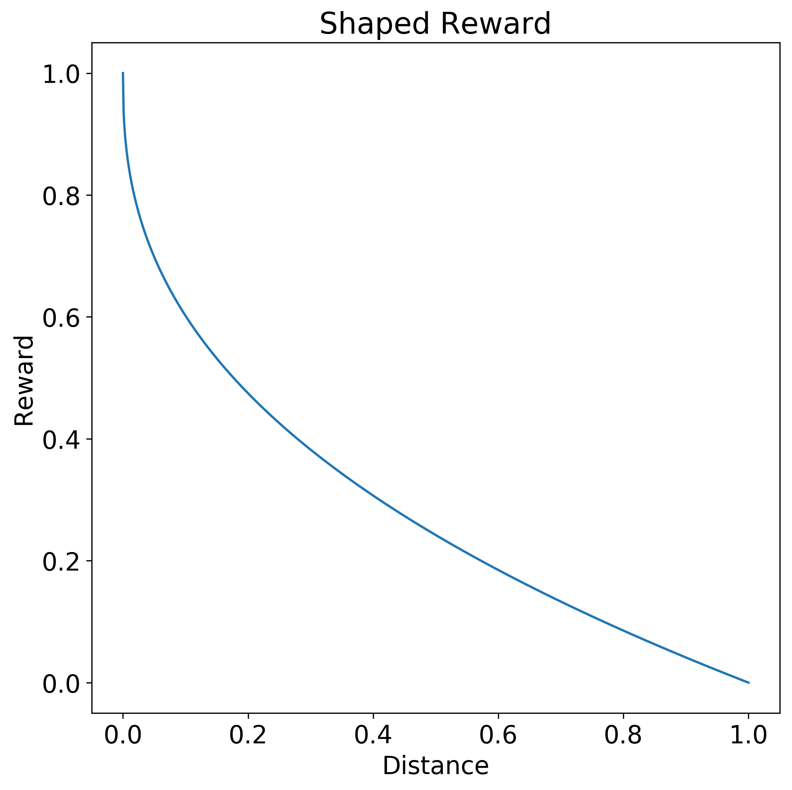

Shaping might discount the value of a future reward versus a more immediate reward, or encourage exploration by shrinking the size of rewards around the goal.

Sometimes, a reward function might specify temporal and spatial considerations, to encourage ordered sequences of actions. However, if a shaped reward function is becoming large and complex, consider breaking up the problem into smaller stages and using *concept networks*.

### Concept networks

*Concept networks* allow specifying and reusing domain-specific knowledge and subject matter expertise to collect a wanted ordering of behavior into a specific sequence of separate tasks. Concept networks help constrain the search space within which the agent can operate and take actions.

In the following concept network for grasping and stacking objects, the **Grasp and Stack**' box is the parent of two gray boxes, **Reach** and **Move**, and three green boxes, **Orient**, **Grasp**, and **Stack**.

Concept networks often allow reward functions to be more easily defined. Each concept can use the most appropriate approach for that task. The notion of concept networks helps with decomposability of the solution into constituent pieces. Components can be replaced without retraining the whole system, allowing reuse of pre-trained models and use of existing controllers or other existing ecosystem components. Especially in industrial control systems, incremental piecemeal improvement can be more desirable than complete removal and replacement.

#### Curriculum learning and apprenticeship learning

Dividing the problem into separate sequential tasks with concept networks allows splitting up the problem into stages of difficulty and presenting it to the agent as a *curriculum* of increasing difficulty. This phased approach starts with a simple problem, lets the agent practice, then challenges it more and more as its ability increases. The reward function changes and evolves as the agent becomes more capable at its task. This *curriculum learning* approach helps guide exploration and drastically reduces required training time.

You can also constrain the policy search space for the agent by instructing it to learn by mimicking the behavior of an external expert. *Apprenticeship learning* uses expert-guided exemplars to constrain the state space the agent explores. Apprenticeship learning trades off learning known solutions more quickly at the expense of not discovering novel solutions.

An example of apprenticeship learning is teaching a self-driving car agent to mimic the actions of a human driver. The agent learns how to drive, but also inherits any flaws and idiosyncrasies of the teacher.

### Design of RL-based AI systems

The following strategy is a practical guide to constructing and building RL-based AI systems:

1. Formulate and iterate on states, terminal conditions, actions, and rewards.
1. Craft reward functions, shaping them as necessary.
1. Allocate rewards for specific subgoals.
1. Discount rewards aggressively if necessary.
1. Experiment with initial states.
1. Experiment with a sampling of examples for training.
1. Limit variation of simulation dynamics parameters during training.
1. Generalize during prediction and keep training as smooth as possible.
1. Introduce some physically relevant noise to accommodate noise in real machines.

## Simulations

AI systems are data-hungry and require exposure to many scenarios to ensure they're trained to make appropriate decisions. The systems often require expensive prototypes that risk damage in real-world environments. The cost of collecting and manually labeling high fidelity training data is high, both in terms of time and direct labor. Using simulators and densely labeled training data generated by simulators is a powerful means of addressing much of this data deficit.

*The curse of dimensionality* refers to the phenomena that arise when dealing with large quantities of data in high-dimensional spaces. Accurately modeling certain scenarios and problem sets requires the use of [deep neural networks](https://en.wikipedia.org/wiki/Deep_learning). These networks themselves are highly dimensional, with many parameters that need fitting. As dimensionality increases, the volume of the space increases at such a rate that available real-world data becomes sparse, making it challenging to collect enough data to make statistically significant correlations. Without enough data, training results in a model that underfits the data and doesn't generalize well to new data, which defeats the purpose of a model.

The problem is twofold:

- The training algorithm has a large learning capacity to accurately model the problem, but needs more data to prevent underfitting.
- Collecting and labeling this large amount of data, if doable, is difficult, expensive, and error-prone.

Simulations offer an alternative to having to collect huge amounts of real-world training data, by virtually modeling systems in their intended physical environments. Simulations allow training in hazardous environments, or in conditions difficult to reproduce in the real world, like various types of weather conditions. Artificially simulated data sidesteps the difficulty in data collection, and keeps algorithms appropriately fed with example scenarios that allow them to accurately generalize to the real world.

Simulations are the ideal training source for DRL, because they're:

- Flexible to custom environments.
- Safe and cost-effective for data generation.
- Parallelizable, allowing for faster training times.

Simulations are available across a broad range of industries and systems, including mechanical and electrical engineering, autonomous vehicles, security and networking, transportation and logistics, and robotics.

Simulation tools include:

- [Simulink](https://www.mathworks.com/products/simulink.html), a graphical programming tool developed by MathWorks for modeling, simulating, and analyzing dynamic systems.
- [Gazebo](http://gazebosim.org/), a tool to allow accurate simulation of populations of robots in complex indoor and outdoor environments.
- [Microsoft AirSim](https://microsoft.github.io/AirSim/), an open-source robotics simulation platform.

## Machine teaching paradigm

*Machine teaching* offers a new paradigm for building ML systems that moves the focus away from algorithms and onto successful model generation and deployment. Machine teaching identifies patterns in the learning process itself, and adopts positive behavior into its own method. Much of the activity in machine learning is focused on improving existing algorithms or developing novel learning algorithms. In contrast, machine teaching focuses on the efficacy of the teachers themselves.

Machine teaching:

- Combines *subject matter expertise* from human domain experts with AI and ML.
- Automates generation and management of *deep reinforcement learning* algorithms and models.
- Integrates *simulations* for model optimization and scalability.
- Provides for greater *explainability* of the behavior of resulting models.

The state of machine learning has largely been determined by a few algorithm experts. These experts have a deep understanding of ML and can change an ML algorithm or architecture to meet required performance or accuracy metrics. The number of ML experts globally can be estimated in the tens of thousands, which slows down the adoption of ML solutions. The overbearing complexity of the models puts ML capabilities outside the reach of many.

While ML experts are few, subject-matter experts are plentiful. Globally, there are tens of millions of domain experts. Machine teaching taps into this larger pool of experts who understand the semantics of problems and can provide examples, but need not be aware of the intricacies of ML. Machine teaching is the fundamental abstraction needed to efficiently program subject matter expertise by codifying what to teach and how to teach it. Subject matter experts with no AI background can break down their expertise into steps and tasks, criteria, and desired outcomes.

For engineers, machine teaching raises the bar of abstraction beyond AI algorithm selection and hyper-parameter tweaking to focus on more valuable application domain problems. Engineers building autonomous systems can create accurate, detailed models of systems and environments, and make them intelligent using methods like deep learning, imitation learning, and reinforcement learning. Another welcome outcome of machine teaching is a faster time to model deployment, by reducing or eliminating the need for manual intervention from machine learning experts during development.

Machine teaching streamlines the process of building ML solutions by looking at common ML practices and adopting beneficial strategies into its own methods. With instruction and configuration from the developer, [Bonsai](https://azure.microsoft.com/services/project-bonsai/), the machine teaching service in the [Microsoft Autonomous Systems Platform](https://www.microsoft.com/ai/autonomous-systems-platform), can automate the development of AI models into an AI system.

Bonsai provides an easily understandable central dashboard that tracks the current state of each project with version control tools. Using this machine-teaching infrastructure ensures that model results can be reproduced, and lets developers easily refresh AI systems with future AI algorithmic breakthroughs.

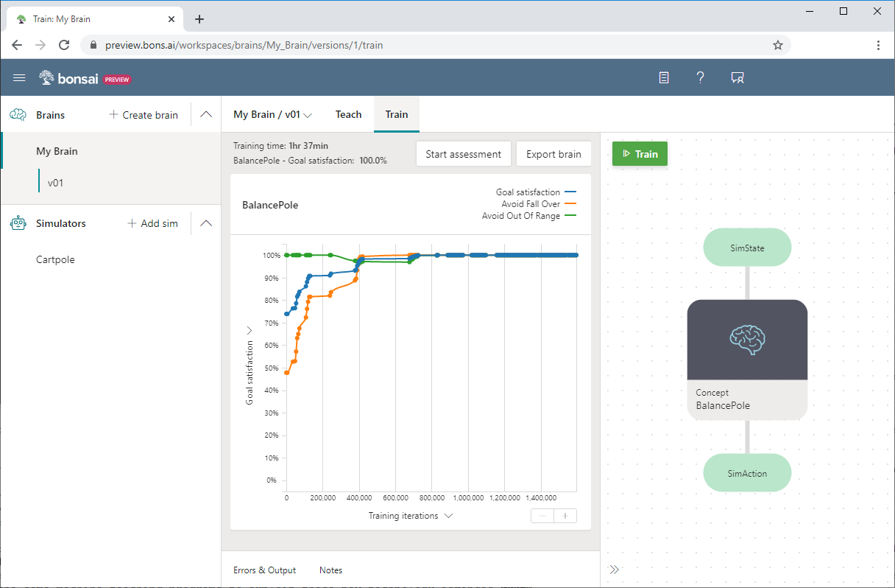

A perspective shift to a machine teaching methodology promotes ML adoption with a more streamlined and accessible process for generating and deploying ML models. Machine teaching offers a way for domain experts to apply the power of DRL as a tool. Machine teaching moves the technology of AI from a focus on ML algorithms and techniques to the application of these algorithms by domain experts to real-world problems.

### Machine teaching process

Machine teaching development and deployment has three phases: Build, Train, and Deploy.

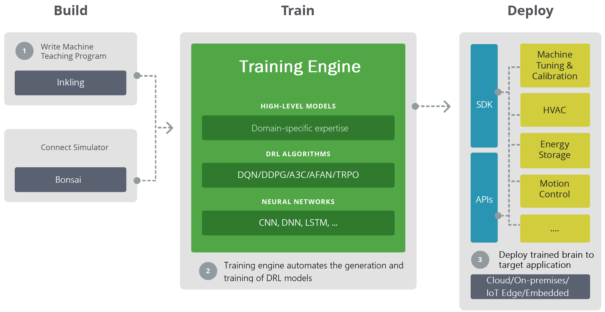

1. The Build phase consists of writing the machine teaching program and connecting to a domain-specific training simulator. Simulators generate sufficient training data for experiments and machine practice.
1. In the Train phase, the training engine automates DRL model generation and training by combining high-level domain models with appropriate DRL algorithms and neural networks.
1. The Deploy phase deploys the trained model to the target application in the cloud, on-premises, or embedded on site. Specific SDKs and deployment APIs deploy trained AI systems to various target applications, perform machine tuning, and control the physical systems.

*Simulated environments* generate large amounts of synthetic data covering many use cases and scenarios. Simulations provide safe and cost-effective data generation for model algorithm training, and faster training times with simulation parallelization. Simulations help train the models across different kinds of environmental conditions and scenarios, much faster and safer than is feasible in the real world.

Subject-matter experts can supervise agents as they work to solve problems in simulated environments, and provide feedback and guidance that lets the agents dynamically adapt within the simulation. After training is complete, engineers deploy the trained agents onto actual hardware, where they can use their knowledge to power autonomous systems in the real world.

### Machine learning and machine teaching

Machine teaching and machine learning are complementary and can evolve independently. Machine learning research focuses on making the learner better by improving machine-learning algorithms. Machine teaching research focuses on making the teacher more productive at building the machine learning models. Machine teaching solutions require several machine learning algorithms to produce and test models throughout the teaching process.

The following diagram shows a representative pipeline for building a machine learning model:

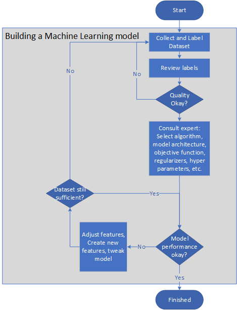

1. The problem owner collects and labels datasets, or assembles a label guideline so the labeling task can be outsourced.
2. The problem owner reviews the labels until their quality is satisfactory.
3. Machine-learning experts select an algorithm, model architecture, objective function, regularizers, and cross-validation sets.
4. Engineers train the model cyclically, adjusting the features or creating new features to improve model accuracy and speed.
5. The model is tested on a small sample. If the system doesn't do well in the test, the preceding steps are repeated.
6. Model performance is monitored in the field. If performance falls below a critical level, the model is modified by repeating the preceding steps.

Machine teaching automates the creation of such models, easing the need for manual intervention in the learning process to improve feature selection or examples, or tweaking of hyper-parameters. In effect, machine teaching introduces a level of abstraction into the AI elements of the model, allowing the developer to focus on the domain knowledge. This abstraction also allows the AI algorithm to be replaced by new more innovative algorithms in time, without requiring a respecification of the problem.

The role of the teacher is to optimize the transfer of knowledge to the learning algorithm so it can generate a useful model. Teachers also play a central role in data collection and labeling. Teachers can filter unlabeled data to select specific examples, or look at the available example data and guess its label based on their own intuition or biases. Similarly, given two features on a large unlabeled set, teachers can conjecture that one is better than the other.

The following image shows the high-level process of machine teaching:

1. The teacher first questions whether a training set is realizable.
2. If the training set isn't realizable, the teacher determines whether the issue is due to inadequate labeling or feature deficiencies. After correcting the labeling or adding features, the teacher again assesses whether the training set is realizable.
3. If the training set is realizable, the teacher assesses whether training quality criteria are being met.
4. If quality criteria aren't being met, the teacher finds the test errors and adds the fixes to the training set, then repeats the assessment steps.
5. Once the training set is realizable and quality criteria are met, the process finishes.

The process is a pair of indefinite loops, ending only when the model and the training itself are of sufficient quality.

The learning capacity of the model increases on demand. There's no need for traditional regularization, because the teacher controls the capacity of the learning system by adding features only when necessary.

### Machine teaching and traditional programming

Machine teaching is a form of programming. The goal of both programming and machine teaching is to create a *function*. The steps to create a stateless target function that returns the value *Y* given an input *X* are similar for both processes:

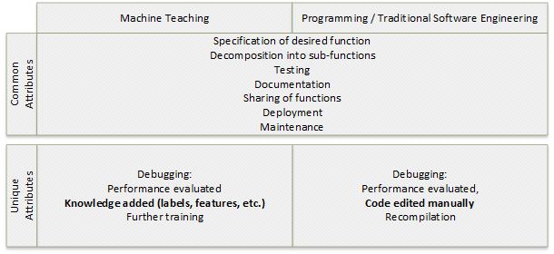

1. Specify the target function.
1. Decompose the target function into subfunctions if applicable.
1. Debug and test the functions and subfunctions.
1. Document the functions.
1. Share the functions.
1. Deploy the functions.
1. Maintain the functions with scheduled and unscheduled debug cycles.

*Debugging* or evaluating the performance of the solution has different attributes between the two processes. In programming, debugging involves manually editing and recompiling code. In machine teaching, debugging includes adding knowledge labels and features, and further training.

Building a target classification function that returns class *Y* given input *X* involves a machine learning algorithm, while the process for machine teaching is like the set of programming steps above.

The following table illustrates some conceptual similarities between traditional programming and machine teaching:

|Programming|Machine teaching|
|----------|----------|
|Compiler|Machine-learning algorithms, support vector machines (SVMS), neural networks, training engine|
|Operating systems, services, integrated development environments (IDEs)|Training, sampling, feature selection, machine training service|
|Frameworks|ImageNet, word2vec|
|Programming languages like Python and C#|Inkling, labels, features, schemas|
|Programming expertise|Teaching expertise|
|Version control|Version control|
|Development processes like specifications, unit tests, deployment, monitoring|Teaching processes like data collection, testing, publishing|

A powerful concept that allows software engineers to write systems that solve complex problems is *decomposition*. Decomposition uses simpler concepts to express more complex ones. Machine teachers can learn to decompose complex machine learning problems with the right tools and experiences. The machine teaching discipline can bring the expectations of success for teaching a machine to a level comparable to that of programming.

## Machine teaching projects

**Prerequisites:**

- Some experience with gathering, exploring, cleaning, preparing, and analyzing data
- Familiarity with basic ML concepts like objective functions, training, cross-validation, and regularization

When building a machine teaching project, start with a true to life but relatively simple model, to allow for fast iteration and formulation. Then, iteratively improve the fidelity of the model, and make the model more generalizable through better scenario coverage.

The following diagram shows the phases of iterative machine teaching model development. Each successive step requires a larger number of training samples.

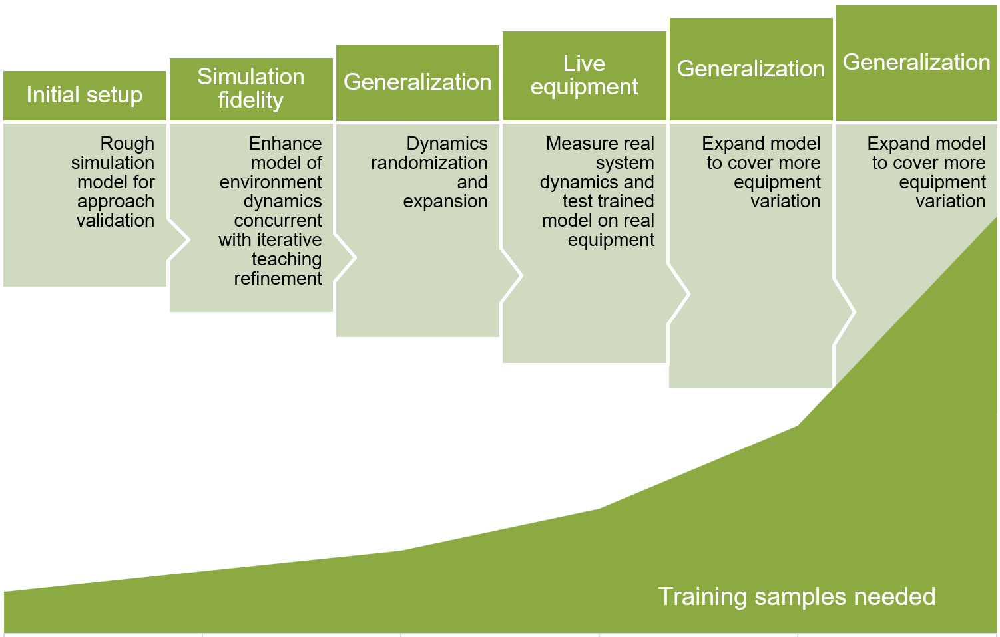

1. Set up initial rough simulation model for approach validation.
2. Enhance simulation fidelity by modeling environment dynamics concurrent with iterative teaching refinements.
3. Generalize model with dynamic randomization and expansion.
4. Measure real system dynamics and test trained model on real equipment.
5. Expand model to cover more equipment variation.

Defining exact parameters for machine teaching projects requires quite a bit of experimentation and empirical exploration. A machine teaching platform like [Bonsai](https://azure.microsoft.com/services/project-bonsai/) in the [Microsoft Autonomous Systems platform](https://www.microsoft.com/ai/autonomous-systems-platform) uses DRL innovations and simulations to help simplify AI model development.

### Example project

An example of an autonomous systems AI project is the use case of a manufacturing process optimization. The goal is to optimize the thickness tolerance of a steel beam being manufactured on a production line. Rollers provide pressure across a piece of steel to shape it into the designed thickness.

The machine state inputs to the AI system are the rolling force, roller error, and roller noise. The control actions from the AI system are actuator commands to control the operation and motion of the rollers, and optimize the thickness tolerance of the steel beam.

First, find or develop a simulator that can simulate agents, sensors, and the environment. The following Matlab simulation model provides an accurate training environment for this AI system:

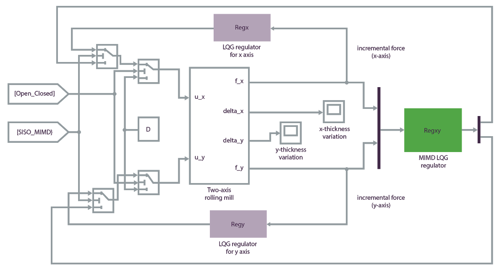

Use the [Bonsai](/bonsai/) machine teaching service in the Microsoft Autonomous Systems Platform to build a machine teaching plan into a model, train the model against the simulator, and deploy the trained AI system to the real production facility.

[Inkling](/bonsai/inkling/) is a purpose-specific language to formally describe machine teaching plans. In Bonsai, you can use Inkling to deconstruct the problem into schema:

Then, define key *concepts* and create a *curriculum* to teach the AI system, specifying the reward function for the simulation state:

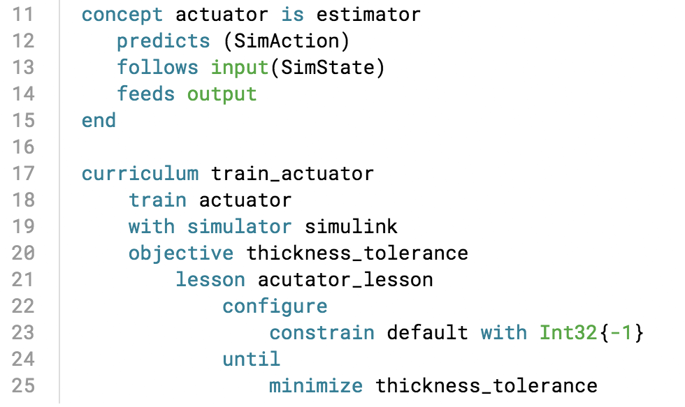

The AI system learns by practicing the optimization task in simulation, following the concepts of machine teaching. You can upload the simulation into Bonsai, where it provides visualizations of training progress as it runs.

After building and training the model or *brain*, you can export it to deploy to the production facility, where optimal actuator commands stream from the AI engine to support operator decisions in real time.

### Other example applications

The following machine teaching examples create policies to control the motions of physical systems. In both cases, manually creating a policy for the agent is infeasible or very difficult. Allowing the agent to explore the space in simulation and guiding it to make choices through reward functions produces accurate solutions.

#### Cartpole

In the sample Cartpole project in Bonsai, the goal is to teach a pole to remain upright on a moving cart. The pole is attached by an unactivated joint to the cart, which moves along a frictionless track. The available sensor information includes the cart position and velocity, and the pole angle and angular velocity.

Applying a force to the cart controls the system. The supported agent actions are to push the cart to the left or the right. The program provides a positive reward for every time step that the pole remains upright. The episode ends when the pole is over 15 degrees from vertical, or the cart moves more than a predefined number of units from the center.

The example uses [Inkling](/bonsai/inkling/) language to write the machine teaching program, and the provided Cartpole simulator to speed and improve the training.

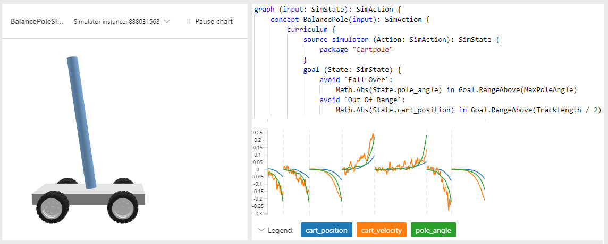

The following Bonsai screenshot shows a Cartpole training, with **Goal satisfaction** on the y-axis and **Training iterations** on the x-axis. The Bonsai dashboard also shows the percentage of goal satisfaction and the total training time.

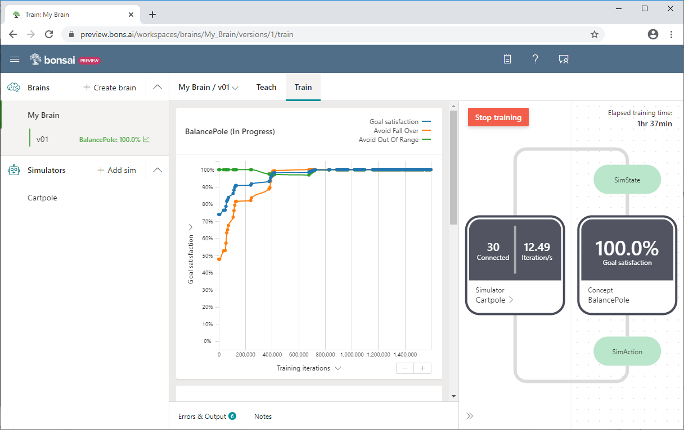

For more information about the Cartpole example or to try it yourself, see:

- [Quickstart: Balance a pole with AI (Cartpole)](/bonsai/quickstart/cartpole/)
- [Learn how you can teach an AI agent to balance a pole](https://blogs.microsoft.com/ai-for-business/cartpole-demo/)

#### Oil drilling

The Horizontal Oil Drilling application is a motion controller to automate oil rigs that drill horizontally underground. An operator controls the drill underground with a joystick to keep the drill inside the oil shale while avoiding obstacles. The drill makes as few steering actions as possible, for faster drilling. The goal is to use reinforcement learning to automate control of the horizontal oil drill.

The available sensor information includes the direction of drill bit force, weight of the drill bit, side force, and drilling angle. The supported agent actions are to move the drill bit up, down, left, or right. The program provides a positive reward when the drill is within the tolerance distance of the chamber walls. The model learns to adapt to different well plans, drill starting positions, and sensor inaccuracies.

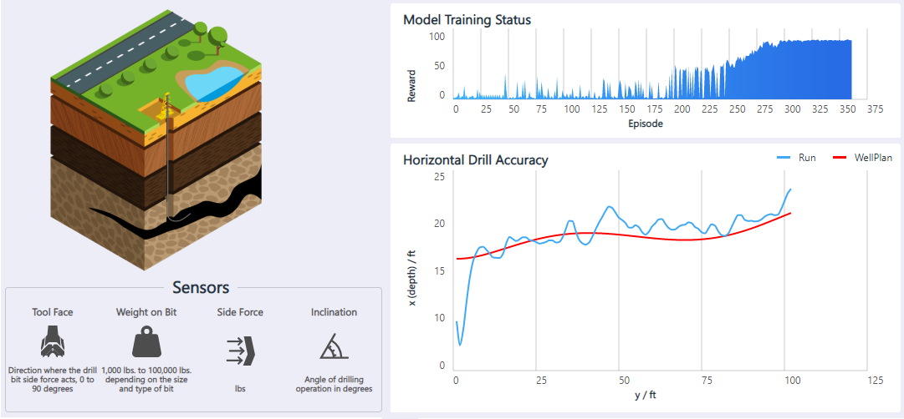

For more information and a demo of this solution, see [Motion control: Horizontal oil drilling](https://aidemos.microsoft.com/machineteaching/motion-control).

## Contributors

*This article is maintained by Microsoft. It was originally written by the following contributors.* 

Principal author:

 - [Jose Contreras](https://www.linkedin.com/in/josedanielcontreras/) | Principal Software Engineering Manager
 
*To see non-public LinkedIn profiles, sign in to LinkedIn.*

## Next steps

- [Machine teaching for autonomous systems](autonomous-systems.yml)
- [Autonomous systems with Microsoft AI](https://www.microsoft.com/ai/autonomous-systems)
- [Autonomy for industrial control systems](https://www.microsoft.com/ai/autonomous-systems-solutions)
- [Machine teaching: How people's expertise makes AI even more powerful](https://blogs.microsoft.com/ai/machine-teaching/)
- [Microsoft broadens availability of autonomous systems tools for engineers and developers](https://blogs.microsoft.com/ai-for-business/build-bonsai-public-preview/)
- [Innovation space: Autonomous systems (Video)](https://www.youtube.com/watch?v=3hSAFtWcui8&feature=youtu.be)
- [Microsoft The AI Blog](https://blogs.microsoft.com/ai/)
- [Bonsai documentation](/bonsai/)
- [Microsoft AirSim on GitHub](https://github.com/Microsoft/AirSim)
- [Aerial Informatics and Robotics Platform (AirSim)](https://www.microsoft.com/research/project/aerial-informatics-robotics-platform/)
- [Gazebo](http://gazebosim.org/)
- [Simulink](https://www.mathworks.com/products/simulink.html)

Learn more about machine teaching:

- ["Bonsai, AI for Everyone," 2016 March 2](https://medium.com/@BonsaiAI/ai-for-everyone-4ddd36c89859)
- ["AI use cases: innovations solving more than just toy problems," 2017 March 2](https://medium.com/@BonsaiAI/ai-use-cases-9d1b70e61396)
- [Patrice Y. Simard, Saleema Amershi, David M. Chickering, et al., "Machine Teaching: A New Paradigm for Building Machine Learning Systems," 2017](https://arxiv.org/abs/1707.06742v2)
- [Carlos E. Perez, "Deep Teaching: The Sexiest Job of the Future," 2017 July 29](https://medium.com/intuitionmachine/why-teaching-will-be-the-sexiest-job-of-the-future-a-i-economy-b8e1c2ee413e)
- [Tambet Matiisen, "Demystifying deep reinforcement learning," 2015 December 19](https://neuro.cs.ut.ee/demystifying-deep-reinforcement-learning/)
- [Andrej Karpathy, "Deep Reinforcement Learning: Pong from Pixels," 2016 May 31](http://karpathy.github.io/2016/05/31/rl/)
- [David Kestenbaum, "Pop Quiz: How Do You Stop Sea Captains From Killing Their Passengers?" 2010 September 10](https://www.npr.org/sections/money/2010/09/09/129757852/pop-quiz-how-do-you-stop-sea-captains-from-killing-their-passengers?t=1556642213216)

## Related resources

- [Machine teaching for autonomous systems](autonomous-systems.yml)
- [Artificial intelligence (AI) architecture design](../../data-guide/big-data/ai-overview.md)
- [Compare Microsoft machine learning products and technologies](../../data-guide/technology-choices/data-science-and-machine-learning.md)
- [How Azure Machine Learning works: resources and assets](/azure/machine-learning/concept-azure-machine-learning-v2)
- [Machine learning at scale](../../data-guide/big-data/machine-learning-at-scale.md)
