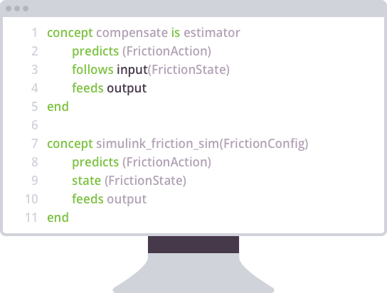
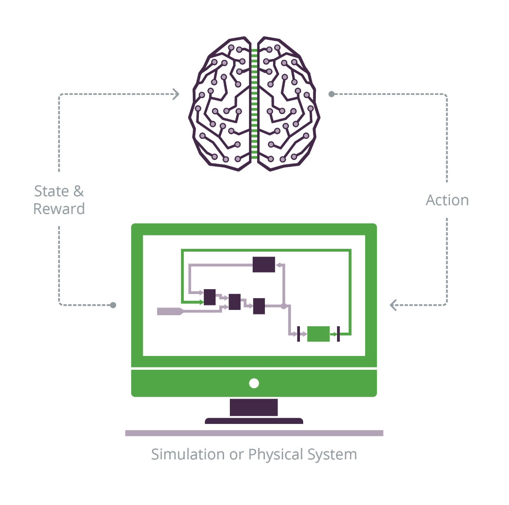
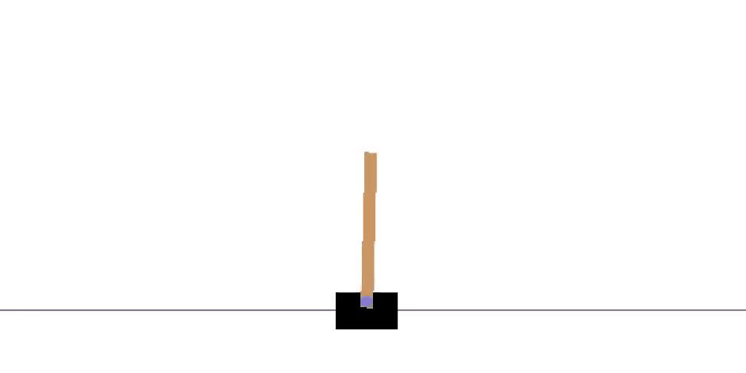
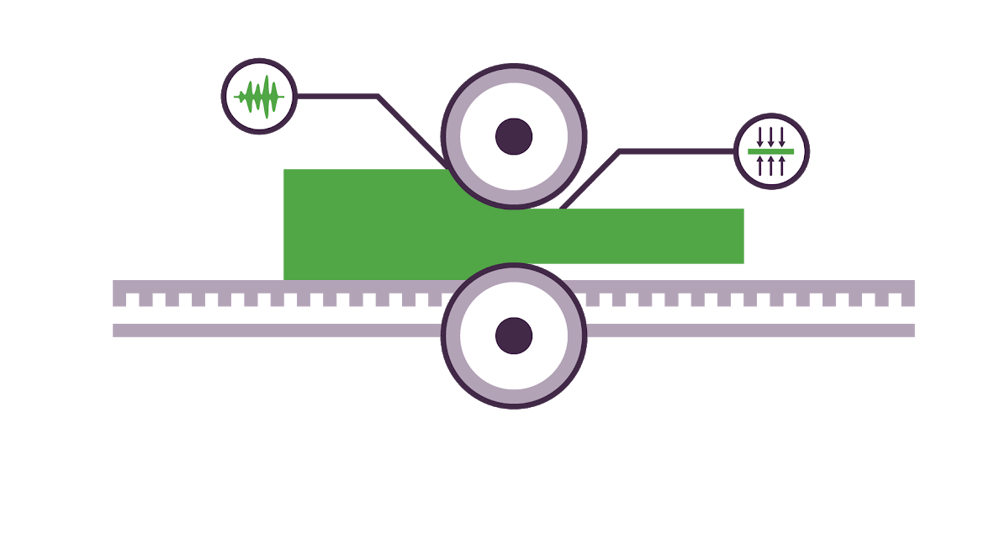
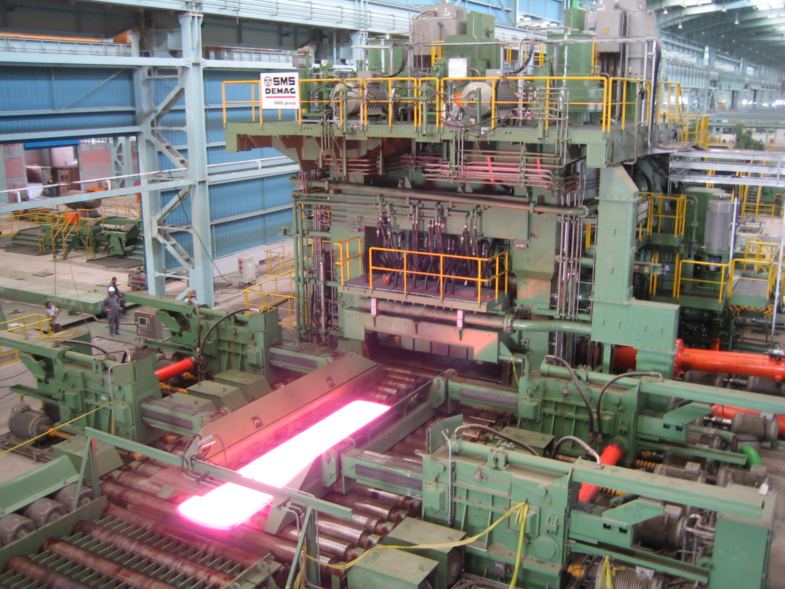

# Machine teaching

The Microsoft autonomous systems AI toolchain introduces the concept of *machine teaching*. Machine teaching is the technique for infusing subject matter expertise into the autonomous systems AI model.

In this article, we will:

* Contextualize the development of autonomous systems.
* Define the concepts around machine teaching.
* Understand the terminology behind deep reinforcement learning, as well as some best practices.
* Discuss the benefits of simulating autonomous systems.

## Introduction to autonomous systems

AI offers unique opportunities and challenges for those enterprises whose operations span both the virtual and physical worlds. The Microsoft Autonomous Systems AI Toolchain empowers users to develop deep reinforcement learning models that can significantly improve the operations of such complex industrial systems.

In this section, we’ll discover the Microsoft autonomous systems AI toolchain. Later, we’ll discuss the evolution of autonomous systems from the First Industrial Revolution to the adoption of cognitive technologies.

### Introduction

Humans have been designing physical tools and machines for repetitive tasks efficiently for thousands of years. These tools, machines, or systems have evolved into complicated enterprise operations spanning both the virtual and physical worlds. AI and machine learning offer tremendous potential in helping to transform the world we live in. They offer unique opportunities and challenges for these enterprises, mostly in automating those complex physical industrial systems.

The Microsoft autonomous systems AI toolchain is an innovative framework for building, training, and deploying a wide variety of autonomous systems for the control of physical devices and machinery. It empowers users to develop deep reinforcement learning models that can improve their operations by focusing on subject matter expertise and abstracting away AI complexity. Today, this approach automates the building, management, and deployment of advanced AI models. Besides, it eases the smooth updating of these models in the future.

### Building AI systems for autonomous control

In this step, we’ll contextualize and discuss AI systems. We’ll also see that the Microsoft autonomous systems AI toolchain provides a framework for building, training, and deploying them.

For thousands of years, humans have designed tools and machines to do repetitive tasks more efficiently than we can.  These technologies aim to produce a greater volume of higher-quality goods, more consistently, at a lower cost, and with less direct manual labor.

AI and machine learning are exciting technologies that offer great potential in helping to transform the world.  They enable our computing machines to recognize correlations between real-world input data and outcomes and to automate decision making. These advances in computing make our world and societies more economically productive, more environmentally friendly, and safer for us.  But the will to automate aspects of our daily lives isn't new.

The Microsoft autonomous systems AI toolchain is an innovative framework for building, training, and deploying a wide variety of autonomous control systems. Example application scenario categories include:

 * Motion control.
 * Machine tuning and calibration.
 * Smart buildings and homes.
 * Industrial robotics.
 * Process control and automation.

In autonomous systems AI terminology, we call the AI systems that are built to control these autonomous systems **deep reinforcement learning** (DRL) models. They’re well suited to the challenges of complex and dynamic environments. 

The toolchain contains the complete set of tools for building, training, and deploying AI systems. It can:

 * Combine *human* domain knowledge and machine learning/AI through *machine teaching*.
 * *Integrate* simulations for model optimization and scalability during training.
 * Automate the generation and management of these AI systems.
 * Deploy and scale the AI systems for real-world use.

The various categories of autonomous control systems share common attributes, and the creation of AI systems to cater for these categories share common challenges, namely:

 * **Subject matter expertise is essential:** experts who understand the problem domain are needed to describe the wanted behavior of the system.
 * **Existing control systems and machine learning techniques are insufficient:** it’s too difficult to express the decision logic required to adequately cover all possible scenarios, and such systems are often fragile when deployed.
 * **Data-centric approaches are expensive and time-consuming:** generating sufficient real-world data to ensure coverage of all possible scenarios is labor-intensive, and challenging.
 * **Difficult to deploy and scale in the real world:** traditional control systems are difficult to build, deploy and scale in the field, to similar applications of different size and complexity.

These common challenges demand another approach - one which:

 * Focuses on the value added by the human domain expertise. 
 * Achieves scalability through the generation of simulated training data.
 * Commoditizes AI through the automated selection and management of deep reinforcement learning algorithms and models.
 * Automates and manages the deployment and scaling of these AI systems.

We'll see in a later section how autonomous systems AI fulfills this fresh approach to provide a toolchain suitable for the end-to-end creation, management, and deployment of AI systems for autonomous control systems.

In the rest of this section, we'll look at the history of automation and the need for autonomous control of our tools, processes, and infrastructure. Through this, we'll better position this next revolution in autonomous system control, in which recent advancements in AI and the proliferation of connected physical devices and sensors converge.

![The Microsoft autonomous systems AI toolchain. It’s structured in three phases: Build, Train, and Deploy. In the Build phase, first, one writes the machine teaching program in Inkling. Second, one connects to the simulator with the SDK. Third, one integrates existing modules with gears. In the Train phase, the AI engine automates the generation and training of DRL models. Within the AI engine, there are high-level models, DRL algorithms (DQN, DDPG, A3C, AFAN, TRPO), and neural networks (CNN, DNN, LSTM). Finally, in the Deploy phase, the trained brain is deployed to the target application, be it on the cloud, on-prem, or embedded. The SDK and the APIs take control of the machine tuning and calibration, the HVAC, the energy storage, the motion control, and so on.](../media/machine-teaching-1-2.png)

Next, you’ll discover the historical industrial changes that made AI possible.

### Advancement of automation in the 20th century

In this step, we’ll review the historical processes that implanted automation in industries, from the Industrial Revolutions to the World Wars.

The First Industrial Revolution (late 1700s to mid-1800s) introduced machines to replace hand production methods in manufacturing. It brought a wider change in mindset that increased efficiency of production systems in terms of automation (through steam power), and consolidation (moving from homes to organized factories).

Since then, entrepreneurs and engineers have continually been dreaming up increasingly clever technologies and innovations to maximize production output.

The Second Industrial Revolution (mid-1800s to early 1900s) brought many important advances in production capability - especially electrification and the production line.

In 1913, Ford Motor Company introduced an assembly line for car production, reducing car assembly time approximately 8x. An assembly line is a system in which parts are added to a product as it moves in semi-finished state from workstation to workstation until completed. By specializing in adding a specific part at each workstation, Ford found that their cars could be produced faster with less labor.

With electrification came a more reliable source of power, and factory electrification increased productivity greatly in the 1920s.

The First and Second World Wars brought major advances in information theory, communications. signal processing. This progress and the development of the transistor allowed this information theory to be applied to the control of physical systems.

Next, you’ll find out what the Third and Fourth Industrial Revolutions brought over for the advancement of automation.

### IIOT/Industry 4.0

As we saw in the previous step, the First Industrial Revolution introduced mechanization with water- and steam-powered machines and engines.

The Second Industrial Revolution brought forth the concepts of mass production, optimized assembly lines, and higher throughput/more reliable machines powered through introducing electrification.

The Third Industrial Revolution allowed computer systems to make inroads in the hard-coded control of these systems: production, transport, healthcare, and so on. The benefits of programmed automation would include consistency, reliability, and security.

The Fourth Industrial Revolution introduced the notion of cyber-physical systems and industrial Internet of Things (IoT). Advances in processing capacity, miniaturization, storage capacity, and network capacity enable us to instrument our production systems and industrial plant equipment. Likewise, they allow to collate vast quantities of real-time sensor data.  But how do we make sense of and use this flow of data?

#### Rise of AI

The systems we wish to control are often too complex to have fully prescribed rules written by a human. AI systems are increasingly more applicable because of the convergence of technological advances (storage, bandwidth, and compute).  With increasingly rich sources of data, we are at a point where we can feed our data-hungry algorithms to help us make sense of it - enabling us to create new and powerful applications.

AI isn't a new discipline: much of the theory has been unchanged for decades. Recently, however, an increased ability to deal with vast quantities of data has enabled more accurate and useful algorithm predictions.

Intelligent automation is the combining of AI and machine learning with automated outcomes and physical systems control. It allows organizations to transform their cultures, processes, and products to achieve unprecedented levels of efficiency, quality, and cost-reduction.

![Diagram of the AI use case spectrum: from augmentation to autonomy. It sorts use cases in a scale going from control on the far left, to optimization, perception, prediction, and data analysis on the far right. The use cases under control and optimization belong to automation of work and include advanced robotics, autonomous vehicles, dark factories, smart sensors, route optimization, inventory optimization, and virtual assistant. Smart manufacturing and the AI-related companies bonsai, Uber, and nest are given as examples. In this automation of work side of the spectrum, there are practically infinite problem spaces. Subject matter expertise is a strategic asset, simulations are the most doable training option, and explainability is paramount. Within perception, there are speech recognition, language translation, detect emotion in images, facial recognition, and labels in objects. Under prediction, one finds product recommendation, fraud detection, churn prediction, likelihood to purchase, and predict crime. Within data analysis, there are customer segmentation and data mining.](../media/machine-teaching-1-4.png)

Next, you’ll learn about cognitive automation and how it meant a further step in industrial automation and towards the birth of machine teaching.

### Autonomous systems

In this step, we introduce the concept of cognitive automation and link it to the emergence of machine teaching.

The concept of cognitive automation covers the application of software and AI to information-intensive processes and systems.

#### Cognitive automation and cognitive technologies

Cognitive automation is the application of software and AI to information-intensive processes and systems. It’s commonly used with robotic process automation, where complex behaviors can be learned through with.

Cognitive technologies are AI-enabled products. They can do tasks that previously only humans could do - for example, computer vision systems, natural language processing and chatbots, and robotic control.  They allow existing products and services to be enhanced and also introduce entirely new classes of products and services.

Cognitive technologies can:

 * augment manual workers for increased productivity
 * replace manual workers in monotonous or hazardous fields
 * allow for new insights because of huge volumes of data processing previously impossible by humans

#### Paradox of automation

The social impacts of the move to AI and machine-controlled automation will be huge, as were the effects of past technological revolutions.  Society will change and adapt, and certain old jobs will disappear while new opportunities will be created.

The *paradox of automation* claims that the more efficient the automated system becomes, the more crucial the human contribution of the operators is. Accordingly, the role of humans changes mundane per-unit-of-work labor to the following responsibilities:

 * Contributing the essential domain expertise used in developing the automated systems.
 * Improving the automated systems.
 * Ensuring that the automated systems are working in an error-free state.

While an automated system can produce output more efficiently, it can also generate much waste - wasted effort, wasted product - if it’s not running correctly. Then, efficient use of automation makes humans *more important*, not less.

AI/machine learning systems are good at finding correlations between sensor data and outcomes.  However, AI systems are no match for our higher-level cognitive abilities such as:

 * Improvisation and decision-making.
 * Creative thinking.
 * Determination of causation.

The Microsoft autonomous systems AI toolchain eases the infusion of human domain and subject matter expertise into its AI systems models through *machine teaching*.

#### Industrial automation and the introduction of machine teaching

Many current production systems using industrial robots automate and accomplish impressive feats of engineering and manufacturing. However, in most cases, these robots can only operate in highly structured environments. They’re typically inflexible to change and highly specialized towards the immediate task at hand. These robots may also be expensive to develop because of both the hardware and the software rules governing their behaviors.

Thanks to the use and evolution of industrial automation in manufacturing industries, we all enjoy high-quality safer products. We further benefit from more efficient use of energy and raw materials. And, based on the paradox of automation, contrary to what many people might believe, the increased use of automation usually creates more jobs - higher-skilled jobs - which continue to foster more economically and socially beneficial outcomes.

We’ll see in a later section that the Microsoft autonomous systems AI toolchain can help us with this task. The toolchain can automate much of the generation of the software rule setting. For doing so, it makes use of human domain knowledge and expertise.

With **machine teaching**, we can simplify the development of these complex robotic systems while improving their capabilities and applicability:

 * Better incorporating subject matter expertise from human domain experts.
 * Training our *AI systems* models faster and more accurately.
 * Providing for greater explainability of the behavior of our resulting AI systems models.

It’s possible to leverage simulated environments to generate large amounts of synthetic data - covering many use cases and scenarios upon which to train the algorithm and providing:

 * Safe and cost-effective data generation for training our models.
 * Faster training times with simulation parallelization. 

### Introduction to autonomous systems: Summary

In this section, you’ve become familiar with the Microsoft autonomous systems AI toolchain. You’ve also contextualized this toolchain within the ongoing advancement of autonomous systems. This evolution ranges from the end of the 18th century to the birth of machine teaching, throughout the four Industrial Revolution.

In the next section, you’ll discover what we understand exactly by machine teaching and more about this new discipline.

## Machine teaching overview

In this section, we’ll delve into machine teaching. We’ll discuss its core concepts and learn why it’s useful. We’ll later grasp the analogies and differences with close disciplines, such as machine learning and traditional software engineering. Finally, we’ll consider the role of teachers and the machine teaching process.

### Introduction: What is machine teaching?

The Microsoft autonomous systems AI toolchain introduces the concept of machine teaching.  **Machine teaching** is the technique for infusing subject matter expertise into the autonomous systems AI model.

Machine teaching raises the bar of abstraction for the engineer beyond AI algorithm selection and hyper-parameter tweaking. Besides, it allows focusing on the most valuable portion - that of the application domain problem. With instruction and configuration from the developer, the Microsoft autonomous systems AI toolchain can automate the development of the most appropriate AI model into an AI system. Even more, it enables the developer to easily refresh the AI system at a future date when new AI algorithmic breakthroughs occur.

In many ways, machine teaching offers a new paradigm for building machine learning systems. It identifies patterns in the learning process *itself* and adopts positive behavior into its own method. Much of the activity in machine learning is focused on improving existing algorithms or developing novel learning algorithms. In contrast, machine teaching focuses on the efficacy of the teachers themselves.

Machine teaching moves our focus away from the learning algorithms, and onto the process of successful model generation and deployment. In doing so, machine teaching makes teaching machines more accessible to domain experts.  While machine learning experts are few, domain experts are plentiful. A perspective shift to a machine-teaching methodology promotes a more streamlined process. This shift can embody much of the AI expertise and allow domain experts to generate and deploy autonomous control models.

In this section, we'll focus on building up a sufficient overview of machine-teaching background knowledge.  In a later section, we'll see this background knowledge put to use with some real examples - illustrating just how powerfully machine teaching can embrace reinforcement learning to simplify the development of sophisticated automation systems.

#### Prerequisites

 * Some experience with data analysis (gathering data, exploring the data [visualization and data wrangling], cleaning, and preparing the data).
 * Familiarity with the basic concepts of machine learning, such as objective functions, training, cross-validation, regularization.

### Why the need for machine teaching?

In this step, we discuss why machine teaching is important and in which ways it can be helpful to us.

To date, the state of machine learning is largely determined by a few algorithm experts. These experts have a deep understanding of machine learning. They can change a machine learning algorithm or architecture to meet the required performance or accuracy metrics. The number of machine learning experts globally can be estimated in the tens of thousands, which slows down the adoption of machine learning solutions. The overbearing complexity of the models puts machine learning outside the reach of many others.

Besides, machine teaching targets the larger set of domain experts. These experts understand the semantics of the problem but need not be aware of the intricacies of the learner. They can provide examples and counterexamples, and explain the difference between them. Globally, there are around tens of millions domain experts. By tapping into this larger pool, machine teaching may speed up the adoption of machine learning solutions in the workplace.

Likewise, the management process of building machine learning solutions can be fraught with inefficiencies, and machine teaching tries to streamline this process. Machine teaching looks at common practices of machine learning and adopts beneficial strategies into its own method. Little work has been done to date to evaluate how the development pipeline used in machine learning can be improved. Machine teaching tests this pipeline at a time of growing complexity and offers us a fresh perspective.

In enabling this perspective, it's key to provide an easily understandable central dashboard. It should track the current state of each project, link data, and store labels with version control tools.  Using this machine-teaching infrastructure ensures that model results can be reproduced time and time again.

A welcome outcome of machine teaching is a faster time to model deployment. A typical machine learning iteration, from data collection to model deployment, can take several weeks. It often must be repeated several times before the expected accuracy and performance is reached. The time to deployment can be cut down by reducing or erasing the need for manual intervention from machine learning experts at various stages in development.

Likewise, with additions such as version control, picking up later from where one left off is also easily achievable with minimal overhead. All models break eventually: perhaps the data distribution has changed, new features are available, or old features are no longer available. This can often be several months after the initial model is deployed. The ability to go back in time to retrieve and recreate the data, labels, and model timely is of paramount importance.

Then, one of the core aims of machine teaching is model reproducibility. 

Next, you’ll learn the difference between machine learning and machine teaching.

### Distinction between machine learning and machine teaching

In this step, we’ll explore the differences between machine learning and machine teaching.

Machine-learning research focuses on making the learner better by improving machine-learning algorithms. Machine-teaching research focuses on making the teacher more productive at building the machine learning models.

A representative pipeline for building a machine learning model is as follows:

 1. **Datasets must be collected and labeled by the problem owner**. Optionally, a label guideline may be put together, so that the task of labeling the data can be outsourced.

 2. **The problem owner reviews labels, and may decide to tweak these further, remove inappropriate or inadequate data for the problem**. Steps 1 and 2 are repeated cyclically until such a point where the product owner is satisfied with the quality of the examples and associated labels.

 3. **One or more machine-learning experts are consulted** to select an algorithm, model architecture, objective function, regularizers, cross-validation sets, and so on. 

 4. **The model is trained cyclically, with engineers adjusting the features, or creating new features to improve model accuracy**. The model can be retweaked further to enhance speed. Models are trained and deployed on a fraction of traffic for testing.

 5. **Test, rinse, repeat**. If the system doesn't do well in the test, revert to step 1.

 6. **Monitor performance in field.** Once the model is deployed, model performance is monitored, and if this falls below a critical level, then the model is modified by returning to step 1.

![Typical machine learning flow. The square one reads ‘Start.’ From here, one advances to ‘Collect and Label Dataset,’ then to ‘Review labels.’ If quality isn’t okay, one returns to ‘Collect and Label Dataset.’ If it’s okay, one proceeds to ‘Consult expert: Select algorithm, model architecture, objective function, regularizers, hyper parameters, etc.’ Then, if model performance is okay, one arrives at the ‘Finished’ box. Otherwise, one goes to ‘Adjust features, create new features, tweak model’. If the dataset is still sufficient, one returns to checking whether model performance is okay. Otherwise, one goes back to ‘Collect and Label Dataset.’](../media/machine-teaching-2-3.png)

Machine teaching automates the creation of such models, easing the need for manual intervention in the learning process to improve feature selection or training examples or tweaking of hyper-parameters. In effect, machine teaching introduces a level of abstraction into the AI elements of the model, allowing the developer to focus on the domain knowledge. This abstraction even allows the actual AI algorithm used to be replaced by new more innovative algorithms in time, without requiring a respecification of the problem.

Both disciplines are complementary and can evolve independently. Naturally, machine-teaching solutions require several machine learning algorithms to produce and test models throughout the teaching process. 

Next, we’ll learn the components that allow the Microsoft Autonomous Systems AI Toolchain to manage the full lifecycle.

### Components of the Microsoft Autonomous Systems AI Toolchain

In this step, you’ll discover the phases and parts of the Microsoft Autonomous Systems AI Toolchain.

The Microsoft autonomous systems AI toolchain manages the full lifecycle (end-to-end) - from building and training to deploying the Deep Reinforcement (DRL) Models.

![Diagram of the AI use case spectrum: from augmentation to autonomy. It sorts use cases in a scale going from control on the far left, to optimization, perception, prediction, and data analysis on the far right. The use cases under control and optimization belong to automation of work and include advanced robotics, autonomous vehicles, dark factories, smart sensors, route optimization, inventory optimization, and virtual assistant. Smart manufacturing and the AI-related companies bonsai, Uber, and nest are given as examples. In this automation of work side of the spectrum, there are practically infinite problem spaces. Subject matter expertise is a strategic asset, simulations are the most viable training option, and explainability is paramount. Within perception, there are speech recognition, language translation, detect emotion in images, facial recognition, and labels in objects. Under prediction, one finds product recommendation, fraud detection, churn prediction, likelihood to purchase, and predict crime. Within data analysis, there are customer segmentation and data mining.](../media/machine-teaching-2-4.png)

The toolchain has many important constituent parts:

* **Build phase** - creating a domain-specific project, to be addressed by an AI system model.
   
     1. *Inkling*: The machine teaching program is coded in a purpose-specific high-level language called *Inkling*
   
     2. *Simulator*: A domain-specific simulator is connected to generate sufficient training data for experiments and machine *practice*
   
     3. *Gears*: Existing models can be integrated into the project.
   
* **Train phase** - creating an AI system model.
   
     4. *AI engine* automates the generation and training of the AI systems models by experimenting and practicing on the domain problem, using various algorithms and network models.
   
* **Deploy phase**.
   
     5. Specific SDKs and deployment APIs are available to deploy the trained AI system to run in the target application. This can be in the cloud, on-prem, or embedded in situ with the system to be controlled.

Of particular note here is the AI engine. The purpose of the AI engine is to **compile** machine teaching **programs** to automatically generate and train AI systems. It does so by:

* Automating model generation, management, and tuning.
 * Choosing the neural network architecture (number of layers, topology), selecting the best DRL algorithm, tuning hyper-parameters of the model, and so on.
 * Connecting to the simulator and orchestrating the training.

Broadly similar to how a software compiler hides the complexity of the bare metal machine code from the high-level programmer, the AI engine hides much of the complexity and details of dealing with the Deep Learning algorithms. 
And as new releases of software compilers often generate better and more optimized executables over time, as the state of the art in AI evolves and new algorithms and network topologies are invented, the AI engine can recompile the same machine teaching programs to exploit these new technology advances.

These AI systems aren’t much good if they aren’t put to productive use. The Microsoft autonomous systems AI's deployment and runtime frameworks simplify the operation, management, and scalability of models across cloud, on-prem, and embedded deployment scenarios. AI training can be run at scale in managed Azure GPU clusters, with support built-in for retraining and analyzing various AI system versions.  Besides, these AI system models can be packaged and deployed to do predictions from complex neural networks at scale.

Next, we’ll see what programming and machine teaching have in common.

### Analogies to programming and traditional software engineering

In this step, you’ll compare programming and machine teaching from both procedural and conceptual perspectives.

![Table comparing machine teaching and programming/traditional software engineering. Common attributes include specification of the desired function, decomposition into subfunctions, testing, documentation, sharing of functions, deployment, and maintenance. Tasks entailed in debugging imply unique attributes. In machine teaching, they include evaluating performance, adding knowledge (labels, features, etc.), and further training. In programming, they include evaluating performance, editing code manually, and recompilation.](../media/machine-teaching-2-5.png)

One can argue that the teaching of machines is a form of programming. The goal of both programming and teaching is to create a function. In that respect, the two activities have far more in common than they have apart. In both cases, we're writing functions. Let us assume that a software engineer needs to create a stateless target function that returns the value *Y* given an input *X*. We can describe the programming process as a set of steps:

 * The target function must be specified.
  
 * The target function can be decomposed into subfunctions.
  
 * Functions (including subfunctions) need to be tested and debugged.
  
 * Functions can be documented.
  
 * Functions can be shared.
  
 * Functions can be deployed.
  
 * Functions need to be maintained (scheduled and unscheduled debug cycles).

Further, let's assume that a teacher wants to build a target classification function that returns class *Y* given input *X*. The classification function represents the machine learning algorithm in this situation, while the process for machine teaching is like the set of programming steps above.

The following table illustrates some conceptual similarities between traditional programming and the activity of machine teaching:

| Programming     | Machine teaching     |
| ---------- | ---------- |
| Compiler       | Machine-learning algorithms (SVMs, neural networks, etc.)       |
| Operating systems, services, IDEs       | Training, sampling, feature selection, etc.       |
| Frameworks       | ImageNet, word2vec, etc.       |
| Programming languages (Fortran, Python C#)       | Labels, features, schemas, etc.       |
| Programming expertise       | Teaching expertise       |
| Version control       | Version control       |
| Development processes (specifications, unit tests, deployment, monitoring, etc.)       | Teaching processes (data collection, testing, publishing, etc.)       |

When *debugging*, the performance of the solution is evaluated. Code is then edited when programming or knowledge added when teaching. The code is recompiled in programming, a step equivalent to training in machine teaching. Finally, both programming and teaching run through a Test phase. These four steps can be repeated in both cases. 

One of the most powerful concepts that allow software engineers to write systems that solve complex problems is that of decomposition. We define decomposition as the act of using simpler concepts to express more complex ones. Machine teachers can also learn to decompose complex machine learning problems with the right tools and experiences, and the machine-teaching discipline can bring the expectations of success for teaching a machine to a level comparable to that of programming.

Next, we’ll discuss the process taking place in machine teaching.

### The teaching process

In this step, you’ll learn how machine teaching takes place at the highest level.

The role of the teacher is to optimize the transfer of knowledge to the learning algorithm so it can generate a useful model. Machine teaching refers to this mapping as a **concept**. 

As you might imagine, teachers play a central role in the data collection and labeling process. They can select specific examples by filtering the set of unlabeled examples. In many cases, teachers also look at the available data of an example and guess its label, based on their own intuition, or natural biases. Similarly, given two features, the teachers can conjecture that one is better than the other on a large unlabeled set. 

The following image shows the high-level algorithm for the process of machine teaching:

![Flowchart showing the teaching process. The chart is divided into two sections: ‘Address test error’ on the left and ‘Address training deficiency’ on the right. The square one reads ‘Start.’ From here, one enters the ‘Address test error’ section. First, one questions oneself whether the training set is realizable. If the answer is yes, one questions oneself whether quality criteria are met. In case affirmative, one arrives at the ‘Finished’ box. If not, one goes to ‘Find a test error; add to training set’ and goes back asking whether the training set is realizable. If it’s not, one enters the ‘Address training deficiency’ section. If there's a labeling error, one goes to ‘Correct labeling error(s).’ Otherwise, one proceeds to ‘Fix “feature blindness”.’ In both cases, the next step is asking again if the training set is realizable.](../media/machine-teaching-2-6.png) 

As we can see from the image, the process is a pair of indefinite loops, ending only when the model is of sufficient quality. The first loop is focused on retraining to meet the overall quality objective of the project. The second complementary loop is focused on improving the quality of the training itself.

The learning capacity of the model is increased on demand: there's no need for traditional regularization because the teacher controls the capacity of the learning system by adding features only when necessary. 

### Machine teaching overview: Summary

In this section, you’ve seen that machine teaching is the fundamental abstraction needed to efficiently program subject matter expertise - by codifying *what* to teach and *how* to teach it. It moves the technology of AI from a focus on the power, capacity, and performance of these learning algorithms and techniques to enable the application of these algorithms by domain experts to real-world problems.

In the next section, you’ll become more familiar with deep reinforcement learning. 

## Understanding deep reinforcement learning

In this section, we’ll learn the basics of reinforcement learning. For this, we’ll discuss reward functions and the perils of incentivization. Later, we’ll cover the processes and tasks in reinforcement learning projects. Finally, we’ll see how machine teaching can unlock the potential of reinforcement learning.

### What is reinforcement learning?

Reinforcement learning is an area of machine learning/AI. It tries to understand the world as presented, and act based on this understanding - to take suitable actions to maximize the outcome in each situation. Reinforcement learning allows agents to learn by trial and error, using feedback and evaluation of its own prior actions and experiences, and is used to develop an agent that can predict the best possible behavior or sequence of behaviors to take given a specific situation.

In the case of the Microsoft autonomous systems AI toolchain, we’ll discuss deep reinforcement learning (DRL), but we won’t delve too deeply into the algorithms in this section. Instead, we’ll focus on a high-level overview of the ideas and aims behind reinforcement learning.

### Reinforcement learning basics and terminology

In this step, you’ll learn about the basics and the terminology used in reinforcement learning

Reinforcement learning aims to maximize a reward function over time, through sequential decision making based on the algorithms current understanding of the world. Unlike supervised learning, where much of our time is spent finding a suitable dataset and labeling this data appropriately, with reinforcement learning much of our time is spent designing the world in which the agent is trying to solve a task. While supervised learning is often thought of as **learning by example**, reinforcement learning can be considered **learning by experience**. 

The key components involved in reinforcement learning include:

* **Actor** or **agent**: the entity that can make a decision to change the current environment.
* **Environment**: the physical or simulated world in which the agent operates.
* **State**: the current situation of the agent and its environment.
* **Action**: an interaction by the agent on its environment.
* **Reward**: the feedback from the environment, following from an action of the agent.
* **Policy**: the method or function to map the current state of the agent and its environment to actions.

The following diagram illustrates the conceptual idea of reinforcement learning, and how these key components interact.

An **agent** takes *actions* in an **environment**. Its actions have consequences on the environment, causing it to change **state**. These consequences are assessed to see if they should be encouraged or discouraged. If they’re beneficial actions, they’re given a positive **reward** and if they’re detrimental, they’re given a negative reward, that is, they’re penalized.

The goal of reinforcement learning is to allow the agent to learn to complete an objective by rewarding good behavior and disincentivizing bad or detrimental behavior. Sounds easy in concept.

Incentives are crucial to all kinds of systems in our daily lives. Our governments use incentivization to ensure civil order, collect taxes, and provide social services. But it can often be tricky to get those incentives right.

Next, we’ll check two examples in which we try to control how a physical system moves: a cart pole and an oil drilling controller.

### Sample applications

In this step, we'll look at two specific example applications of reinforcement learning to help provide some frame of reference. What kinds of sensor input might be available to the agent? What types of actions could the agent take?

In these examples, the desire is to create a policy to control the motion of a physical system. In the cart pole example, a cart must make a move to keep a pole balanced on top of it.  In the oil drilling example, the aim is to automate control of a horizontal oil drill according to some predefined drilling plan.

In both these cases, creating a policy for the agent by hand is either infeasible or incredibly difficult. Yet, by allowing our agent to explore the space in simulation and guiding it to make choices through reward functions, accurate solutions can be produced.

#### Cart pole

Consider a pole attached by an unactivated joint to a cart, which moves along a frictionless track. The system is controlled by applying a force to the cart. The pendulum starts upright, and the goal is to prevent it from falling over. A positive reward is provided for every time step that the pole remains upright. The episode ends when the pole is over 15 degrees from vertical, or the cart moves more than a predefined number of units from the center.

The available sensor information includes:
 
 * The position of the cart.
 * The velocity of the cart.
 * The angle of the pole.
 * The angular velocity of the pole.

The supported agent actions are:

 * To push the cart to the left.
 * To push the cart to the right.

#### Oil drilling

Consider the application of a motion controller that automates machines or parts of machines like oil rigs that drill horizontally underground. An operator controls the drill underground with a joystick to keep the drill inside the oil shale while avoiding obstacles. The goal is to use reinforcement learning to automate control of the horizontal oil drill. A positive reward is provided when the drill is within the tolerance distance of the chamber walls.

The available sensor information includes:

 *  The direction where the drill bit force acts.
 *  The weight on the drill bit.
 *  The side force detected.
 *  The drilling angle.

The supported agent actions are:

 * To move the drill bit up.
 * To move the drill bit down.
 * To move the drill bit left.
 * To move the drill bit right. 

Next, we’ll introduce the concept of reward functions, which are an essential part of reinforcement learning.

### Reward functions

In this step, we’ll discuss reward functions and some of the dilemmas they imply, such as the exploration versus exploitation trade-off and the Cobra effect. Finally, we’ll discover concept networks and how they can be useful to us. 

Using a **reward function**, the agent learns about the world around it, including the physics and dynamics  of that world. The fundamental process by which an agent learns to maximize its reward, at least initially, is trial and error. The reward structure is normally left to the user to define. Tweaking this parameter can significantly affect results. The agent senses the environment by observation. The environment can be fully or partially observable, determined by the sensors accessible to the agent. There need not be just one agent in the environment, although this is most common. Multiple agents are also valid. The problem can be stochastic (random) in nature, or deterministic. The observations from the world can be discrete or continuous. Each observation is followed by an action, which causes the environment to change. This cycle repeats until a terminal state is reached. Typically, the system has no memory, and the algorithm simply cares about the state it’s come from, the state arrived at, and the reward received.

The agent needs to balance exploration versus maximizing its reward, depending on what the goal is and how the reward function is specified. This is referred to as the *exploration versus exploitation trade-off*. As with many aspects of the real world, the agent must balance the merits of further exploration of the environment, that may lead to better decisions in the future, or exploitation of the environment, using all the knowledge the agent currently has about the world. In reinforcement learning, we learn as we go, so actions taken can offer a fresh perspective, particularly if these haven't been tried before. 

As the agent learns through trial and error, it requires lots of data with which to evaluate its actions. Then, reinforcement learning usually is most applicable to domains in which simulated data can be easily produced, or in which there are large historical bodies of data.

To determine how much to reward a particular action, we need to create a **reward function**.  Creating good reward functions is more involved than might first be realized.  Rewards are subject to what is known as the *Cobra effect* in economics. 

> During the British rule of colonial India, the government became concerned about the number of cobra snakes. 
> The government decided to offer a reward for every dead cobra to cull the snake population. 
> Initially, this appeared to be a success, as large numbers of the snakes were killed to claim the reward. 
> However, it did not take long for people to start gaming the system, and breeding cobras deliberately to 
> collect the reward.

> Eventually, the governing authorities noticed this and canceled the program. With no further 
> incentive, the cobra breeders set their snakes free, with a result that the wild cobra population had 
> actually increased compared to what it was at the start of the incentive. The well-intentioned 
> incentivization had made the situation worse, not better.

The learning from this is that **you get what you incentivize, not what you intend**.

It helps if the reward function has a particular shape to it. A step function is an example of a sparse reward function that doesn't tell the agent much about *how* good its action was.

For contrast, a shaped reward function gives the agent a sign of how much it should favor or avoid that action in the given circumstances. 

This shaping might, for instance, discount the value of a future reward versus a more immediate reward. Or it might encourage exploration or shrink the size of rewards (both positive and negative) around the goal.

Adding shaping to the reward function allows the agent to learn an appropriate policy much easier and quicker. 

Sometimes, the reward function might be specified depending on temporal as well as spatial considerations, to encourage ordered sequences of actions.  However, if your staged reward function is becoming large and complex, you should break up the problem into smaller stages and consider using the notion of **concept networks** instead.

#### Concept networks

*Concept networks* allow the reuse and specification of domain-specific prior knowledge and subject matter expertise to collect a wanted ordering of behavior into a specific sequence of separate tasks. By doing so, they can help to constrain the search space within which the agent can operate and take actions.

Concept networks often allow reward functions to be more easily defined - each *concept* can use the most appropriate approach for that task. The notion of concept networks helps with decomposability of the solution into constituent pieces. Components can be replaced without retraining the whole system – enabling the reuse of pre-trained models, and the use of existing controllers or other existing ecosystem components.

Particularly in industrial control systems, incremental piece-meal improvement is often much more desirable than a complete "rip and replace".

Next, we’ll learn about two methods to teach the agent the policy we’re looking for: curriculum learning and apprenticeship learning.

### Learning

There are different mechanisms by which we can teach our agent to learn an appropriate policy. We'll look at two such mechanisms here. Dividing the problem into separate sequential tasks as per **concept networks**, we can split up the problem into stages of difficulty and present the learning problem to the agent as a curriculum of increasing difficulty to be learned.

We can also constrain the policy search space for the agent but instructing it to learn to mimic the behavior of an external expert.

These methods are called **curriculum learning** and **apprenticeship learning** respectively.

#### Curriculum learning

Intuitively, it makes sense that the reward function might change and evolve as the agent becomes more capable at its task.  For example, we wouldn't try to instruct a five-year-old the same way that we would a teenager or an adult. Instead, it makes sense to use a phased approach, where we start with a simple problem, let the agent practice, then as its ability increases we challenge it more and more.

This phased approach is referred to as **curriculum learning**, and it helps guide exploration and drastically reduces the training time required.

#### Apprenticeship learning

Another form of learning that can be used is called *apprenticeship learning*, referring to learning via imitation. Apprenticeship learning is the use of expert-guided exemplars to constrain the state space being explored by the agent. 

This trades off learning known solutions more quickly at the expense of not discovering novel solutions

A concrete example of this is teaching a self-driving car agent to mimic the actions of a human driver. With this example of apprenticeship learning, it’s worth bearing in mind that the agent will learn how to drive but will also inherit any flaws and idiosyncrasies of the teacher!

Next, we’ll outline the steps and tasks involved in a reinforcement learning project.

### Overall approach

In this step, we’ll provide a practical guide to reinforcement learning projects.

When building a deep reinforcement learning project, it’s pragmatic to start with a true to life but relatively simple model first - to allow for fast iteration and formulation. Then, the fidelity of the model can be iteratively improved, and the model made more generalizable through better scenario coverage.

Introducing simulation model variations during training helps significantly in achieving robust policies.

![Diagram showing the phases of iterative development, which are the following. First, ‘Initial setup: rough simulation model for approach validation,’ then ‘Simulation fidelity: enhance model of environment dynamics concurrent with iterative teaching refinement.’ Later comes ‘Generalization: dynamics randomization and expansion’ and ‘Live equipment: measure real system dynamics and test trained model on real equipment.’ Finally, there are two phases of ‘Expand model to cover more equipment variation.’ In each step, more training steps are needed.](../media/machine-teaching-3-6.png)

As an overall approach to deep reinforcement learning, the following strategy could be considered a practical guide to constructing and building the AI system:

* Formulate and iterate on states, terminal conditions, actions, and rewards.
* Craft reward functions.
	* Shape them if necessary.
* Allocate rewards for specific subgoals.
* Discount rewards aggressively if necessary - for example, future awards might count for less than more immediate rewards.
* Experiment with initial states.
* Experiment with a sampling of examples for training.
* Limit variation of simulation dynamics parameters during training.
* Generalize during prediction and keep training as smooth as possible.
* Plan to train longer as iterative development progresses.
* Introduce some physically relevant noise to accommodate noise in real machines.

As you might appreciate, there's quite a bit of experimentation and empirical exploration here in figuring out the exact type of parameters for the AI system. Thankfully, machine teaching offers us a mechanism we can avail of to offload much of this experimental work to the machine.

Next, we’ll discuss how machine teaching helps us in guiding our reinforcement learning practices.

### Machine teaching as a key to unlock the potential of reinforcement learning

Machine teaching offers a means by which the power of deep reinforcement learning (DRL) can be applied as a tool by those with domain-specific knowledge.

To drive a car, you don't need to know how the car was built. Similarly to best apply deep reinforcement learning to a specific industrial control problem, you shouldn't need to know the details of the AI algorithms used, but what the problem is you are trying to solve and how to express it in a clear and precise manner.

Machine teaching is the missing abstraction needed to efficiently program subject matter expertise into our deep reinforcement learning model, our AI system.  It enables this by encapsulating and hiding the complexity of the underlying AI technologies, while simultaneously enabling us to codify *what* to teach, and *how* to teach it.

Fundamentally, machine teaching means bringing subject matter and domain expertise to bear - looking beyond pure algorithmic power and techniques to the application of those techniques by those with the knowledge to teach.

### Understanding deep reinforcement learning: Summary

In this section, you’ve learned the core concepts and methods of reinforcement learning. You’ve also discovered applications in which it can be most useful and challenges that you should consider.

In the next section, you’ll explore the advantages of simulation for industries.

## Simulating autonomous systems

In this section, we’ll learn about simulated training data for deep learning and the challenges it implies. Later, we’ll see how simulations are employed in industry and discuss an example use case showing how autonomous systems AI can address real-world business problems.

### Simulators and simulations

As we've already discussed, more and more autonomous systems are turning to AI to augment their decision-making processes. AI, coupled with traditional hand-crafted rules, can be fused to help develop powerful autonomous systems that can perceive their environment and alter their behaviors in a safe and controlled fashion.

However, these AI systems are data-hungry and require exposure to many representative scenarios to ensure they are trained to make appropriate decisions.  The systems themselves often require expensive prototypes, and the risks of damaging these in real-world environments are consequential. The cost of collecting and manually labeling high fidelity training data can be tremendously significant, both in terms of time and direct labor costs.

Using simulators and densely labeled training data generated by simulators is a powerful means of addressing much of this data deficit.

### What is a simulation? Why do we simulate?

In this step, we introduce the relation between simulations and data, and the challenge it poses.

Simulations allow an alternative approach to having to collect huge amounts of real-world training data. They allow the designers to explore the design space virtually - by modeling the system under test and the physical environment in which it’s intended to reside. They allow simulation of hazardous environments, or of conditions difficult to reproduce in the real world - for example, various types of weather conditions.

#### The curse of dimensionality

But why do we need so much data to do our training?  ‘The curse of dimensionality’ is the term given to the phenomena that arise when dealing with large quantities of data in high-dimensional spaces.

We find that accurately modeling certain scenarios and problem sets requires the use of deep neural networks. These networks themselves are highly dimensional, with many parameters that need fitting. If we don't have enough data, our efforts at training will result in a model that underfits the data and doesn't generalize well to new data - its entire purpose.

As the dimensionality increases, the volume of the space increases at such a rate that available real-world data becomes sparse. This makes it challenging to collect enough real-world data such that any correlations in it are statistically significant, greatly complicating machine learning.

Then, the problem is two-fold: 

* The algorithm we're attempting to train has a large learning capacity to accurately model our problem, but this needs a significant quantum of data to prevent underfitting.

* Collecting and labeling this large corpus of data, if doable, is difficult, expensive, and error-prone.

With artificially simulated data, we can often side-step the difficulty in data collection, and keep our algorithms appropriately fed with example scenarios that allow it accurately to generalize to real-world scenarios

Next, we’ll discuss some benefits of simulation for industries. We’ll cover in some detail Microsoft AirSim, a simulation platform that can be useful for this purpose.

### Simulations in industry

In this step, we’ll cover the perks of using simulations in industry. Later, we’ll learn about Microsoft AirSim, an illustrative example.

Simulations are the ideal training source for deep reinforcement learning. They are:

* Flexible to custom environments.
* Safe and cost-effective for data generation.
* Parallelizable, allowing for faster training times.

They're available across a broad range of industries and systems, such as:

* Mechanical and electrical engineering.
* Autonomous vehicles.
* Security and networking analysis.
* Transportation and logistics.
* Robotics.

Various simulation tools exist, including:

* Simulink, a graphical programming tool, developed by MathWorks, for the modeling, simulating, and analysis of dynamic systems. 
* Gazebo, a tool to allow accurate simulation of populations of robots in complex indoor and outdoor environments, and to ease the design, testing, and evaluation of robotic systems and the training of AIs.
* Microsoft AirSim, an open-source robotics simulation platform.

#### AirSim

Microsoft AirSim (Aerial Informatics and Robotics Simulation) is an open-source robotics simulation platform, designed to train autonomous systems. From ground vehicles, wheeled robotics, aerial drones, and even static IoT devices, AirSim can capture data for models without costly field operations.

AirSim provides realistic environments, vehicle dynamics, and multi-modal sensing for researchers building autonomous vehicles that use AI to enhance their safe operation in the open world.

Engineers building autonomous systems create accurate, detailed models of both systems and environments, making them intelligent using methods such as deep learning, imitation learning, and reinforcement learning. Tools such as autonomous systems AI can be used to train the models across different kinds of environmental conditions and vehicle scenarios in the cloud on Microsoft Azure – much faster and safer than is feasible in the real world. After training is complete, designers may deploy these trained models onto actual hardware.

Machine learning has become an increasingly important AI approach to building autonomous and robotic systems. One of the key challenges with machine learning is the need for massive data sets—and the amount of data needed to learn useful behaviors can be prohibitively high. Since a new robotic system is often non-operational during the training phase, the development and debugging phases with real-world experiments must deal with the unpredictability of the solution in development, including any physical hazards that might entail.

AirSim solves these two problems: the need for large data sets for training and the ability to debug in a simulator:

* It provides a realistic simulation tool for designers and developers for the seamless generation of the amount of training data they require. 

* Besides, AirSim leverages current game engine rendering, physics, and perception computation to create an accurate, real-world simulation.  It works as a plug-in to Epic Games’ Unreal Engine 4 editor, providing control over building environments and simulating difficult-to-reproduce, real-world events to capture meaningful data for AI models.

Together, this realism, based on efficiently generated ground-truth data, enables the study and execution of complex missions that are time-consuming and/or risky in the real world. For example, collisions in a simulator cost virtually nothing, yet provide actionable information for improving the design of the system.

Next, we’ll apply what we’ve learned to a specific use case, a manufacturing process optimization. 

### Sample use case - Manufacturing process optimization

Having covered the core concepts of autonomous systems AI, in this step we'll quickly refresh ourselves on the constituent pieces of the Microsoft autonomous systems AI toolchain:

![The Microsoft autonomous systems AI toolchain. It’s structured in three phases: Build, Train, and Deploy. In the Build phase, first, one writes the machine teaching program in Inkling. Second, one connects to the simulator with the SDK. Third, one integrates existing modules with gears. In the Train phase, the AI engine automates the generation and training of DRL models. Within the AI engine, there are high-level models, DRL algorithms (DQN, DDPG, A3C, AFAN, TRPO), and neural networks (CNN, DNN, LSTM). Finally, in the Deploy phase, the trained brain is deployed to the target application, be it on the cloud, on-prem, or embedded. The SDK and the APIs take control of the machine tuning and calibration, the HVAC, the energy storage, the motion control, and so on.](../media/machine-teaching-4-4.png)

Let's now look at an example of an autonomous systems AI project in action.  Consider the use case of a manufacturing process optimization. Specifically, we want to optimize the thickness tolerance of a steel beam being manufactured on a production line.

The machinery to generate the beam might look something like this:

Rollers provide pressure across a piece of steel to shape it into the designed thickness.  The machine state inputs to our AI system are:

 * The rolling force.
 * Roller error.
 * Roller noise.

The control actions output from our AI system will be actuator commands to control the operation and motion of the rollers, and optimize the thickness tolerance of the steel beam.

We would first need to find or develop a simulator, which can simulate agents, sensors, and the environment.  Here, let's imagine we have a pre-existing Matlab simulation model that provides us with an accurate training environment for the AI system.

We'll use the power of autonomous systems AI to **build** a machine teaching plan into a model that we’ll then **train** against our simulator, and finally **deploy** the trained AI system to the real production facility.

With the *Inkling* language, we can deconstruct our problem into the key concepts that we want our AI system to learn. Inkling is a purpose-specific language to formally describe machine teaching plans. Through Inkling, we can define the concepts we want to teach to our AI system:

With these defined, we can create a **curriculum** (a set of lessons) with which to teach our AI system, specifying our reward function for the simulation state:

We use the AI engine to connect to the simulation and control training, providing visualizations for training progress as it runs. The AI system learns by practicing the optimization task in simulation, following the concepts of machine teaching we discussed in an earlier section.

Finally, once we have built and taught our model, we can deploy it to the production facility - where optimal actuator commands stream from the AI engine to support operator decisions in real time.

### Simulating autonomous systems: Summary

In this section, you’ve explored the challenges of simulations and how they can be resourceful in a wide range of industry applications.

## Learn more

In this article, we’ve covered a wide range of topics related to machine teaching. If you want to go deeper, we encourage you to check the next resources:

* [Bonsai’s blog](https://bons.ai/blog).
* [Bonsai documentation](https://docs.microsoft.com/en-us/bonsai/).
* [Bonsai, “AI for Everyone,” 2016 March 2]( https://medium.com/@BonsaiAI/ai-for-everyone-4ddd36c89859).
* [Bonsai, “AI use cases: innovations solving more than just toy problems,” 2017 March 2](https://medium.com/@BonsaiAI/ai-use-cases-9d1b70e61396).
* [Patrice Y. Simard, Saleema Amershi, David M. Chickering, et al., “Machine Teaching: A New Paradigm for Building Machine Learning Systems,” 2017](https://arxiv.org/abs/1707.06742v2).
* [Carlos E. Perez, “Deep Teaching: The Sexiest Job of the Future,” 2017 July 29](https://medium.com/intuitionmachine/why-teaching-will-be-the-sexiest-job-of-the-future-a-i-economy-b8e1c2ee413e).
* [Tambet Matiisen, “Demystifying deep reinforcement learning,” 2015 December 19](https://neuro.cs.ut.ee/demystifying-deep-reinforcement-learning/).
* [Andrej Karpathy, “Deep Reinforcement Learning: Pong from Pixels,” 2016 May 31](http://karpathy.github.io/2016/05/31/rl/).
* [Wikipedia, “End-to-end reinforcement learning”](https://en.wikipedia.org/wiki/End-to-end_reinforcement_learning).
* [Wikipedia, “Reinforcement learning”](https://en.wikipedia.org/wiki/Reinforcement_learning).
* [Wikipedia, “Cobra effect”] (https://en.wikipedia.org/wiki/Cobra_effect).
* [David Kestenbaum, “Pop Quiz: How Do You Stop Sea Captains From Killing Their Passengers?,” 2010 September 10](https://www.npr.org/sections/money/2010/09/09/129757852/pop-quiz-how-do-you-stop-sea-captains-from-killing-their-passengers?t=1556642213216).
* [GitHub repo of Microsoft AirSim](https://github.com/Microsoft/AirSim).
* [Aerial Informatics and Robotics Platform](https://www.microsoft.com/en-us/research/project/aerial-informatics-robotics-platform/).
* [Gazebo](http://gazebosim.org/).
* [Simulink](https://www.mathworks.com/products/simulink.html).
