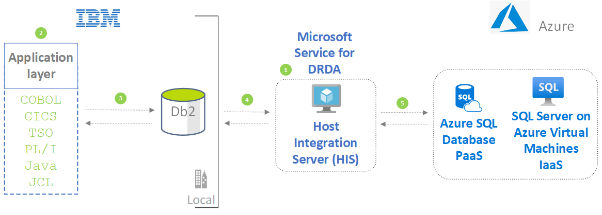

Main point: connect IBM clients to Azure databases

## Potential use cases

Intro phrase (something like "On-premises file replication and sync use cases include:")

see doc

## Architecture

1. Host Integration Server (HIS) software runs on an on-premises or Azure VM. HIS helps IBM host systems connect with Azure systems by providing integration services for networks, data, applications, messaging, and security features.

1. Mainframe and midrange applications run on the local system. These applications use languages and environments like COBOL, CICS, TSO, PL1, Java, and JCL. To access the Azure data store, no significant changes are needed in this code. The applications can access Azure databases in the same way that they access local mainframe or midrange tables.

1. A mainframe or midrange application sends a SQL request to the local Db2 subsystem. The solution uses these Db2 configurations, which reroute the request to the HIS server: 
   - The SYSIBM.IPNAMES table contains the IP address of the HIS server. See [Update SYSIBM.IPNAMES table](https://docs.microsoft.com/host-integration-server/core/configuring-db2-for-z-os#updating-sysibmipnames-table) for more information.
   - The SYSIBM.LOCATIONS table contains the name, address, and other properties of the target database. See [Update SYSIBM.LOCATIONS table](https://docs.microsoft.com/host-integration-server/core/configuring-db2-for-z-os#updating-sysibmlocations-table) for more information.

1. The HIS server receives the request and forwards it to the target database. IBM DB2 clients and servers communicate using Distributed Relational Database Architecture (DRDA) protocol and formats. Microsoft Service for DRDA is a component of HIS that functions as a DRDA Application Server (AS). In this role, Microsoft Service for DRDA converts the Db2 SQL statements and runs them on the Azure database.

1. The target database handles the request. This solution configures Azure SQL Database or SQL Server on Azure VM as target databases:

   - SQL Server on Azure VMs falls into the industry category Infrastructure-as-a-Service (IaaS). As an IaaS offering, SQL Server provides a customizable database engine. 
   - Azure SQL Database offers all the benefits of a fully managed and evergreen platform as a service (PaaS).
   
   These database services can also form the core of business intelligence solutions that offer analytics and insights.

### Components

Add the traditional list. Or maybe not. Theano used this text: "Various file moving, integration, and storage scenarios use different components. See the [Azure pricing calculator](https://azure.microsoft.com/pricing/calculator) to estimate costs for Azure resources." And then she used the list.

## Next steps

- For more information, contact Azure Data Engineering On-premises Modernization at [datasqlninja@microsoft.com](mailto:datasqlninja@microsoft.com).
- Read the [Azure Database Migration Guides](https://datamigration.microsoft.com/).

## Related resources

- [Replicate and sync mainframe data in Azure](/azure/architecture/reference-architectures/migration/sync-mainframe-data-with-azure)
- [Modernize mainframe and midrange data](/azure/architecture/reference-architectures/migration/modernize-mainframe-data-to-azure)
- [Migrate IBM mainframe applications to Azure with TmaxSoft OpenFrame](/azure/architecture/solution-ideas/articles/migrate-mainframe-apps-with-tmaxsoft-openframe)
- [Unisys mainframe migration with Asysco](/azure/architecture/reference-architectures/migration/unisys-mainframe-migration)
