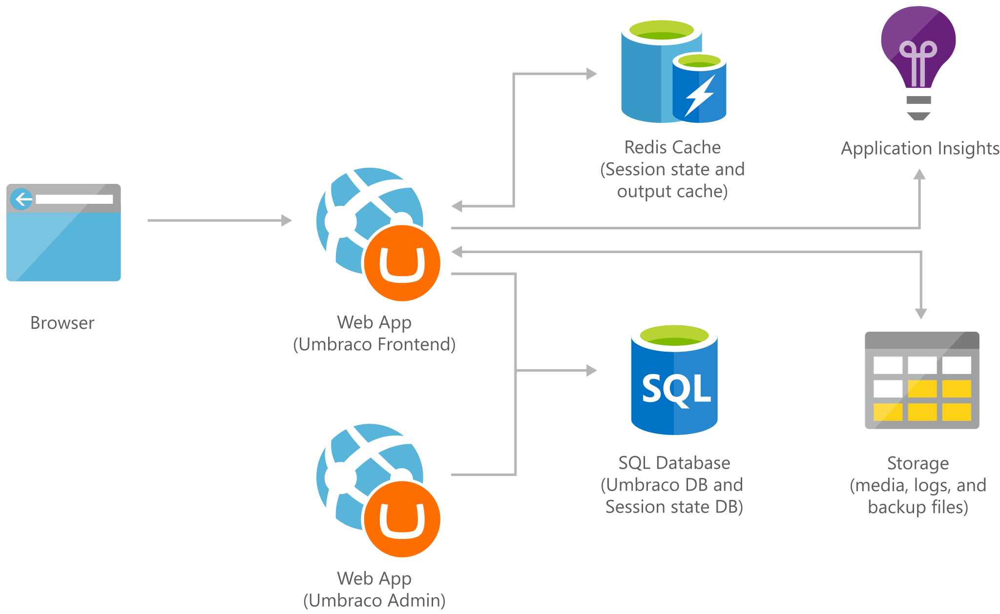

[!INCLUDE [header_file](../../../includes/sol-idea-header.md)]

Medium Umbraco CMS web app configured to scale and optimal for high-traffic sites. It uses two web apps, one for your front-end app and the other for your back-office app, deployed in a single region with autoscaling enabled.

This solution is built on the Azure managed services: [Azure SQL Database](https://azure.microsoft.com/services/sql-database), [Storage Accounts](https://azure.microsoft.com/services/storage), Application Insights and [Azure Cache for Redis](https://azure.microsoft.com/services/cache). These services run in a high-availability environment, patched and supported, allowing you to focus on your solution instead of the environment they run in.

## Architecture

*Download an [SVG](../media/medium-umbraco-web-app.svg) of this architecture.*

## Deploy to Azure

Use the following pre-built template to deploy this architecture to Azure

[Deploy to Azure](https://portal.azure.com/#create/Microsoft.Template/uri/https%3A%2F%2Fraw.githubusercontent.com%2FAzure%2Fazure-quickstart-templates%2Fmaster%2Fumbraco-cms-webapp-redis-cache%2Fazuredeploy.json)

[View template source](https://azure.microsoft.com/resources/templates/umbraco-cms-webapp-redis-cache)

## Components

* Run an Umbraco CMS on the [Web Apps](https://azure.microsoft.com/services/app-service/web) feature of Azure App Service with the front-end and back-office apps running on the same app.
* Store your site's content in [Azure SQL Database](https://azure.microsoft.com/services/sql-database). The back-office web app and front-end web app use the same database. Use [Azure SQL Database](https://azure.microsoft.com/services/sql-database)'s features such as backup and high availability.
* [Storage Accounts](https://azure.microsoft.com/services/storage): Store all your media in Azure Storage, so you can reduce I/O operation on the web app file server and improve performance.
* Application Insights: Detect issues, diagnose crashes, and track usage in your web app with Application Insights. Make informed decisions throughout the development lifecycle.
* Store session state and output cache on [Azure Cache for Redis](https://azure.microsoft.com/services/cache) to improve performance and reduce the load on your web front ends.

## Next steps
<!-- markdownlint-disable MD024 -->
* [Create a web app from the Azure Marketplace](/api/Redirect/documentation/articles/app-service-web-create-web-app-from-marketplace)
* [SQL Database tutorial: Create a SQL database in minutes by using the Azure portal](/api/Redirect/documentation/articles/sql-database-get-started)
* [Get started with Azure Blob storage using .NET](/api/Redirect/documentation/articles/storage-dotnet-how-to-use-blobs)
* [Logs, exceptions and custom diagnostics for ASP.NET in Application Insights](/api/Redirect/documentation/articles/app-insights-search-diagnostic-logs)
* [How to create a Web App with Azure Cache for Redis](/api/Redirect/documentation/articles/cache-web-app-howto)
* [Deploy to Azure](https://portal.azure.com/#create/Microsoft.Template/uri/https%3A%2F%2Fraw.githubusercontent.com%2FAzure%2Fazure-quickstart-templates%2Fmaster%2Fumbraco-cms-webapp-redis-cache%2Fazuredeploy.json)