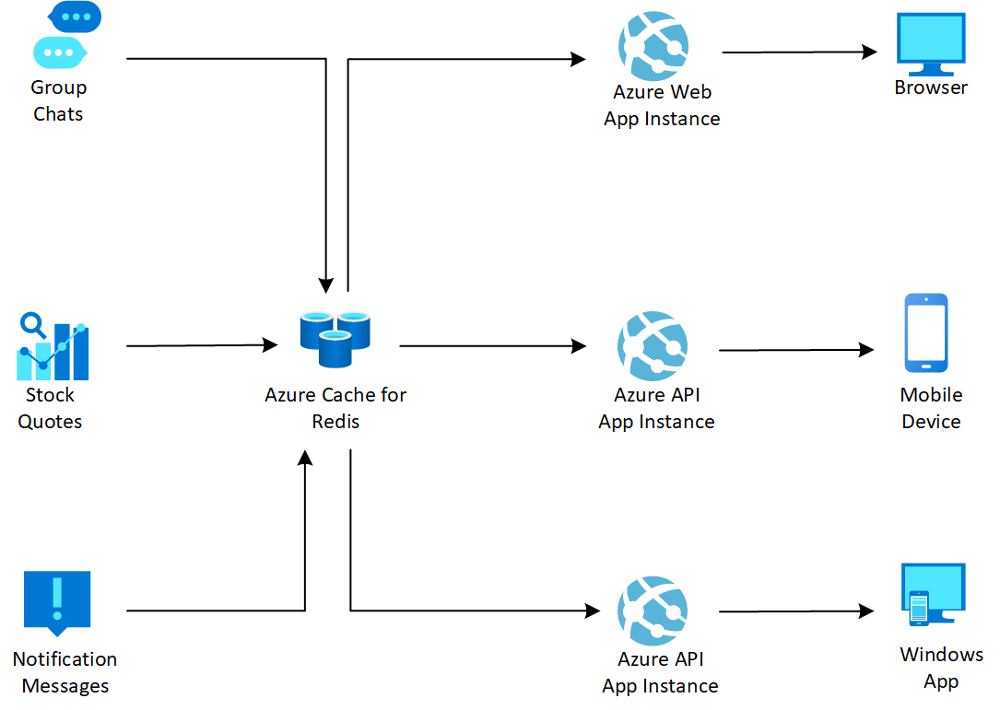

[!INCLUDE [header_file](../../../includes/sol-idea-header.md)]

This example scenario demonstrates how to use Azure Cache for Redis as a message broker to implement a publish/subscribe asynchronous messaging capability.  It's ideal for routing real-time messages and scaling up web communication frameworks such as SignalR.

## Architecture

*Download an [SVG](../media/messaging.svg) of this architecture.*

### Data flow

1. The publishers send messages to Azure Cache for Redis.
1. Azure Cache for Redis stores these messages and manages the delivery to the subscribers.
1. The subscribers pull messages that they have subscribed to from Azure Cache for Redis.

### Components

Key technologies used to implement this architecture:

* [Azure Cache for Redis](https://azure.microsoft.com/services/cache/) Azure Cache for Redis is a fully managed, in-memory cache that enables high-performance and scalable architectures. Use it to create cloud or hybrid deployments that handle millions of requests per second at sub-millisecond latency – all with the configuration,  security and availability benefits of a managed service.
* [Azure App Service](https://azure.microsoft.com/services/app-service) Azure App Service is an HTTP-based service for hosting web applications, REST APIs, and mobile back ends.  You can develop in your favorite language, be it .NET, .NET Core, Java, Ruby, Node.js, PHP, or Python. Applications run and scale with ease on both Windows and Linux-based environments.

## Next Steps

* [Asynchronous messaging options in Azure](../../guide/technology-choices/messaging-content.md)
* [Caching Best Practice](../../best-practices/caching.md?toc=%2fazure%2fredis-cache%2ftoc.json)
