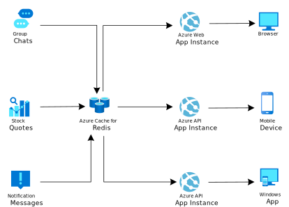

[!INCLUDE [header_file](../../../includes/sol-idea-header.md)]

This solution uses Azure Cache for Redis to route real-time messages in publish and subscribe systems. It also scales up web communication frameworks like Azure SignalR Service.

## Architecture

*Download a [Visio file](https://arch-center.azureedge.net/messaging.vsdx) of this architecture.*

### Dataflow

1. The publishers send messages to Azure Cache for Redis.
1. Azure Cache for Redis stores these messages and manages the delivery to the subscribers.
1. The subscribers pull messages that they've subscribed to from Azure Cache for Redis.

### Components

- [Azure Cache for Redis](https://azure.microsoft.com/services/cache) is a fully managed, in-memory cache that enables high-performance and scalable architectures. You can use it to create cloud or hybrid deployments that handle millions of requests per second at submillisecond latency—all with the configuration, security, and availability benefits of a managed service. Although Azure Cache for Redis is often used as a data cache to improve application performance, you can also use it as a message broker.
- [Azure App Service](https://azure.microsoft.com/services/app-service) is an HTTP-based service for hosting web applications, REST APIs, and mobile back ends. With App Service, you can develop in your favorite language, be it .NET, Java, Ruby, Node.js, PHP, or Python. Applications run and scale with ease in both Windows and Linux-based environments.
- [Azure SignalR Service](https://azure.microsoft.com/products/signalr-service) is an open-source software library that provides a way to send notifications to web apps in real time.

## Scenario details

This scenario demonstrates how to use Azure Cache for Redis as a message broker to implement a publish/subscribe asynchronous messaging capability. It's ideal for routing real-time messages. You can also use this solution to scale up web communication frameworks. For instance, you can use it to distribute messages across a SignalR application that's deployed on separate Internet Information Services (IIS) instances.

### Potential use cases

This solution applies to scenarios that use publish and subscribe systems, including:

- Middleware that connects the microservices of business functions within a company.
- Collection and distribution systems for application logs.
- Seating reservation systems.

## Next steps

- [About Azure Cache for Redis](/azure/azure-cache-for-redis/cache-overview)
- [App Service overview](/azure/app-service/overview)
- [What is Azure SignalR Service?](/azure/azure-signalr/signalr-overview)
- [Implement pub/sub and streams in Azure Cache for Redis](/training/modules/azure-redis-publish-subscribe-streams)
- [SignalR scale out with Redis](/aspnet/signalr/overview/performance/scaleout-with-redis)

## Related resources

- [Asynchronous messaging options in Azure](../../guide/technology-choices/messaging.yml)
- [Caching guidance](../../best-practices/caching.yml)
