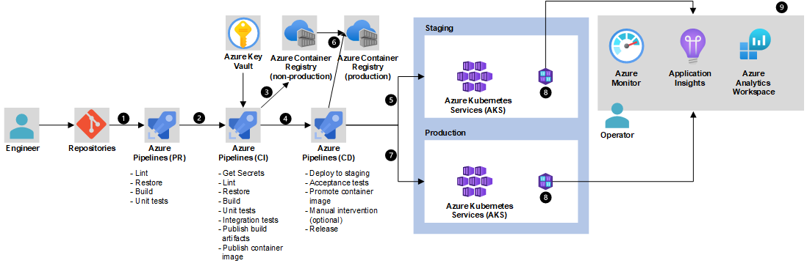

[!INCLUDE [header_file](../../../includes/sol-idea-header.md)]

Use AKS to simplify the deployment and management of microservices-based architecture. AKS streamlines horizontal scaling, self-healing, load balancing, and secret management.

## Architecture

*Download a [Visio file](https://arch-center.azureedge.net/microservices-with-aks.vsdx) of this architecture.*

### Dataflow

1. Developer uses an IDE, such as Visual Studio, to commit changes to GitHub.
1. GitHub triggers a new build on Azure DevOps.
1. Azure DevOps packages the microservices as containers and pushes them to the Azure Container Registry.
1. Containers are deployed to the AKS cluster.
1. Users access services via apps and a website.
1. Azure Active Directory is used to secure access to the resources.
1. Microservices use databases to store and retrieve information.
1. Administrator accesses via a separate admin portal.

### Components

- [Azure DevOps](https://azure.microsoft.com/services/devops/) packages the microservices as containers.
- [Azure Kubernetes Service](https://azure.microsoft.com/services/kubernetes-service/) offers fully managed Kubernetes clusters for deployment, scaling, and management of containerized applications.
- [Azure Container Registry](https://azure.microsoft.com/services/container-registry/) is a managed, private Docker registry service on Azure. Use Container Registry to store private Docker images, which are deployed to the cluster.
- [GitHub Enterprise](https://help.github.com/en/github) provides a code-hosting platform that developers can use for collaborating on both open-source and inner-source projects.
- [Azure Pipelines](https://azure.microsoft.com/services/devops/pipelines/) Pipelines is part of Azure DevOps Services that is used to run automated builds, tests, and deployments. Every time code is changed in the code repository, Azure DevOps pipeline continuously builds container images, pushed to your Azure Container Registry, and the manifests are then deployed to your Azure Kubernetes Service cluster.
- [Azure Active Directory](https://azure.microsoft.com/services/active-directory/). When AKS is integrated with Azure Active Directory, it allows to use Azure AD users, groups, or service principals as subjects in Kubernetes RBAC to manage AKS resources securely.
- [Azure Database for MySQL](https://azure.microsoft.com/services/mysql/) is a fully managed MySQL Database service on Azure to store stateful data.
- [Azure SQL Database](https://azure.microsoft.com/services/sql-database/) is a fully managed and intelligent relational database service built for the cloud. With SQL Database, you can create a highly available and high-performance data storage layer for modern cloud applications.
- [Azure Cosmos DB](https://azure.microsoft.com/services/cosmos-db/) is a fully managed NoSQL database service for building and modernizing scalable, high performance applications.

## Next steps

- To learn about the AKS product roadmap, see [Azure Kubernetes Service Roadmap on GitHub](https://github.com/Azure/AKS/projects/1).
- If you need a refresher in Kubernetes, complete the [Azure Kubernetes Service Workshop](/learn/modules/aks-workshop/), to deploy a multi-container application to Kubernetes on Azure Kubernetes Service (AKS).

## Related resources

- To learn about hosting Microservices on AKS, see [Microservices architecture on Azure Kubernetes Service (AKS)](../../reference-architectures/containers/aks-microservices/aks-microservices.yml).
- Follow the [Azure Kubernetes Service solution journey](../../reference-architectures/containers/aks-start-here.md).
- See the [CI/CD pipeline for container-based workloads](../../example-scenario/apps/devops-with-aks.yml).
