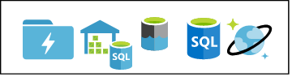
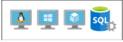

[!INCLUDE [header_file](../../../includes/sol-idea-header.md)]

To address business transformations like acquisitions or divesture, teams need to plan for the separation or joining of their cloud workloads from an existing security tenant (Azure Active Directory) to a new one. This article describes how to define and implement a cross-tenant workload migration strategy.

## Architecture

:::image type="content" source="../media/cross-tenant-migration-strategy.svg" alt-text="Diagram that shows a cross-tenant migration architecture." border="false":::

*Download a [Visio file](https://arch-center.azureedge.net/cross-tenant-migration-strategy.vsdx) of this architecture.* 

### Dataflow

1. 
   a. Extract the Azure Resource Manager (ARM) template and configuration artifacts and store them in a source code / configuration repository. This step conforms with Infrastructure as Code (IaC) practices and ensures that the migrated resources have the same resource deployment definition. It also facilitates deployment automation.

   b. Deploy the artifacts (infrastructure and configuration) to the target resource group or groups in the new tenant subscription.

2. Create a sidecar subscription in the existing tenant to host cloned data service resources and backups of virtual machines (VMs). This step requires Global Administrator permissions. Most organizations have an admin team that can create this subscription.

3. Clone the resources by using a tool like Azure Data Factory, AzCopy for data migration, or native backup and restore.

4. Move the subscription to the new tenant.

5. Either move the resources to the target resource group or migrate data to pre-created resources in the target resource group. Alternatively, restore VMs from the backups. The implementation plan should describe the provisioning method.

6. Delete the sidecar subscription.

### Components

* [Azure Active Directory (Azure AD)](https://azure.microsoft.com/products/active-directory) is a cloud-based identity and access management service. Your Azure AD tenant represents your organization and helps you manage an instance of cloud services for your internal and external users.
* [An Azure subscription](/azure/cloud-adoption-framework/ready/considerations/fundamental-concepts) is a logical container for your resources. Each Azure resource is associated with only one subscription. Creating a subscription is the first step in adopting Azure.
* [Azure DevOps](https://azure.microsoft.com/services/devops) provides developer services that can help your teams plan work, collaborate on code development, and build and deploy applications.
* [Azure Backup](https://azure.microsoft.com/products/backup) provides cost-effective solutions for backing up your data and recovering it from Azure.
* [Azure App Service](https://azure.microsoft.com/products/app-service) is an HTTP-based service for hosting web applications, REST APIs, and mobile back ends. It provides [continuous deployment](/azure/app-service/deploy-continuous-deployment) and other DevOps capabilities.
* [Azure SQL Database](https://azure.microsoft.com/products/azure-sql/database) is a fully managed and intelligent relational database service that's built for the cloud. You can use SQL Database to create a high-performance data storage layer for modern cloud applications.
* The [Azure Storage](https://azure.microsoft.com/products/category/storage) platform is the Microsoft cloud solution for modern data storage scenarios. Azure Storage provides highly available, massively scalable, durable storage for various data objects in the cloud.
* [Azure Synapse Analytics](https://azure.microsoft.com/products/synapse-analytics) is an enterprise analytics service that accelerates time to insight across data warehouses and big data systems.
* [Azure Machine Learning](https://azure.microsoft.com/products/machine-learning) is a cloud service for accelerating and managing the machine learning project lifecycle. Machine learning professionals, data scientists, and engineers can use it in their day-to-day workflows.
* [Azure Databricks](https://azure.microsoft.com/products/databricks) provides a unified set of tools for building, deploying, sharing, and maintaining enterprise-grade data solutions at scale.
* [Azure Cognitive Services](https://azure.microsoft.com/products/cognitive-services) is a set of cloud-based AI services that can help developers build cognitive intelligence into applications, even if they don't have AI or data science skills or knowledge.
* [Azure Cosmos DB](https://azure.microsoft.com/products/cosmos-db) is a fully managed NoSQL and relational database for modern app development. 
* [Azure Event Hubs](https://azure.microsoft.com/products/event-hubs) is a big data streaming platform and event ingestion service.
* [Azure Key Vault](https://azure.microsoft.com/products/key-vault) is a cloud service that you can use to provide access to secrets and store them with enhanced security. 
* [Azure Virtual Machines](https://azure.microsoft.com/products/virtual-machines) is one of several types of on-demand, scalable computing resources that Azure offers. You typically use a virtual machine when you need more control over the computing environment than other choices provide.
* [Resource groups](/azure/azure-resource-manager/management/manage-resource-groups-cli) are logical containers for Azure resources. Resource groups are used to organize all resources that are related to this project.

## Scenario details

Modern cloud workloads use cloud-native security standards and policy-driven governance to establish standardization across environments and maximize TCO by reducing non-standard operations management. To address business transformations like acquisitions or divesture, the organizational team, including developers, architects, operations, and technical decision makers, need to plan for the separation or joining of their cloud workloads from an existing to a new security (Azure AD) tenant. This planning can help ensure that all data and application services that rely on IaaS or PaaS cloud components are migrated, secured, and isolated to their respective business boundaries. 

You can use the built-in subscription-move capability to move the entire subscription under a new Azure Active Directory (Azure AD) tenant. However, in practice, most divesture organization workloads are mixed with the retaining organization workloads before the split, so the complete isolation requires more granular workload migrations.

In this scenario, a healthcare company with multiple global business units wants to divest a business. To do that, they need to define and implement a cross-tenant workload migration strategy.

To start, the company needs to categorize workload resources as PaaS (compute), PaaS and IaaS (data services), or IaaS (compute). Following are three approaches, one for each of these resource types. These approaches provide a quick, enhanced-security migration that can result in reduced TCO.

- PaaS (compute) resources that run based on logic and configuration

   

  **Solution:** Re-create these resources in the target tenant. Use DevOps processes.

- PaaS and IaaS (data services) resources that store data

   

   **Solution:** Azure subscriptions can be relocated from one Azure AD tenant to another. Move these resources to the new tenant via a sidecar subscription. You need to carefully evaluate the resources before you move them. For example, Azure SQL databases with Azure AD authentication integration enabled can't be moved as they are. Use backup and restore instead. This process removes all role-based access control (RBAC) assignments. After the resource is moved to the new tenant, you need to restore those RBAC assignments.

- IaaS (compute) resources that provide hosting for customized logic (for example, VMs)

   

   **Solution:** For this type of resource, take backups and restore the resources in the target environment.

### Potential use cases

- Organizational divesture and acquisition
- Internal organization spin-offs
- Investing natively in Azure and moving away from a service provider model

## Contributors

*This article is maintained by Microsoft. It was originally written by the following contributors.*

Principal author:

- [Lalit Patel](https://www.linkedin.com/in/lalit-r-patel-5108a) | Principal Cloud Solution Architect

Other contributor:

- [Mick Alberts](https://www.linkedin.com/in/mick-alberts-a24a1414) | Technical Writer 

## Next steps

- [Azure RBAC documentation](/azure/role-based-access-control)
- [Migrate an Azure subscription](/azure/cost-management-billing/manage/billing-subscription-transfer#transfer-a-subscription-to-another-azure-ad-tenant-account)
- [Query to list affected resources when transferring an Azure subscription](/azure/governance/resource-graph/samples/samples-by-category?tabs=azure-cli#list-impacted-resources-when-transferring-an-azure-subscription)
- [What is Azure Active Directory?](/azure/active-directory/fundamentals/active-directory-whatis)
- [Azure Backup documentation](/azure/backup)
- [What is Azure SQL Database?](/azure/azure-sql/database/sql-database-paas-overview)

## Related resources

- [Microsoft security best practices for identity and access management](/security/compass/identity)
- [Design a CI/CD pipeline using Azure DevOps](../../example-scenario/apps/devops-dotnet-baseline.yml)
- [Back up on-premises applications and data to the cloud](../../solution-ideas/articles/backup-archive-on-premises-applications.yml)
