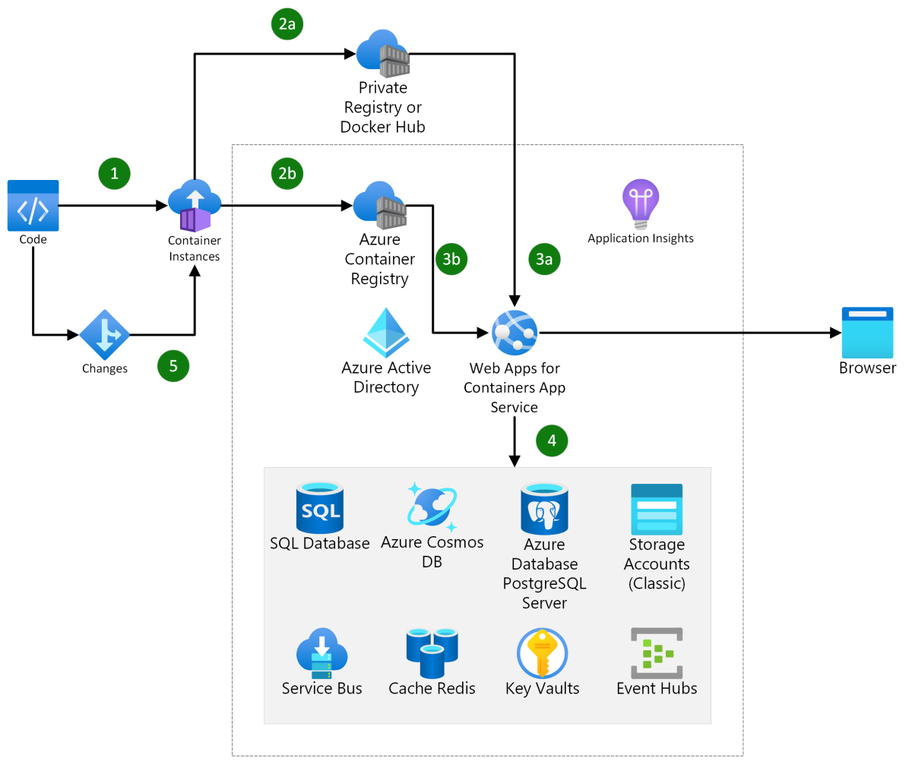

[!INCLUDE [header_file](../../../includes/sol-idea-header.md)]

Easily migrate existing web applications to container(s) and run the container on Web App for Containers in Azure App Service. Web App for Containers allows you to focus on composing your containers without worrying about managing and maintaining an underlying container orchestrator. When you build web apps, Web App for Containers is a good option for taking your first steps with containers. Containers easily other Azure resources like storage and database services.

## Architecture

*Download a [Visio file](https://arch-center.azureedge.net/migrate-existing-applications-to-container-apps.vsdx) of this architecture.*

### Dataflow

1. Developer converts existing web application to container.
2. Developer publishes container image to:
    1. Azure Container Registry.
    1. Or, a private registry or Docker Hub.
3. App Service pulls image with:
    1. Managed identity, which uses an Azure Active Directory security principal to  access to Azure Container Directory.
    1. Or, credentials for private registry or Docker Hub if required.
4. Service connectors to access other Azure resources.
5. Developer pushes new image to the container registry, which triggers App Service updates when continuous deployment is enabled.

### Components

[Web App for Containers](https://azure.microsoft.com/services/app-service/containers/): With App Service, you can deploy and run containerized web apps on Windows and Linux. Containerized apps can scale as needed in a fully managed platform. Create streamline CI/CD workflow with Docker Hub, Azure Container Registry, and GitHub.

[Azure Container Registry](https://azure.microsoft.com/services/container-registry/):  A registry of Docker and Open Container Initiative (OCI) images, with support for all OCI artifacts. Use container images in Azure services like App Service, Machine Learning, and Batch. For example, when configuring Web App for Containers for your web app, you can specify a container image from Azure Container Registry.

[Azure Cosmos DB](https://azure.microsoft.com/services/cosmos-db/): A fully managed NoSQL database service for building and modernizing scalable, high-performance applications. Cosmos DB is integrated with key Azure services including Azure Functions, IoT Hub, AKS (Azure Kubernetes Service), App Service, and more. You can choose from multiple database APIs including the native Core (SQL) API, API for MongoDB, Cassandra API, Gremlin API, and Table API.

[Azure SQL Database](https://azure.microsoft.com/services/sql-database): A fully managed relational database with built-in intelligence. Azure SQL Database helps you build applications locally or in the cloud on popular platforms and frameworks with driver support for the most common languages, and simplify development with native support for websites running in Azure App Service.

[Azure Storage](https://azure.microsoft.com/services/storage): Azure Storage offers a durable, highly available, massively scalable cloud storage solution and includes object, file, disk, queue, and table storage.  Azure storage includes services for object, block, and file storage to meet your website's demands. For example, websites can easily use Azure Blob Storage for scalable and secure block storage for website media like photos and videos.

[Azure Monitor](https://azure.microsoft.com/services/monitor/): Application Insights, provides health and performance monitoring, and diagnostics. Azure Monitor can be used with Web App for Containers (App Service) to monitor website metrics like number of connections and counts of request resulting in HTTP status codes.

[Azure Service Connector](/azure/service-connector/): Service Connector helps you connect Azure compute services to other backing services. For example, use a service connector between Azure App Service and Azure Database for MySQL or PostgreSQL, Azure Storage, and Azure Key Vault. For a full list of supported services, see [Services are supported in Service Connector](/azure/service-connector/overview#what-services-are-supported-in-service-connector).

## Scenario details

### Potential use cases

This solution idea is ideal for migrating current web applications to containers run on Azure. This solution idea can be used to create a website when the following apply:

* Uses existing programming experience used to create code-deployed websites to create container-deployed websites. Lift and shift existing web apps to containers on App Service.

* Simplified development and deployment with tools like Visual Studio, Visual Studio Code, Azure CLI, and Azure Cloud Shell.

* Portability across different environments from dev to production and different clouds. You can test locally, on a different platform than what is deployed for production.

* Scalability in App Service means you can scale out number of workers used on demand.

* Modularity for future website work either in App Service or in other services like Azure Container Apps and Azure Kubernetes Service. Web Apps for Containers can be a good first step for moving to containers.

* A container deployed in Web Apps for Containers is ready for continuous integration and continuous deploy (CI/CD). CI/CD capabilities allow you to ship updates faster.

## Contributors

[Marc Gelormino](https://www.linkedin.com/in/marcgelormino/) | Content Developer

## Next steps

* [Deploy and run a containerized web app with Azure App Service](/training/modules/deploy-run-container-app-service/)
* [Manage container images in Azure Container Registry](/training/modules/publish-container-image-to-azure-container-registry/)
* [Overview on Web App for Containers and Azure App Service on Linux](https://azure.microsoft.com/blog/webapp-for-containers-overview/)
* [Comparing Container Apps with other Azure container options](/azure/container-apps/compare-options)
* [CI/CD for Containers](/azure/architecture/solution-ideas/articles/cicd-for-containers)

## Related resources

Related architecture guides:

* [Web applications architecture design](/azure/architecture/guide/web/web-start-here)
* [Run containers in a hybrid environment](/azure/architecture/hybrid/hybrid-containers)

Example language deployments of containers in App Service:

* [Deploy a containerized Python web app on Azure App Service](/azure/developer/python/tutorial-containerize-deploy-python-web-app-azure-01)
* [Deploy Express.js with VS Code to Azure App Service](/azure/developer/javascript/tutorial/tutorial-vscode-docker-node/tutorial-vscode-docker-node-01)
* [Deploy an ASP.NET Core container to Azure App Service using Visual Studio](/visualstudio/containers/deploy-app-service)
