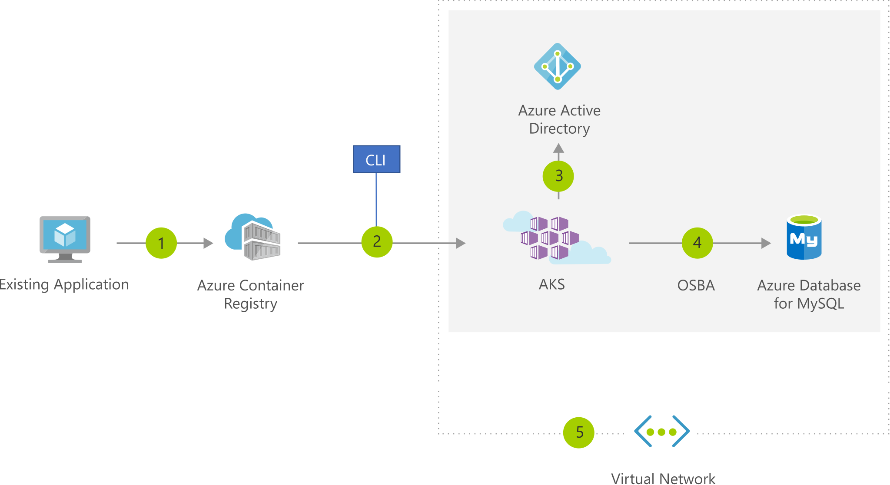

[!INCLUDE [header_file](../../../includes/sol-idea-header.md)]

Easily migrate existing application to container(s) and run within the Azure managed Kubernetes service (AKS). Control access via integration with Azure Active Directory and access SLA-backed Azure Services, such as Azure Database for MySQL using OSBA (Open Service Broker for Azure), for your data needs.

## Architecture

*Download an [SVG](../media/migrate-existing-applications-with-aks.svg) of this architecture.*

### Dataflow

1. User converts existing application to container(s) &amp; publishes container image(s)to the Azure Container Registry
1. Using Azure Portal or command line, user deploys containers to AKS cluster
1. Azure Active Directory is used to control access to AKS resources
1. Easily access SLA-backed Azure Services such as Azure Database for MySQL using OSBA (Open Service Broker for Azure)
1. Optionally, AKS can be deployed with a VNET virtual network
