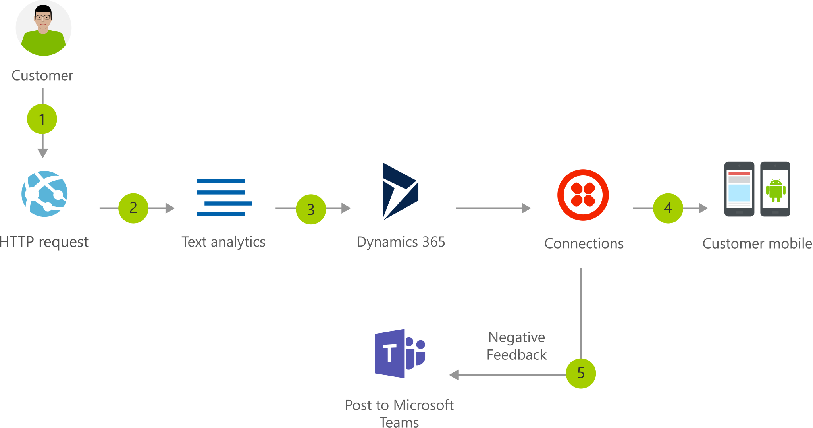

[!INCLUDE [header_file](../../../includes/sol-idea-header.md)]

This line-of-business application solution provides a mechanism for monitoring and responding to customer feedback. Easily connect multiple business systems to enable nimbler customer support.

## Architecture

*Download an [SVG](../media/modern-customer-support-portal-powered-by-an-agile-business-process.svg) of this architecture.*

### Dataflow

1. Customer submits feedback posted to a web endpoint.
1. The feedback is posted to Azure Cognitive Services Text Analytics API to extract sentiment and keywords.
1. The customer feedback creates a new case in Dynamics CRM or other CRM.
1. The solution sends a text message to the customer, thanking them for the feedback.
1. If the feedback sentiment scores lower than 0.3, the app posts this information to a customer service channel to respond.

### Components

- [Azure Text Analytics](https://azure.microsoft.com/services/cognitive-services/text-analytics)
- [Dynamics 365](https://dynamics.microsoft.com)
- [Microsoft Teams](https://teams.microsoft.com)

## Next steps

- [Matching the architecture to your business needs](../../guide/design-principles/build-for-business.md)
- [Managing identities in your applications](../../multitenant-identity/index.yml)
- [Automate access and use of data across applications with Logic Apps](/azure/logic-apps)
- [Infuse intelligence into your apps with Cognitive Services](/azure/cognitive-services/welcome)
