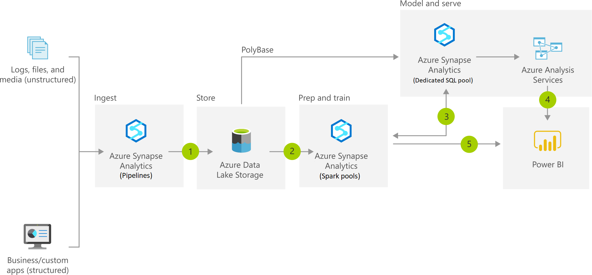

[!INCLUDE [header_file](../../../includes/sol-idea-header.md)]

A modern data warehouse lets you bring together all your data at any scale easily, and to get insights through analytical dashboards, operational reports, or advanced analytics for all your users.

## Architecture

*Download an [SVG](../media/modern-data-warehouse.svg) of this architecture.*

## Data Flow

1. Combine all your structured, unstructured and semi-structured data (logs, files, and media) using Azure Data Factory to Azure Blob Storage.
1. Leverage data in Azure Blob Storage to perform scalable analytics with Azure Databricks and achieve cleansed and transformed data.
1. Cleansed and transformed data can be moved to Azure Synapse Analytics to combine with existing structured data, creating one hub for all your data. Leverage native connectors between Azure Databricks and Azure Synapse Analytics to access and move data at scale.
1. Build operational reports and analytical dashboards on top of Azure Data Warehouse to derive insights from the data, and use Azure Analysis Services to serve thousands of end users.
1. Run ad hoc queries directly on data within Azure Databricks.

## Components

* [Azure Synapse Analytics](https://azure.microsoft.com/services/synapse-analytics) is the fast, flexible and trusted cloud data warehouse that lets you scale, compute and store elastically and independently, with a massively parallel processing architecture.
* Azure [Data Factory](https://azure.microsoft.com/services/data-factory) is a hybrid data integration service that allows you to create, schedule and orchestrate your ETL/ELT workflows.
* [Azure Blob storage](https://azure.microsoft.com/services/storage/blobs) is a Massively scalable object storage for any type of unstructured data-images, videos, audio, documents, and more-easily and cost-effectively.
* [Azure Databricks](https://azure.microsoft.com/services/databricks) is a fast, easy, and collaborative Apache Spark-based analytics platform.
* [Azure Analysis Services](https://azure.microsoft.com/services/analysis-services) is an enterprise grade analytics as a service that lets you govern, deploy, test, and deliver your BI solution with confidence.
* [Power BI](https://powerbi.microsoft.com) is a suite of business analytics tools that deliver insights throughout your organization. Connect to hundreds of data sources, simplify data prep, and drive ad hoc analysis. Produce beautiful reports, then publish them for your organization to consume on the web and across mobile devices.

## Next steps

* [Synapse Analytics Documentation](/azure/sql-data-warehouse)
* [Azure Data Factory V2 Preview Documentation](/azure/data-factory)
* [Introduction to object storage in Azure](/azure/storage/blobs/storage-blobs-introduction)
* [Azure Databricks Documentation](/azure/azure-databricks)
* [Analysis Services Documentation](/azure/analysis-services)
* [Power BI Documentation](/power-bi)

## Pricing Calculator

* [Customize and get pricing estimates](https://azure.com/e/4269bfbeee564d3cb88348a033e022e8)