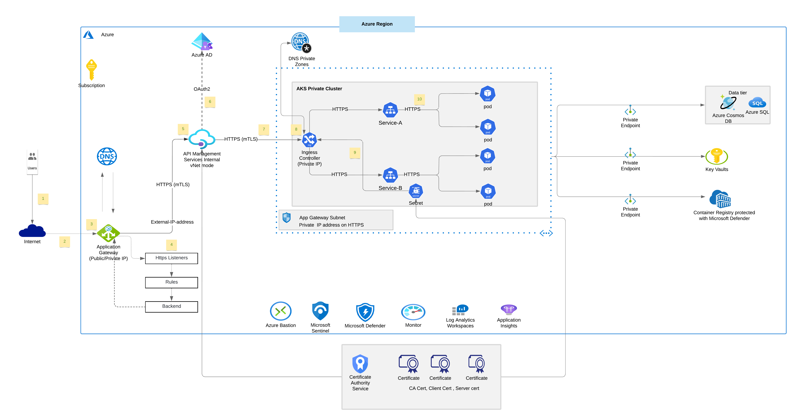

[!INCLUDE [header_file](../../../includes/sol-idea-header.md)]

This solution demonstrates how to integrate Azure Kubernetes Service,API Managenent with mTLS with end to end encryption.

## Potential use cases

Azure Kubernetes Service (AKS) integration with API Management and Application Gateway with mTLS. Deploy AKS as private cluster, horizontal scaling, self-healing,  load balancing, and secret management using Azure Key Vault. Securely connect to Azure PaaS services over private endpoint.

This approach can be used to manage the following scenarios:

* Integrate API Management with Azure Kubernetes Service
* Deploy API Management in internal mode and expose APIs using Application Gateway
* Configure mTLS and end to end encryption for maximum secuirty and traffic over Https  
* Securely connect to Azure PaaS services over Private Endpoint
* Microsoft Defender for Cloud for Container secuirty

## Architecture

*Download a [Visio file](https://arch-center.azureedge.net/mutual-tls-for-deploying-aks-and-apim.vsdx) of this architecture.*

### Dataflow

1. User request to application endpoint from internet
2. Application Gateway receive traffic as Https and Validate PFX certificate, private key
3. Decrypt traffic using private Keys ( SSL Offloaded) and ReEncrypt traffic using Public Key ( end-to-end encryption )
4. Apply Application Gateway rules, Http Settings base on backend pool and send traffic to backend pool over Https
5. API Management deployed as internal vNet mode with private IP address and receive traffic as Https with custom domain PFX certificates
6. API Management policies and authentication using OAuth with Azure Active directory
7. Traffic send to AKS ( Azure Kubernetes Service) ingress controller over Https
8. AKS ingress controller receive traffic as Https and verify PEM server certificate and private key
9. Ingress TLS secret ( Kubernetes Secret) process with pem.cert and pem.key. Decrypt traffic using private key (  Offloaded)
10. Re-encrypt traffic using Private Key and send traffic to AKS service to Pods over Https. AKS Ingress can be configured as Https backend or Passthrough based on requirement

### Components

* [Application Gateway](https://learn.microsoft.com/en-us/azure/application-gateway/overview) Azure Application Gateway is a web traffic load balancer that enables you to manage traffic to web applications
* [Azure Kubernetes Service](https://azure.microsoft.com/services/kubernetes-service) offers fully managed Kubernetes clusters for deployment, scaling, and management of containerized applications.
* [Azure Container Registry](https://azure.microsoft.com/services/container-registry) is a managed, private Docker registry service on Azure. Use Container Registry to store private Docker images, which are deployed to the cluster.
* [Azure Active Directory](https://azure.microsoft.com/services/active-directory). When AKS is integrated with Azure Active Directory, it allows you to use Azure AD users, groups, or service principals as subjects in Kubernetes RBAC to manage AKS resources securely.
* [Azure SQL Database](https://azure.microsoft.com/services/sql-database) is a fully managed and intelligent relational database service built for the cloud. With SQL Database, you can create a highly available and high-performance data storage layer for modern cloud applications.
* [Azure Cosmos DB](https://azure.microsoft.com/services/cosmos-db) is a fully managed NoSQL database service for building and modernizing scalable, high performance applications.
* [Azure API Management](https://azure.microsoft.com/en-us/products/api-management) Publish APIs to developers, partners, and employees securely and at scale.
* [Azure Private Endpoint](https://azure.microsoft.com/en-us/products/private-link) Private access to Azure PaaS services hosted on the Azure platform, keeping your data on the Microsoft network.
* [Azure Key Vault](https://azure.microsoft.com/en-us/products/key-vault) Safeguard and maintain control of keys and other secrets.
* [Microsoft Defender for Cloud](https://azure.microsoft.com/en-us/products/defender-for-cloud) Microsoft Defender for Cloud is a solution for cloud security posture management (CSPM) and cloud workload protection (CWP) that finds weak spots across your cloud configuration, helps strengthen the overall security posture of your environment, and can protect workloads across multicloud and hybrid environments from evolving threats.
* [Azure Monitor](https://azure.microsoft.com/en-us/products/monitor) Collect, analyze, and act on telemetry data from your Azure and on-premises environments. Azure Monitor helps you maximize performance and availability of your applications and proactively identify problems in seconds.
* [Log Analytics in Azure Monitor](https://learn.microsoft.com/en-us/azure/azure-monitor/logs/log-analytics-overview) Log Analytics is a tool in the Azure portal that's used to edit and run log queries with data in Azure Monitor Logs.
* [Application Insights in Azure Monitor](https://learn.microsoft.com/en-us/azure/azure-monitor/app/app-insights-overview) Application Insights is an extension of Azure Monitor and provides Application Performance Monitoring (also known as “APM”) features.
* [Microsoft Sentinel](https://azure.microsoft.com/en-us/products/microsoft-sentinel) Microsoft Sentinel is a cloud-native security information and event manager (SIEM) platform that uses built-in AI to help analyze large volumes of data across an enterprise—fast.
* [Azure Bastion](https://azure.microsoft.com/en-us/products/azure-bastion) Azure Bastion is a fully managed service that provides more secure and seamless Remote Desktop Protocol (RDP) and Secure Shell Protocol (SSH) access to virtual machines (VMs) without any exposure through public IP addresses. Provision the service directly in your local or peered virtual network to get support for all the VMs within it.

## Next steps

* To learn about the AKS product roadmap, see [Azure Kubernetes Service Roadmap on GitHub](https://github.com/Azure/AKS/projects/1).
* Learn more about Azure Kubernetes Service (AKS), see [Azure Kubernetes Service (AKS) documentation](https://learn.microsoft.com/en-us/azure/aks/intro-kubernetes).
* Azure Kubernetes Service learning path [AKS Learing](https://learn.microsoft.com/en-us/training/paths/intro-to-kubernetes-on-azure).  
* Learn about API management landing zone accelerator, see [Azure API Management on GitHub](https://github.com/Azure/apim-landing-zone-accelerator).
* Microsoft Defender for Cloud Blog [Microsoft Defender for Cloud on Blog](https://techcommunity.microsoft.com/t5/microsoft-defender-for-cloud/bg-p/MicrosoftDefenderCloudBlog).

## Related resources

* Follow the [Azure Kubernetes Service solution journey](../../reference-architectures/containers/aks-start-here.md).
* Explore API MAnagement learning path [Azure API Management training](https://learn.microsoft.com/en-us/training/modules/explore-api-management/).
