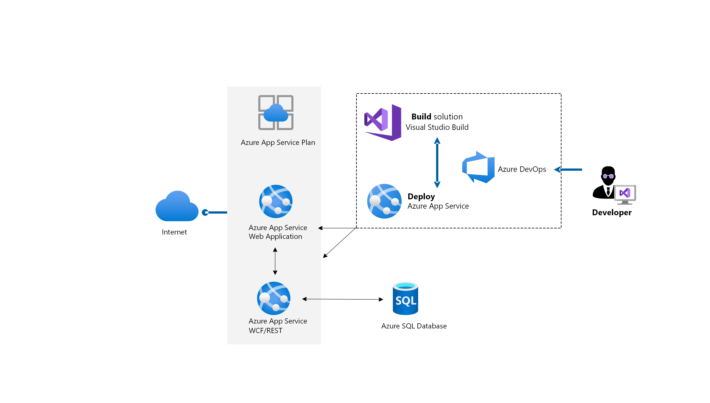

[!INCLUDE [header_file](../../../includes/sol-idea-header.md)]

Modern web applications must meet higher user expectations and greater demands than ever before. By migrating legacy .NET applications to Azure, organizations can ensure their apps are incredibly secure, flexible and available from anywhere in the world, and scalable to meet spikes in demand.

## Architecture

The following annotations describe the migration process:

1. Provision an Azure SQL Database instance in Azure. After the app website is migrated to Azure, the WCF/REST services app will point to this instance.
2. Assess the database using Data Migration Assistant and migrate it using the Database Migration Service.
3. Provision the two web apps.
4. Set up Azure DevOps: create a new Azure DevOps project, and import the GitHub repo.
5. Configure connection strings so that the web tier web app, the WCF/REST services web app, and the SQL instance can communicate.
6. Set up build and release pipelines to create the app, and deploy to two separate web apps.

### Components

- [Azure App Service](/azure/app-service/overview) is an HTTP-based service for hosting web applications, REST APIs, and mobile back ends. You can take advantage of its DevOps capabilities, such as continuous deployment, as shown here.
- [Azure SQL Database](/azure/azure-sql/database/sql-database-paas-overview) is a fully managed and intelligent relational database service built for the cloud. With SQL Database, you can create a highly available and high-performance data storage layer for modern cloud applications.
- [Azure DevOps](https://azure.microsoft.com/services/devops/) provides developer services to support teams to plan work, collaborate on code development, and build and deploy applications.
- [Azure Database Migration Service](/azure/dms/dms-overview) enables seamless migration from multiple database sources to Azure, with minimal downtime.

## Solution details

In this scenario, a global online retail business needs to modernize their existing .NET application due to changes in customer demand. They migrate their web and mobile application to the cloud for increased efficiency, agility, and scale, as well as reduced costs. Here, we show a proposed architecture: a fully managed platform for building, deploying, and scaling your web apps with Azure App Service and Azure SQL Database.

For the data tier of the app, this company chose Azure SQL Database for its dynamic scalability, built-in intelligence optimization, and global scalability and availability. They leveraged Azure Database Migration Service to migrate their on-premises database to Azure SQL. For the app tier, they chose Azure App Service, a PaaS service that enables them to deploy the app with just a few configuration changes using Visual Studio. They chose to deploy two web apps, one for the customer-facing front-end website, and the other a WCF (Windows Communication Framework) or REST services app that talks to both the front-end app and the database and processes business logic.

By following this process, customers can connect to the online retail catalog via the web app. The load balancer automatically scales during periods of increased traffic to improve application uptime. Product inventory and pricing are queried and pulled from Azure SQL Database, as follows:

1. Customers connect to the online catalog via the front end web app
2. Azure App Service provides security and automated management.  DevOps capabilities are also possible such as continuous deployment from Azure DevOps.
3. Product inventory and pricing are queried and pulled from Azure SQL Database.

## Next Steps

- [Learn more](/azure/cloud-adoption-framework/migrate/azure-best-practices/contoso-migration-refactor-web-app-sql) about the migration process used in this example.
- Learn how [Stackify](https://customers.microsoft.com/story/726302-stackify) uses Azure SQL Database and Azure App Service to power their .NET applications.
- [Learn how](/learn/paths/migrate-sql-workloads-azure/) to migrate your on-premises SQL workloads to Azure.
- Explore [learning paths](/learn/browse/?products=azure-app-service&roles=developer) and training modules for developers using Azure App Service
