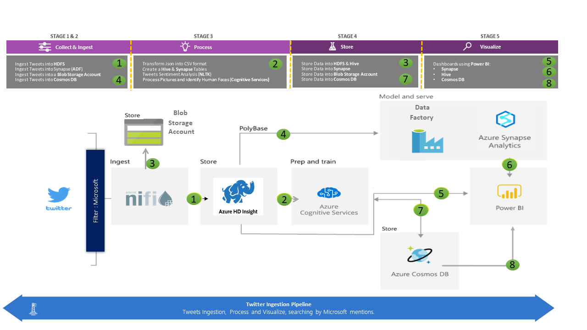
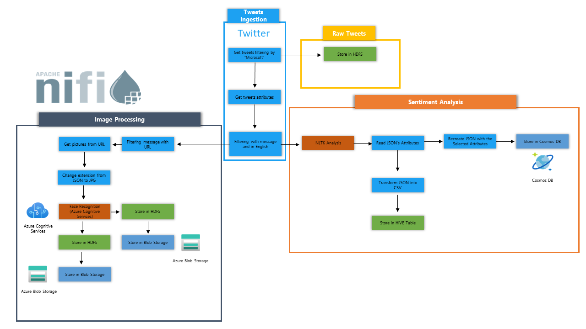
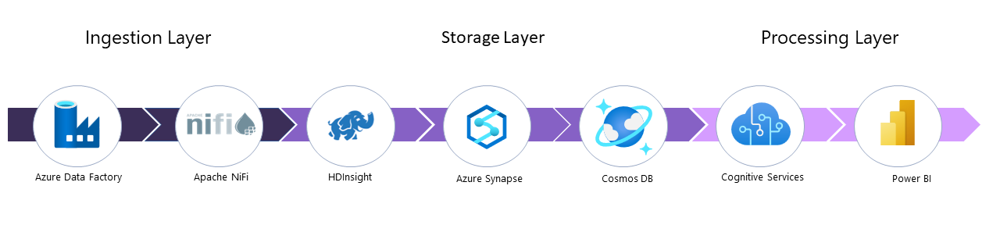

[!INCLUDE [header_file](../../../includes/sol-idea-header.md)]

# Sentiment Analysis and Face Recognition on Azure

Branding is important for industries globally, sometimes company value is based on the image that the market has about the company.  As companies move to making predictive data driven decision as opposed to reactive decisions, the need exists to be able to monitor and understand what is happening in real time.  In order to gain competitive advantages, companies need to use social media analysis to identify and understand public opinion.  Along with identifying the sentiment in Tweets, companies might choose to recognize the faces and pictures in these Tweets.

This pattern provides the solution across industries as monitoring social networks is not limited to one industry vertical.  The goal of this solution is to create a transformation pipeline that outputs clusters of comments and trending topics.

This solution showcases how companies using open source solutions can seamlessly integrate with Azure Sentiment Analysis and Face Recognition to deliver value.

## Potential Use Cases

This solution is ideal for the manufacturing industry.

NiFi works well for moving data and managing the flow of data:
* Connecting decoupled systems in the cloud
* Moving data in and out of Azure Storage and other data stores
* Integrating edge-to-cloud and hybrid-cloud applications with Azure IoT, Azure Stack, and Azure Kubernetes Service (AKS)

This solution applies to many areas:

* Modern data warehouses (MDWs) bring structured and unstructured data together at scale. They collect and store data from various sources, sinks, and formats. NiFi excels at ingesting data into Azure-based MDWs for the following reasons:
  * Over 200 processors are available for reading, writing, and manipulating data.
  *  The system supports Storage services such as Azure Blob Storage, Azure Data Lake Storage, Azure Event Hubs, Azure Queue Storage, Azure Cosmos DB, and Azure Synapse Analytics.
  * Robust data provenance capabilities make it possible to implement compliant solutions. For information about capturing data provenance in the Log Analytics feature of Azure Monitor, see Reporting considerations later in this article.
* NiFi can run on a standalone basis on small-footprint devices. In such cases, NiFi makes it possible to process edge data and move that data to larger NiFi instances or clusters in the cloud. NiFi helps filter, transform, and prioritize edge data in motion, ensuring reliable and efficient data flows.
* Industrial IoT (IIoT) solutions manage the flow of data from the edge to the data center. That flow starts with data acquisition from industrial control systems and equipment. The data then moves to data management solutions and MDWs. NiFi offers capabilities that make it well suited for data acquisition and movement:
  * Edge data processing functionality
  * Support for protocols that IoT gateways and devices use
  * Integration with Event Hubs and Storage services
* IoT applications in the areas of predictive maintenance and supply chain management can make use of this functionality.

## Architecture

**Collect and Ingest**: 
* Ingest Tweets into HDFS (1)
* Ingest Tweets into Synapse via Azure Data Factory (4)
* Ingest Tweets into Blob Storage (4)
* Ingest Tweets into Cosmos DB (4)
* 
**Process**:
* Transform JSON into CSV (2)
* Create Hive and Azure Synapse tables (2)
* Tweets Sentiment Analysis (NLTK) (2)
* Process pictures and identify human faces (Cognitive Services) (2)
  
**Store**: 
* Store data in HDFS and Hive (3)
* Store data in Synapse (3)
* Store data in Blob Storage (3)
* Store data in Cosmos DB (7)

**Visualize**: 
* Dashboards using Power BI:
*   Synapse (5)
*   Hive (6)
*   Cosmos DB (8)

### Dataflow

There are three main parts to this DataFlow:

**Tweets Ingestion**: Transformation of the JSON file into a CSV; extracting attributes from the JSON to use in the CSV composition as variables.

**Image Processing**: The sentiment analysis runs against tweets that have any pictures; these pictures are collected; human face detection is run; if a human face is recognized, it is stored in HDInsight.

**Sentiment Analysis**: Apply an NLTK algorithm on the ingested messages; do sentiment analysis of the text in the tweets; then store CSV-converted results on a Hive table and store the JSON on Cosmos DB. 

### Components

- [Azure Data Factory](/azure/data-factory/introduction) is used for different types of batch transformation from the different sources to the different sinks. Big data processing is a critical task for every organization. that are built to simplify ETL as well as handle the complexities and scale challenges of big data integration.

- [Apache Nifi](https://nifi.apache.org/) handles multiple sources and multiples sinks with different types of processors in order to doing streaming transformations. Designed to automate the flow of data between software systems. 

- [HDInsight](https://azure/services/hdinsight/) is a Hadoop Platform for data and analytics for on-premise environments,  to ingest, store and process data in real time and batch time. Is an open source framework for distributed storage and processing of large, multi-source data sets. HDP modernizes IT infrastructure and keeps data secure

- [Azure Synapse](/azure/synapse-analytics/sql-data-warehouse/sql-data-warehouse-overview-what-is) centralizes data in the cloud for easy access.

- [Azure Cosmos DB](/azure/cosmos-db/introduction) is a fully managed NoSQL database for modern app development. Single-digit millisecond response times, and automatic and instant scalability, guarantee speed at any scale. Business continuity is assured with SLA-backed availability and enterprise-grade security.

- [Azure Cognitive Services Language Understanding & Vision](https://azure/services/cognitive-services/) are cloud-based services with REST APIs and client library SDKs available to help build cognitive intelligence into applications. Cognitive features can be added to applications without having artificial intelligence (AI) or data science skills.

- [Power BI](/power-bi/fundamentals/power-bi-overview) is a business analytics service by Microsoft. It aims to provide interactive visualizations and business intelligence capabilities with an interface simple enough for end users to create their own reports and dashboards. It is part of the Microsoft Power Platform.

### Alternatives

Most of the pieces can be interchanged, as an example use a Cloudera cluster instead of an HDInsight cluster.

ADF can be swapped out for Azure Databricks.  Often solutions using ADF also make use of Databricks, and Databricks can be used to as an orchestrater in addition to transforming or storing data.

Instead of Nifi use Airflow where it can also be used as a workflow tool running ETL scripts.

For Cosmos DB use ElasticSearch as a main repository of the files.

Use Kibana as dashboard instead of Power BI.

## Considerations

These considerations implement the pillars of the Azure Well-Architected Framework, which is a set of guiding tenets that can be used to improve the quality of a workload. For more information, see [Microsoft Azure Well-Architected Framework](/azure/architecture/framework).

Depending of the number of sources and different kinds of processing tools that will be used, these transformations and visualizations can simplified.  If applicable, consider using a simple pipeline with one sink and create a dashboard from that instead of using multiples sources and multiples dashboards. 

This example tries to use as many services as possible to compare the use of PowerBI from different sources and see the performance and the difficulties from one source to another and from one data type to another.

### Reliability

To push this to a production environment, RTO and RPO will need to be evaluated.  All DR decisions and scenarios will be driven from those conversations.

Most of the cases will need to create a HA (high availability) service for each of the tools.  It is important to reduce the RTP in case of a DR scenario; in this case with HA a DR scenario can be avoided if the services created in another region for example.

### Security

Drive toward a strong security posture using an identity-based system and native Azure tools.  For external tools, use external authentication tools such as Kerberos to ensure a robust and secure workload.

### Cost optimization

Review the [Overview of the cost optimization pillar](/azure/architecture/framework/cost/overview).

### Operational excellence

Monitoring logs from all the services should be centralized.  Since there are both native Azure tools and also external tools, these should be integrated to give a holistic view of all systems.

### Performance efficiency

As there are multiple sources, consider compression and type of file format as part of the process.  Cosmos DB will need to be configured appropriately to allow tradeoff between latency and consistency levels; performance should be monitored and evaluated throughout the process to avoid Cosmos DB becoming a bottleneck.  Consider aligning geographic locations to decrease latency.

## Contributors

TBD

## Next steps

TBD

## Related resources

  - [ETL using HDInsight](/azure/architecture/solution-ideas/articles/extract-transform-and-load-using-hdinsight)
  - [Knowledge Mining for Customer Feedback](/azure/architecture/solution-ideas/articles/customer-feedback-and-analytics)
  - [Apache NiFi on Azure](/azure/architecture/example-scenario/data/azure-nifi)
