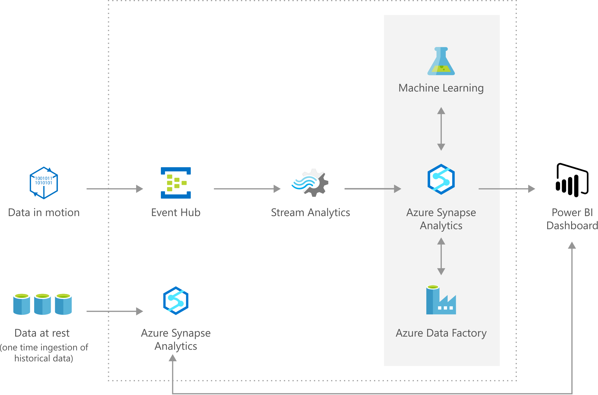

[!INCLUDE [header_file](../../../includes/sol-idea-header.md)]

Today, most facilities operate reactively to problems in tank levels. This reactivity often leads to spills, emergency shutdowns, expensive remediation costs, regulatory issues, costly repairs, and fines. Tank level forecasting helps manage and abate these and other problems.

The tank level forecasting process starts at the well input. Oil is measured as it comes into the facility via meters and is sent to tanks. Levels are monitored and recorded in tanks during the refining process and then oil, gas, and water output are recorded via sensors, meters, and records. Forecasts are then made using data from the facility; for example, forecasts can be made every 15 minutes.

Azure Cognitive Services are adaptable and can be customized to meet different requirements that facilities and corporations have.

## Potential use cases

Forecasts are created by harnessing the power of real-time and historical data readily available from sensors, meters, and records, which helps to:

* Prevent tank spillage and emergency shutdowns
* Discover hardware malfunction or failure
* Schedule maintenance, shutdowns, and logistics
* Optimize operations and facility efficiency
* Detect pipeline leaks and slugging
* Reduce costs, fines, and downtime

## Architecture

*Download an [SVG](../media/oil-and-gas-tank-level-forecasting.svg) of this architecture.*

### Workflow

  1. The data feeds into the Azure Event Hubs and Azure Synapse Analytics service as data points or events, that will be used in the rest of the solution flow.
  2. Azure Stream Analytics analyze the data to provide near real-time analytics on the input stream from the event hub and directly publish to Power BI for visualization.
  3. Azure Machine Learning is used to make forecast on the tank level of particular region given the inputs received.
  4. Azure Synapse Analytics is used to store the prediction results received from Azure Machine Learning. These results are then consumed in the Power BI dashboard.
  5. Azure Data Factory handles orchestration, and scheduling of the hourly model retraining.
  6. Finally, Power BI is used for results visualization, so that users can monitor the tank level from a facility in real time and use the forecast level to prevent spillage.

### Components

* [Azure Data Factory](https://azure.microsoft.com/services/data-factory/)
* [Azure Event Hubs](https://azure.microsoft.com/services/event-hubs/)
* [Azure Machine Learning](https://azure.microsoft.com/services/machine-learning/)
* [Azure Stream Analytics](https://azure.microsoft.com/services/stream-analytics/)
* [Azure Synapse Analytics](https://azure.microsoft.com/services/synapse-analytics/)
* [Power BI](https://powerbi.microsoft.com/)

## Deploy this scenario

For more details on how this solution is built, visit the solution guide in [GitHub](https://github.com/Azure/cortana-intelligence-tank-level-forecast), which was built with a similar, previous set of Azure AI services.

This solution provides advanced analytics tools through Microsoft Azure - data ingestion, data storage, data processing, and advanced analytics components - all of the essential elements for building a tank level forecasting solution.

This solution combines several Azure services to provide powerful advantages. Event Hubs collects real-time tank level data. Stream Analytics aggregates the streaming data and makes it available for visualization. Azure Synapse Analytics stores and transforms the tank level data. Machine Learning implements and executes the forecasting model. Power BI visualizes the real-time tank level and the forecast results. Finally, Data Factory orchestrates and schedules the entire data flow.

The 'Deploy' button will launch a workflow that will deploy an instance of the solution within a Resource Group in the Azure subscription you specify. The solution includes multiple Azure services (described below) along with a web job that simulates data so that immediately after deployment you have a working end-to-end solution.

After deployment, see the post deployment instructions in GitHub.

## Next steps

* [Choosing a data analytics technology in Azure](../../data-guide/technology-choices/analysis-visualizations-reporting.md)
* [Stream processing with Azure Stream Analytics](../../reference-architectures/data/stream-processing-stream-analytics.yml)
* [Anomaly Detector Process](./anomaly-detector-process.yml)
* [Demand Forecasting](./demand-forecasting.yml)
* [Predicting Length of Stay in Hospitals](./predicting-length-of-stay-in-hospitals.yml)
* [Predictive Aircraft Engine Monitoring](./aircraft-engine-monitoring-for-predictive-maintenance-in-aerospace.yml)
