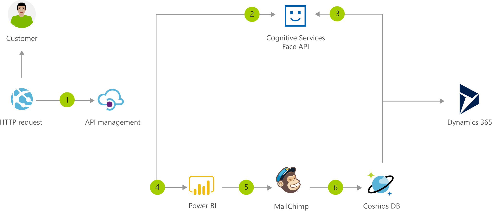

[!INCLUDE [header_file](../../../includes/sol-idea-header.md)]

This serverless architecture enables you to build and run applications without having to worry about the underlying infrastructure and the associated management and maintenance. By using it, you can dramatically improve developer productivity.

## Architecture

*Download an [SVG](../media/onboarding-customers-with-a-cloud-native-serverless-architecture.svg) of this architecture.*

### Data flow

1. Information about the new customer is posted to a web endpoint.
1. The customer's photo is posted to [Cognitive Services Face API](/azure/cognitive-services/face/). Face API associates the customer's photo and name.
1. The customer information is recorded in [Dynamics 365](/dynamics365/) or other CRM.
1. The information about a new customer is sent to [Power BI](/power-bi/).
1. The customer information is added to the mailing list ([MailChimp](https://mailchimp.com/)).
1. The solution creates a record of the member in [Cosmos DB](/azure/cosmos-db/).

## Next Steps

- [Decide which compute option to use for your apps](../../guide/technology-choices/compute-decision-tree.yml)
- [Learn to build Serverless apps](/azure/azure-functions)
- [Learn how you can use machine learning](/azure/machine-learning/how-to-enable-virtual-network)
- [Infuse intelligence into your apps with Cognitive Services](/azure/cognitive-services)
