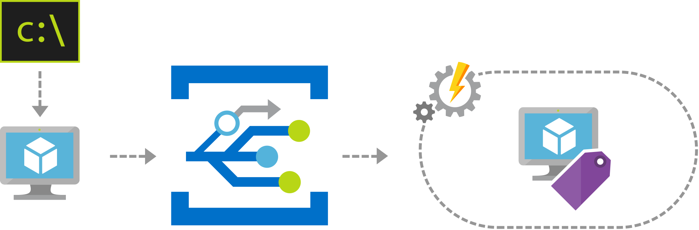

[!INCLUDE [header_file](../../../includes/sol-idea-header.md)]

Azure Event Grid can be used as an essential building block in the automation of cloud operations. 

## Potential use cases

One scenario is to simplify the management of resources, such as policy enforcement or tagging. For example, Event Grid can notify an Azure Automation account when a virtual machine is created. These events can be used to automatically check that the service configurations are compliant, put metadata into operations tools, tag virtual machines, or file work items. Event Grid can consume topics from [multiple services](/azure/event-grid/system-topics) in Azure. In this scenario, the Azure subscription is a source for the Event Grid.

## Architecture

*Download an [SVG file](../media/ops-automation-using-event-grid.svg) of this architecture.*

### Dataflow

1. A user deploys a new resource in Azure.
2. The deployment creates the resource (in this sample, a VM).
3. The deployment triggers the Event Grid.
4. The event is fired, and the subscriber Automation account receives the event.
5. The Automation account applies a tag to the new deployed resource (a task example).
6. The event can optionally also be consumed by a Logic App, and the Logic App could make an entry in an operation tool (for example).

### Components

- [Azure Event Grid](/azure/event-grid/overview)
- [Azure Automation account](/azure/automation/automation-quickstart-create-account)
- [Azure Logic Apps](/azure/logic-apps/logic-apps-overview)

## Next steps

Review some of the following guides:

- [Sample quickstart custom events](/azure/event-grid/custom-event-quickstart)
- [Azure subscription as an Event Grid source](/azure/event-grid/event-schema-subscriptions)
- [How to subscribe to events in the Azure portal](/azure/event-grid/subscribe-through-portal)
