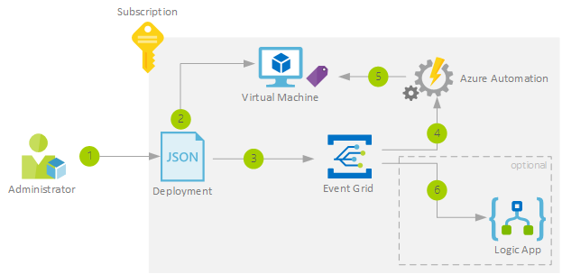

[!INCLUDE [header_file](../../../includes/sol-idea-header.md)]

The Azure Event Grid can be used as an essential building block in automation of cloud operation. One scenario is to simplify the management of resources e.g. policy enforcement or tagging. For example, Event Grid can notify an Azure Automation account when a virtual machine is created. These events can be used to automatically check that service configurations are compliant, put metadata into operations tools, tag virtual machines, or file work items. Event grid could consume topics from [multiple service](/azure/event-grid/system-topics) in Azure. In this scenario the Azure subscription as source for the Event Grid.

## Architecture

*Download an [SVG](../media/ops-automation-using-event-grid.svg) of this architecture.*

## Data Flow

1. An User is deploying a new resource in Azure
2. The deployment creates the resource (in this sample a VM)
3. The deployment triggers the Event Grid
4. The event is fired an the subscriber Automation Account receives the event
5. The Automation Account applies e.g. a tag to the new deployed resource
6. The event can optional also been consumed by a LogicApp and the LogicApp could for example make an entry in a operation tools.

## Components

- [Azure Event Grid](/azure/event-grid/overview)
- [Azure Automation account](/azure/automation/automation-quickstart-create-account)
- [Azure Logic Apps](/azure/logic-apps/logic-apps-overview)

## Next Steps

Review some of these guides:

- [Sample quickstart custom events](/azure/event-grid/custom-event-quickstart)
- [Azure subscription as an Event Grid source](/azure/event-grid/event-schema-subscriptions)
- [How to subscribe to events in the Azure Portal](/azure/event-grid/subscribe-through-portal)
