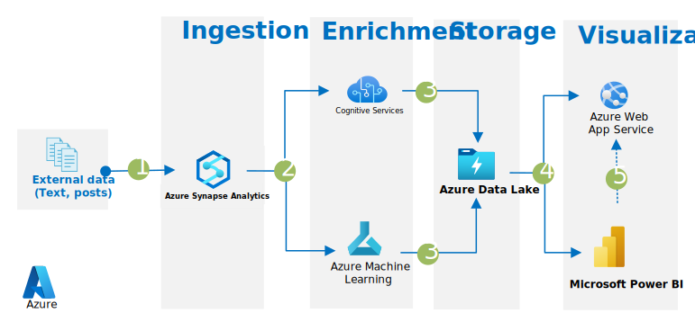

[!INCLUDE [header_file](../../../includes/sol-idea-header.md)]

Azure services can extract insights from social media for you to use in big data marketing campaigns.

## Architecture

*Download a [Visio file](https://arch-center.azureedge.net/optimize-marketing-with-machine-learning.vsdx) of this architecture.*

### Dataflow

1. [Azure Synapse Analytics][synapse-overview] enriches data in dedicated SQL pools with the model that's registered in Azure Machine Learning via a stored procedure.
1. [Azure Cognitive Services](/azure/cognitive-services/what-are-cognitive-services) enriches the data by running sentiment analysis, predicting overall meaning, extracting relevant information, and applying other AI features. [Machine Learning](/azure/machine-learning/overview-what-is-azure-machine-learning) is used to develop a machine learning model and register the model in the Machine Learning registry.
1. [Azure Data Lake Storage](/azure/storage/blobs/data-lake-storage-introduction) provides storage for the machine learning data and a cache for training the machine learning model.
1. The [Web Apps](/azure/app-service/overview) feature of Azure App Service is used to create and deploy scalable business-critical web applications. [Power BI][pbi-overview] provides an interactive dashboard with visualizations that use data that's stored in Azure Synapse Analytics to drive decisions on the predictions.

### Components

- [Azure Synapse Analytics](https://azure.microsoft.com/services/synapse-analytics) is an integrated analytics service that accelerates time to insight across data warehouses and big data systems.

- [Cognitive Services](https://azure.microsoft.com/services/cognitive-services#api) consists of cloud-based services that provide AI functionality. The REST APIs and client library SDKs help you build cognitive intelligence into apps even if you don't have AI or data science skills.

- [Machine Learning](https://azure.microsoft.com/services/machine-learning) is a cloud-based environment that you can use to train, deploy, automate, manage, and track machine learning models.

- [Data Lake Storage](https://azure.microsoft.com/services/storage/data-lake-storage) is a massively scalable and secure data lake for high-performance analytics workloads.

- [App Service](https://azure.microsoft.com/services/app-service) provides a framework for building, deploying, and scaling web apps. The [Web Apps](https://azure.microsoft.com/services/app-service/web) feature is a service for hosting web applications, REST APIs, and mobile back ends.

- [Power BI](https://powerbi.microsoft.com) is a collection of analytics services and apps. You can use Power BI to connect and display unrelated sources of data.

## Scenario details

Marketing campaigns are about more than the message that you deliver. When and how you deliver that message is just as important. Without a data-driven, analytical approach, campaigns can easily miss opportunities or struggle to gain traction.

These days, marketing campaigns are often based on social media analysis, which has become increasingly important for companies and organizations around the world. Social media analysis is a powerful tool that you can use to receive instant feedback on products and services, improve interactions with customers to increase customer satisfaction, keep up with the competition, and more. Companies often lack efficient, viable ways to monitor social media conversations. As a result, they miss countless opportunities to use these insights to inform their strategies and plans.

### Potential use cases

If you can extract information about your customers from social media, you can enhance customer experiences, increase customer satisfaction, gain new leads, and prevent customer churn. These applications of social media analytics fall into three main areas:

- **Measuring brand health:**

  - Capturing customer reactions and feedback for new products on social media.
  - Analyzing sentiment on social media interactions for a newly introduced product.

- **Building and maintaining customer relationships:**

  - Quickly identifying customer concerns.
  - Listening to untagged brand mentions.

- **Optimizing marketing investments:**

  - Extracting insights from social media for campaign analysis.

## Contributors

*This article is maintained by Microsoft. It was originally written by the following contributors.*

Principal author:

- [Christina Skarpathiotaki](https://www.linkedin.com/in/christinaskarpathiotaki) | AI Cloud Solution Architect

Other contributors:

- [Nicholas Moore](https://www.linkedin.com/in/nicholas-moore) | Cloud Architecture / Data / Artificial Intelligence

## Next steps

Learn more with the following learning paths:

- [Create machine learning models][ms-learn-create-ml]
- [Build AI solutions with Azure Machine Learning][ms-learn-build-ai-solutions]
- [Data integration at scale with Azure Data Factory or Azure Synapse Pipeline][ms-learn-synapse-data-integration]
- [Sentiment Analysis with Cognitive Services in Azure Synapse Analytics](/azure/synapse-analytics/machine-learning/tutorial-cognitive-services-sentiment)
- [Text Analytics with Cognitive Services in Azure Synapse Analytics](/azure/synapse-analytics/machine-learning/tutorial-text-analytics-use-mmlspark)

For information about solution components, see these resources:

- [Azure Machine Learning documentation][aml-docs]
- [Azure Synapse Analytics documentation][synapse-docs]
- [Cognitive Services Documentation](/azure/cognitive-services)
- [Power BI documentation][pbi-docs]
- [App Service overview](/azure/app-service/overview)
- [Train machine learning models in Azure Synapse Analytics][apache-spark-machine-learning-training]
- [Machine learning model scoring for dedicated SQL pools in Azure Synapse Analytics][tutorial-sql-pool-model-scoring-wizard]
- [Machine learning with Apache Spark in Azure Synapse Analytics](/azure/synapse-analytics/spark/apache-spark-machine-learning-concept)

## Related resources

- [Predictive marketing with machine learning](./predictive-marketing-campaigns-with-machine-learning-and-spark.yml)
- [Face recognition and sentiment analysis](../../example-scenario/ai/nifi-sentiment-analysis-face-recognition.yml)
- [Customer churn prediction using real-time analytics](./customer-churn-prediction.yml)

<!-- links -->
[synapse-docs]: /azure/synapse-analytics
[aml-docs]: /azure/machine-learning
[pbi-docs]: /power-bi
[synapse-overview]: /azure/synapse-analytics/overview-what-is
[aml-overview]: /azure/machine-learning/overview-what-is-azure-ml
[apache-spark-machine-learning-training]: /azure/synapse-analytics/spark/apache-spark-machine-learning-training
[tutorial-sql-pool-model-scoring-wizard]: /azure/synapse-analytics/machine-learning/tutorial-sql-pool-model-scoring-wizard
[pbi-overview]: /power-bi/fundamentals/power-bi-overview
[ms-learn-create-ml]: /training/paths/create-machine-learn-models
[ms-learn-build-ai-solutions]: /training/paths/build-ai-solutions-with-azure-ml-service
[ms-learn-synapse-data-integration]: /training/paths/data-integration-scale-azure-data-factory
