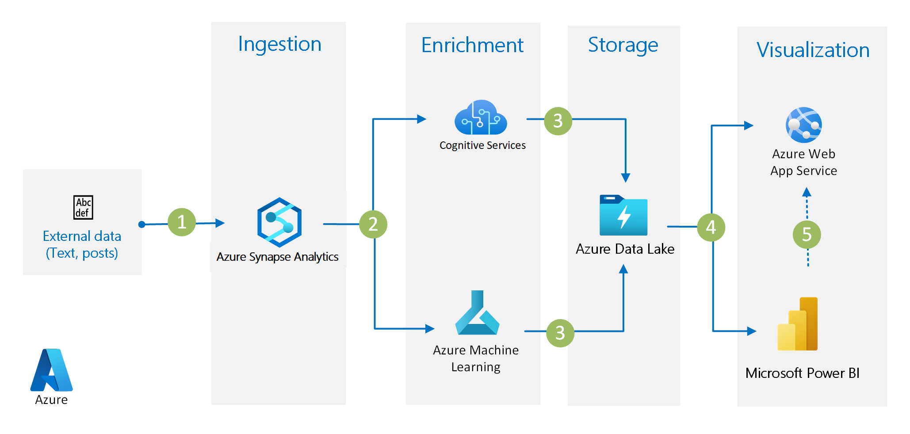

# Optimize Marketing with Machine Learning

[!INCLUDE [header_file](../header.md)]

Marketing campaigns are about more than the message being delivered; when and how that message is delivered is just as important. Without a data-driven, analytical approach, campaigns can easily miss opportunities or struggle to gain traction.

Through machine learning informed by historical campaign data, this solution helps predict customer responses and recommends an optimized plan for connecting with your leads—including the best channel to use (by email, SMS, a cold call, etc.), the best day of the week, and the best time of the day.

Optimizing your campaigns with machine learning helps improve both sales leads and revenue generation and can provide strong ROI for your marketing investment.

In this solution, SQL Server R Services brings the compute to the data by running R on the computer that hosts the database.

## Architecture

*Download an [SVG](../media/optimize-marketing-with-machine-learning.svg) of this architecture.*

## Components

* [SQL Server R Services](https://www.microsoft.com/sql-server/sql-server-r-services): SQL Server stores the campaign and lead data. R-based analytics provide training and predicted models and predicted results for consumption using R.
* [Machine Learning Studio](https://azure.microsoft.com/services/machine-learning-studio): Machine Learning helps you easily design, test, operationalize, and manage predictive analytics solutions in the cloud.
* [Power BI](https://powerbi.microsoft.com) provides an interactive dashboard with visualization that uses data stored in SQL Server to drive decisions on the predictions.

## Next steps

* [Get started with SQL Server R Services](https://www.microsoft.com/sql-server/sql-server-r-services)
* [Learn more about Machine Learning](https://docs.microsoft.com/azure/machine-learning/machine-learning-what-is-machine-learning)
* [Learn more about Power BI](https://powerbi.microsoft.com/documentation/powerbi-landing-page)
