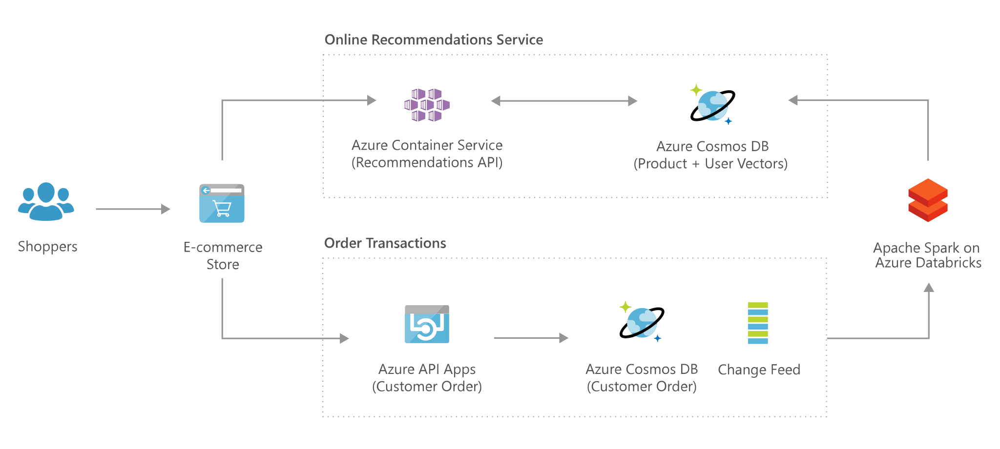

# Personalization using Cosmos DB

[!INCLUDE [header_file](../../../includes/sol-idea-header.md)]

Generate personalized recommendations for customers in real time, using low-latency and tunable consistency settings for immediate insights

## Architecture

*Download an [SVG](../media/personalization-using-cosmos-db.svg) of this architecture.*
