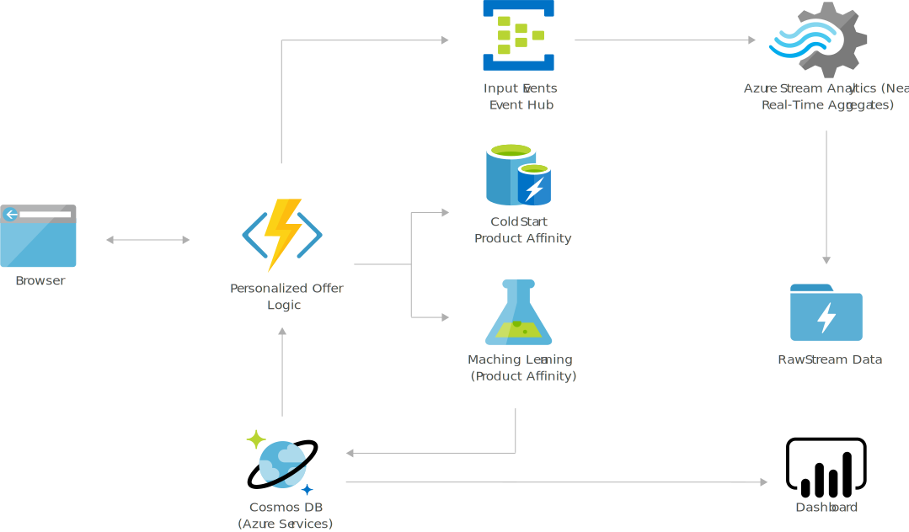

[!INCLUDE [header_file](../../../includes/sol-idea-header.md)]

This architecture shows how you can create a solution personalizing offers with [Azure Functions](/azure/azure-functions/functions-overview), [Azure Machine Learning](/azure/machine-learning/overview-what-is-azure-ml), and [Azure Stream Analytics](/azure/stream-analytics/stream-analytics-introduction).

## Architecture

*Download a [Visio file](https://arch-center.azureedge.net/personalized-marketing.vsdx) of this architecture.*

### Dataflow

* [Event Hubs](https://azure.microsoft.com/services/event-hubs) ingests raw click-stream data from Azure Functions and passes it on to Stream Analytics.
* [Azure Stream Analytics](https://azure.microsoft.com/services/stream-analytics) aggregates clicks in near real time by product, offer, and user. Writes to Azure Cosmos DB and also archives raw click-stream data to Azure Storage.
* [Azure Cosmos DB](https://azure.microsoft.com/services/cosmos-db) stores aggregated data of clicks by user, product, and offers user-profile information.
* [Azure Storage](https://azure.microsoft.com/services/storage) stores archived raw click-stream data from Stream Analytics.
* [Azure Functions](https://azure.microsoft.com/services/functions) takes in user clickstream data from websites and reads existing user history from Azure Cosmos DB. These data are then run through the Machine Learning web service or used along with the cold-start data in Azure Cache for Redis to obtain product-affinity scores. Product-affinity scores are used with the personalized-offer logic to determine the most relevant offer to present to the user.
* [Azure Machine Learning](https://azure.microsoft.com/services/machine-learning) helps you design, test, operationalize, and manage predictive analytics solutions in the cloud.
* [Azure Cache for Redis](https://azure.microsoft.com/services/cache) stores pre-computed cold-start product affinity scores for users without history.
* [Power BI](https://powerbi.microsoft.com) enables visualization of user activity data and offers presented by reading in data from Azure Cosmos DB.

### Components

* [Event Hubs](https://azure.microsoft.com/services/event-hubs)
* [Azure Stream Analytics](https://azure.microsoft.com/services/stream-analytics)
* [Azure Cosmos DB](https://azure.microsoft.com/services/cosmos-db)
* [Azure Storage](https://azure.microsoft.com/services/storage)
* [Azure Functions](https://azure.microsoft.com/services/functions)
* [Azure Machine Learning](https://azure.microsoft.com/services/machine-learning)
* [Azure Cache for Redis](https://azure.microsoft.com/services/cache)
* [Power BI](https://powerbi.microsoft.com)

## Scenario details

Personalized marketing is essential for building customer loyalty and remaining profitable. Reaching customers and getting them to engage is harder than ever, and generic offers are easily missed or ignored. Current marketing systems fail to take advantage of data that can help solve this problem.

Marketers using intelligent systems and analyzing massive amounts of data can deliver highly relevant and personalized offers to each user, cutting through the clutter and driving engagement. For example, retailers can provide offers and content based on each customer's unique interests, preferences and product affinity, putting products in front of the people most likely to buy them.

This architecture shows how you can create a solution personalizing offers with [Azure Functions](/azure/azure-functions/functions-overview), [Azure Machine Learning](/azure/machine-learning/overview-what-is-azure-ml), and [Azure Stream Analytics](/azure/stream-analytics/stream-analytics-introduction).

### Potential use cases

By personalizing your offers, you'll deliver an individualized experience for current and prospective customers, boosting engagement and improving customer conversion, lifetime value, and retention.

This solution is ideal for the retail and marketing industries.

## Next steps

See the product documentation:

* [Learn more about Event Hubs](/azure/event-hubs/event-hubs-what-is-event-hubs)
* [Learn more about Stream Analytics](/azure/stream-analytics/stream-analytics-introduction)
* [Learn how to use Azure Cosmos DB](/azure/cosmos-db)
* [Learn more about Azure Storage](/azure/storage/common/storage-introduction)
* [Learn how to create functions](/azure/azure-functions/functions-overview)
* [Learn more about machine learning](/azure/machine-learning/overview-what-is-azure-ml)
* [Learn how to use Azure Cache for Redis](/azure/redis-cache/cache-dotnet-how-to-use-azure-redis-cache)
* [Learn about Power BI](https://powerbi.microsoft.com/documentation/powerbi-landing-page)

Try a learning path:

* [Implement a Data Streaming Solution with Azure Streaming Analytics](/training/paths/implement-data-streaming-with-asa)
* [Build a Machine Learning model](/training/modules/machine-learning-model-nasa)
* [Create serverless apps with Azure Functions](/training/paths/create-serverless-applications)

## Related resources

Read other Azure Architecture Center articles:

* [Big data architecture style](../../guide/architecture-styles/big-data.yml)
* [Machine learning at scale](../../data-guide/big-data/machine-learning-at-scale.md)
* [Scalable personalization on Azure](/azure/architecture/solution-ideas/articles/build-content-based-recommendation-system-using-recommender)
