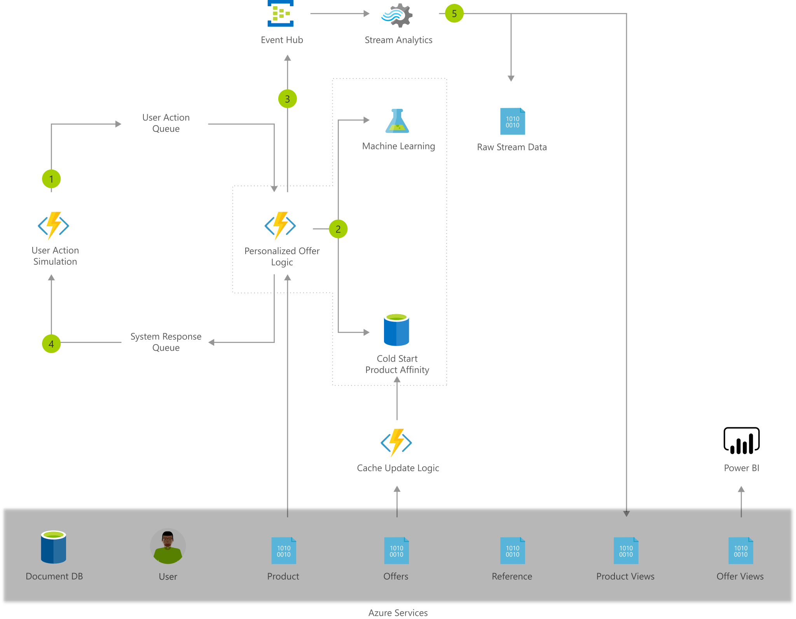

[!INCLUDE [header_file](../../../includes/sol-idea-header.md)]

In today's highly competitive and connected environment, modern businesses can no longer survive with generic, static online content. Furthermore, marketing strategies using traditional tools are often expensive, hard to implement, and do not produce the desired return on investment. These systems often fail to take full advantage of the data collected to create a more personalized experience for the user.

Surfacing offers that are customized for the user has become essential to building customer loyalty and remaining profitable. On a retail website, customers desire intelligent systems that provide offers and content, based on their unique interests and preferences. Today's digital marketing teams can build this intelligence using the data generated from all types of user interactions.

By analyzing massive amounts of data, marketers have the unique opportunity to deliver highly relevant and personalized offers to each user. However, building a reliable and scalable big data infrastructure, and developing sophisticated machine learning models that personalize to each user is not trivial.

## Architecture

*Download an [SVG](../media/personalized-offers.svg) of this architecture.*

### Dataflow

1. User activity on the website is simulated with an Azure Function and a pair of Azure Storage Queues.
1. Personalized offer functionality is implemented as an Azure Function.
    * This is the key function that ties everything together to produce an offer and record activity.
    * Data is read in from Azure Cache for Redis and Azure CosmosDB SQL API, product affinity scores are computed from Azure Machine Learning
    * If no history for the user exists, pre-computed affinities are read in from Azure Cache for Redis.
1. Raw user activity data (Product and Offer Clicks), Offers made to users, and performance data (for Azure Functions and Azure Machine Learning) are sent to Azure Event Hub.
1. The offer is returned to the User.
    * In our simulation, this process is done by writing to an Azure Storage Queue, which is picked up by an Azure Function in order to produce the next user action.
1. Azure Stream Analytics analyzes the data to provide near real-time analytics on the input stream from the Azure Event Hub.
    * The aggregated data is sent to Azure CosmosDB SQL API.
    * The raw data is sent to Azure Data Lake Storage.

### Components

This solution combines several Azure services to provide powerful advantages:

* [Azure Event Hubs](/azure/event-hubs/) collects real-time consumption data.
* [Azure Stream Analytics](/azure/stream-analytics/) aggregates the streaming data and makes it available for visualization and updates to the data used in making personalized offers to the customer.
* [Azure CosmosDB SQL API](/azure/cosmos-db/introduction) stores the customer, product, and offer information. In the GitHub implementation, Azure Document DB was used, but this storage can also be [achieved using Azure Cosmos DB SQL API](https://azure.microsoft.com/blog/dear-documentdb-customers-welcome-to-azure-cosmos-db/).
* [Azure Storage](/azure/storage/) is used to manage the queues that simulate user interaction.
* [Azure Functions](/azure/azure-functions/) is used as a coordinator for the user simulation and as the central portion of the solution for generating personalized offers.
* [Azure Machine Learning](/azure/machine-learning/) implements and executes the user to product affinity scoring, by considering user preference and product history
* When no user history is available.
[Azure Cache for Redis](/azure/azure-cache-for-redis/) is used to provide pre-computed product affinities for the customer.
* [Power BI Dashboard](/power-bi/create-reports/) visualizes the real-time activity for the system and with the data from CosmosDB SQL API the behavior of the various offers.

## Solution details

Save time and let a trained SI partner help you with a proof of concept, deployment, and integration of this solution.

Microsoft Azure provides advanced analytics tools - data ingestion, data storage, data processing, and advanced analytics components - all of the essential elements for building a personalized offer solution.

## Next steps

* [Deep-dive into the classifiers used in this model](https://github.com/Azure/cortana-intelligence-personalization-data-science-playbook/blob/master/Personalized_Offers_from_Classifiers_Use_Case.md#types)
* [Learn how to implement MLOps](/azure/machine-learning/concept-model-management-and-deployment)
* [Build a Real-time Recommendation API on Azure](../../reference-architectures/ai/real-time-recommendation.yml)
* Grow your skillsets in Azure Machine Learning and Data Science through our [Microsoft Certified: Data Scientist Associate certification](/learn/certifications/azure-data-scientist/)
* [Implement a classification model in Azure Machine Learning Studio](/learn/modules/create-classification-model-azure-machine-learning-designer/). No coding required!
* [Learn how to create a drag-and-drop ML model](/learn/modules/use-automated-machine-learning/)

## Related resources

* [Artificial intelligence (AI) - Architectural overview](../../data-guide/big-data/ai-overview.md)
* [Azure Machine Learning documentation](/azure/machine-learning/)
* [Movie recommendations on Azure](../../example-scenario/ai/movie-recommendations-with-machine-learning.yml)
* [Personalized marketing solutions](./personalized-marketing.yml)
* [Product recommendations for retail using Azure](./product-recommendations.yml)
