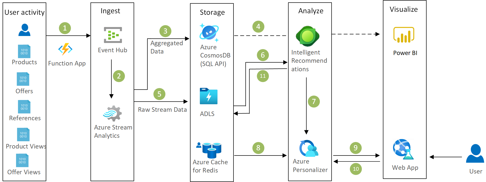

[!INCLUDE [header_file](../../../includes/sol-idea-header.md)]

In today's highly competitive and connected environment, modern businesses can no longer survive on generic, static online content. Furthermore, marketing strategies that use traditional tools can be expensive and hard to implement. As a result, they don't produce the desired return on investment. These systems often fail to take full advantage of collected data when they create a more personalized experience for users.

Presenting offers that are customized for each user has become essential to building customer loyalty and remaining profitable. On a retail website, customers desire intelligent systems that provide offers and content based on their unique interests and preferences. Today's digital marketing teams can build this intelligence by using the data that's generated from all types of user interactions.

Marketers now have the opportunity to deliver highly relevant and personalized offers to each user by analyzing massive amounts of data. But building a reliable and scalable big data infrastructure isn't trivial. And developing sophisticated machine learning models that are personalized for each user is also a complex undertaking.

## Potential use cases

You can use this solution to market goods and services based on customer data, such as records of products that the customer viewed or purchased.

## Architecture

*Download an [SVG](../media/personalized-offers.svg) of this architecture.*

### Dataflow

1. User activity on the website is simulated with Azure Functions and a pair of Azure Storage queues.

1. Personalized offer functionality is implemented with an instance of Functions.

   - This function is the key component that ties everything together to produce an offer and record activity.
   - Data is read in from Azure Cache for Redis and the Azure Cosmos DB SQL API.
   - Product affinity scores are computed from Azure Machine Learning.
   - If no history for the user exists, pre-computed affinities are read in from Azure Cache for Redis.

1. Raw user activity data is sent to Azure Event Hubs. This data includes:

   - Product and offer click data.
   - Information about offers that were made to users.
   - Performance data for Functions and Machine Learning.

1. An offer is returned to the user. In the simulation, this process writes to a Storage queue. That action triggers Functions, which produces the next user action.

1. Azure Stream Analytics analyzes the data to provide near real-time analytics on the input stream from Event Hubs.

   - The aggregated data is sent to the Azure Cosmos DB SQL API.
   - The raw data is sent to Azure Data Lake Storage.

### Components

- [Event Hubs](https://azure.microsoft.com/services/event-hubs) is a fully managed streaming platform. In this solution, Event Hubs collects real-time consumption data.
- [Stream Analytics](https://azure.microsoft.com/services/stream-analytics) offers real-time serverless stream processing. This service provides a way to run queries in the cloud and on edge devices. In this solution, Stream Analytics aggregates the streaming data and makes it available for visualization and updates.
- [Azure Cosmos DB](https://azure.microsoft.com/services/cosmos-db) is a globally distributed, multi-model database. With Azure Cosmos DB, your solutions can elastically scale throughput and storage across any number of geographic regions. The [Azure Cosmos DB SQL API](/azure/cosmos-db/choose-api#coresql-api) stores data in document format and is one of several database APIs that Azure Cosmos DB offers. In the GitHub implementation of this solution, DocumentDB was used to store the customer, product, and offer information. But you can also use the Azure Cosmos DB SQL API. For more information, see [Dear DocumentDB customers, welcome to Azure Cosmos DB!](https://azure.microsoft.com/blog/dear-documentdb-customers-welcome-to-azure-cosmos-db).
- [Storage](https://azure.microsoft.com/products/category/storage) is a cloud storage solution that includes object, file, disk, queue, and table storage. Services include hybrid storage solutions and tools for transferring, sharing, and backing up data. This solution uses Storage to manage the queues that simulate user interaction.
- [Functions](https://azure.microsoft.com/services/functions) is a serverless compute platform that you can use to build applications. With Functions, you can use triggers and bindings to integrate services. This solution uses Functions to coordinate the user simulation. Functions is also the core component that generates personalized offers.
- [Machine Learning](https://azure.microsoft.com/services/machine-learning) is a cloud-based environment that you can use to train, deploy, automate, manage, and track machine learning models. Here, Machine Learning uses each user's preferences and product history to provide the user-to-product affinity scoring.
- [Azure Cache for Redis](https://azure.microsoft.com/services/cache) provides an in-memory data store that's based on Redis software. Azure Cache for Redis provides open-source Redis capabilities as a fully managed offering. In this solution, Azure Cache for Redis provides pre-computed product affinities for customers with no available user history.
- [Power BI](https://powerbi.microsoft.com) is a business analytics service that provides interactive visualizations and business intelligence capabilities. Its easy-to-use interface makes it possible for you to create your own reports and dashboards. This solution uses Power BI to display real-time activity in the system. For instance, Power BI uses the data from the Azure Cosmos DB SQL API to display the customer response to various offers.
- [Data Lake Storage](https://azure.microsoft.com/services/storage/data-lake-storage) is a scalable storage repository that holds a large amount of data in the data's native, raw format.

## Solution details

You can save time when you implement this solution by hiring a trained system integrator (SI). The SI can help you develop a proof of concept and can help deploy and integrate the solution.

Microsoft Azure provides advanced analytics tools in the areas of data ingestion, data storage, data processing, and advanced analytics components—all the essential elements for building a personalized offer solution.

## Next steps

- [Detailed information about the classifiers that this model uses](https://github.com/Azure/cortana-intelligence-personalization-data-science-playbook/blob/master/Personalized_Offers_from_Classifiers_Use_Case.md#types)
- [MLOps: Model management, deployment, lineage, and monitoring with Azure Machine Learning](/azure/machine-learning/concept-model-management-and-deployment)
- [Build a real-time recommendation API on Azure](../../reference-architectures/ai/real-time-recommendation.yml)
- [Microsoft Certified: Data Scientist Associate certification](/certifications/azure-data-scientist)
- [Create a classification model with Azure Machine Learning designer, with no coding required](/training/modules/create-classification-model-azure-machine-learning-designer)
- [Use automated machine learning in Azure Machine Learning and learn how to create a drag-and-drop machine learning model](/training/modules/use-automated-machine-learning)
- [Azure Event Hubs—A big data streaming platform and event ingestion service](/azure/event-hubs/event-hubs-about)
- [Welcome to Azure Stream Analytics](/azure/stream-analytics/stream-analytics-introduction)
- [Welcome to Azure Cosmos DB](/azure/cosmos-db/introduction)
- [Introduction to Azure Storage](/azure/storage/common/storage-introduction)
- [Introduction to Azure Functions](/azure/azure-functions/functions-overview)
- [What is Azure Machine Learning?](/azure/machine-learning/overview-what-is-azure-machine-learning)
- [About Azure Cache for Redis](/azure/azure-cache-for-redis/cache-overview)
- [Create reports and dashboards in Power BI - documentation](/power-bi/create-reports)
- [Introduction to Azure Data Lake Storage Gen2](/azure/storage/blobs/data-lake-storage-introduction)

## Related resources

- [Artificial intelligence (AI) - Architectural overview](../../data-guide/big-data/ai-overview.md)
- [Azure Machine Learning documentation](/azure/machine-learning)
- [Movie recommendations on Azure](../../example-scenario/ai/movie-recommendations-with-machine-learning.yml)
- [Personalized marketing solutions](./personalized-marketing.yml)
- [Product recommendations for retail using Azure](./product-recommendations.yml)
