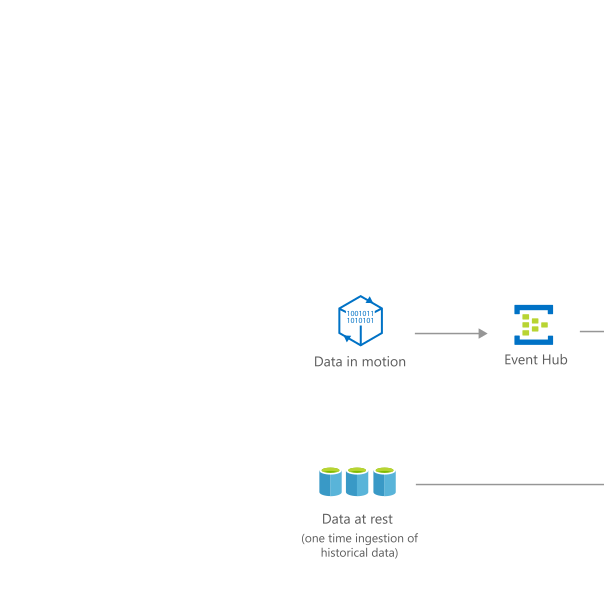

[!INCLUDE [header_file](../../../includes/sol-idea-header.md)]

In this solution, we'll use the clinical and socioeconomic in-patient data generated by hospitals for population health reporting.

## Architecture

*Download a [Visio file](https://arch-center.azureedge.net/population-health-management-for-healthcare.vsdx) of this architecture.*

### Dataflow

1. Real-time data generating devices (IoMT) transfer data to a streaming data ingestion sink with device authentication such as [Azure IoT Hub](/azure/iot-hub). This sink could be a standalone Azure IoT Hub or it could be included in a fully managed application platform like [Azure IOT Central](/azure/iot-fundamentals/iot-services-and-technologies#azure-iot-central) with solution accelerators such as a [continuous patient monitoring template](/azure/iot-central/healthcare/overview-iot-central-healthcare#what-is-continuous-patient-monitoring-template).

1. The device data is then received into [IoMT FHIR Connector for Azure](/azure/healthcare-apis/azure-api-for-fhir/iot-fhir-portal-quickstart), where it's normalized, grouped, transformed, and persisted into the [Azure API for FHIR](/azure/healthcare-apis/azure-api-for-fhir/overview).

1. Data sources such as Electronic Medical Record systems, patient administration systems, or lab systems may generate other message formats such as HL7 messages that are converted via an HL7 ingest and conversion workflow.  The HL7 ingest platform consumes HL7 Messages via MLLP and securely transfers them to Azure via HL7overHTTPS. The data lands in blob storage, which produces an event on Azure Service Bus for processing. The HL7 convert is an [Azure Logic App](/azure/logic-apps) based workflow that performs orderly conversion from HL7 to FHIR via the FHIR Converter, persists the message into an Azure API for FHIR Server Instance

1. Data is exported from the Azure FHIR Service to Azure Data Lake Gen2 using the [Bulk Export](/azure/healthcare-apis/data-transformation/export-data) feature.  Sensitive data can be [anonymized](https://github.com/microsoft/FHIR-Tools-for-Anonymization) as part of the export function.

1. [Azure Data Factory](/azure/data-factory) jobs are scheduled to copy other data sources from on-premises or alternate sources to Azure Data Lake Gen 2.

1. Use [Azure Databricks](/azure/databricks) to clean and transform the structureless datasets and combine them with structured data from operational databases or data warehouses.  Use scalable machine learning/deep learning techniques, to derive deeper insights from this data using Python, R, or Scala, with inbuilt notebook experiences in Azure Databricks.  In this solution, we use Databricks to bring together related, but disparate datasets for use in the patient length of stay model.

1. Experimentation and model development occurs in Azure Databricks.  Integration with Azure ML through [MLflow](/azure/machine-learning/how-to-use-mlflow-azure-databricks) allows for rapid model experimentation with tracking, model repository, and deployment.

1. Publish trained models using Azure Machine Learning service for batch scoring through [Azure Databricks endpoints](/azure/machine-learning/how-to-use-mlflow-azure-databricks#deploy-models-to-adb-endpoints-for-batch-scoring), or as a real-time endpoint using an [Azure Container Instance](/azure/machine-learning/how-to-deploy-mlflow-models#deploy-to-azure-container-instance-aci) or [Azure Kubernetes Service](/azure/machine-learning/how-to-deploy-mlflow-models#deploy-to-azure-kubernetes-service-aks).

### Components

* [Azure IoT Connector for FHIR](https://azure.microsoft.com/blog/microsoft-azure-iot-connector-for-fhir-now-in-preview) is an optional feature of Azure API for FHIR that provides the capability to ingest data from Internet of Medical Things (IoMT) devices.  Alternatively, anyone wishing to have more control and flexibility with the IoT Connector, the [IoMT FHIR Connector for Azure](https://github.com/Microsoft/iomt-fhir) is an open-source project for ingesting data from IoMT devices and persisting the data in a FHIR® server.  A simplified deployment template is available [here](https://github.com/microsoft/iomt-fhir/blob/master/docs/ARMInstallation.md).

* [Azure Data Factory](https://azure.microsoft.com/services/data-factory) is a hybrid data integration service that allows you to create, schedule, and orchestrate your ETL/ELT workflows.

* [Azure API for FHIR](https://azure.microsoft.com/services/health-data-services) is a fully managed, enterprise-grade service for health data in the FHIR format.

* [Azure Data Lake Storage](https://azure.microsoft.com/services/storage/data-lake-storage) is massively scalable, secure data lake functionality built on Azure Blob Storage.

* [Azure Databricks](https://azure.microsoft.com/free/databricks) is a fast, easy, and collaborative Apache Spark-based data analytics platform.

* [Azure Machine Learning](https://azure.microsoft.com/free/machine-learning) is a cloud service for training, scoring, deploying, and managing machine learning models at scale. This architecture uses the Azure Machine Learning service's native support for MLflow to log experiments, store models, and deploy models.

* [Power BI](https://powerbi.microsoft.com) is a suite of business analytics tools that deliver insights throughout your organization. Connect to hundreds of data sources, simplify data prep, and drive interactive analysis. Produce beautiful reports, then publish them for your organization to consume on the web and across mobile devices.

## Scenario details

Population health management is an important tool that is increasingly being used by health care providers to manage and control the escalating costs. The crux of population health management is to use data to improve health outcomes. Tracking, monitoring, and bench marking are the three bastions of population health management, aimed at improving clinical and health outcomes while managing and reducing cost.

As an example of a machine learning application with population health management, a model is used to predict length of hospital stay. It's geared towards hospitals and health care providers to manage and control the health care expenditure through disease prevention and management. You can learn about the data used and the length of hospital stay model in the manual deployment guide for the solution. Hospitals can use these results to optimize care management systems and focus their clinical resources on patients with more urgent need. Understanding the communities they serve through population health reporting can help hospitals transition from fee-for-service payments to value-based care while reducing costs and providing better care.

### Potential use cases

This solution is ideal for the healthcare industry. It can be used for the following scenarios:

* Patient monitoring
* Clinical trials
* Smart clinics

## Deploy this scenario

Two sample projects are detailed here that can be imported into Azure Databricks. Standard Cluster Mode must be used on the Predicting Length of State notebooks, due to the use of R code. You can deploy the solution in the following examples:

1. [Live Population Health Report with Length of Stay predictions](https://github.com/Azure/cortana-intelligence-population-health-management/tree/master/Azure%20Data%20Lake/ManualDeploymentGuide/Model) trains a model using encounter-level records for a million or so patients. The schema for data matches the State Inpatient Databases (SID) data from the [Healthcare Cost and Utilization Project](https://www.hcup-us.ahrq.gov)(HCUP) to facilitate the solution's use with real HCUP data. It's suitable for use on similar patient populations, though we recommend that hospitals retrain the model using their own historical patient data for best results. The solution simulates 610 clinical and demographic features, including age, gender, zipcode, diagnoses, procedures, charges, etc. for about a million patients across 23 hospitals. To be applied to newly admitted patients, the model must be trained using only features that are available for each patient at the time of their admission.

1. [Patient-specific Readmission Prediction and Intervention for Health Care](https://github.com/Azure/cortana-intelligence-population-health-management/blob/master/Spark/Manual%20Deployment%20Guide/HDInsight%20Spark/1_Data_Preparation.ipynb) uses a [diabetes dataset](https://archive.ics.uci.edu/ml/datasets/Diabetes) originally produced for the 1994 AAI Spring Symposium on Artificial Intelligence in Medicine, now generously shared by Dr. Michael Kahn on the [UCI Machine Learning Repository](https://archive.ics.uci.edu/ml).

## Contributors

*This article is maintained by Microsoft. It was originally written by the following contributors.*

Principal author:

* [Kris Bock](https://au.linkedin.com/in/krisbock) | Senior Customer Engineer

## Next steps

* [Continuous patient monitoring](/azure/iot-central/healthcare/tutorial-continuous-patient-monitoring) provides an app template that can build a continuous patient monitoring solution.
* [Medical Imaging Server for DICOM](https://github.com/microsoft/dicom-server) is a .NET Core implementation of DICOMweb™ that can be run in Azure.
* [OpenHack for FHIR](https://github.com/microsoft/OpenHack-FHIR) is a collection of OpenHack based tutorials that can be used to learn about the FHIR-related services in Azure.

Product documentation:

- [IoMT FHIR Connector for Azure](/azure/healthcare-apis/azure-api-for-fhir/iot-fhir-portal-quickstart)
- [Azure API for FHIR](/azure/healthcare-apis/azure-api-for-fhir/overview)
- [What is Azure Logic Apps?](/azure/logic-apps/logic-apps-overview)
- [What is Azure Data Factory?](/azure/data-factory/introduction)
- [Introduction to Azure Data Lake Storage](/azure/storage/blobs/data-lake-storage-introduction)
- [What is Azure Machine Learning?](/azure/machine-learning/overview-what-is-azure-machine-learning)
- [What is Power BI?](/power-bi/fundamentals/power-bi-overview)

## Related resources

* [Artificial intelligence (AI) - Architectural overview](../../data-guide/big-data/ai-overview.md)
* [Business process management](./business-process-management.yml)
* [Predict length of stay and patient flow](/azure/architecture/example-scenario/digital-health/predict-patient-length-of-stay)
* [Remote patient monitoring solutions](/azure/architecture/example-scenario/digital-health/remote-patient-monitoring)
