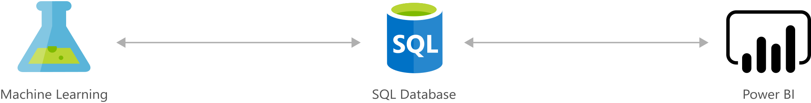

[!INCLUDE [header_file](../../../includes/sol-idea-header.md)]

For the people running a healthcare facility, length of stay-the number of days from patient admission to discharge-matters. However, that number can vary across facilities and across disease conditions and specialties, even within the same healthcare system, making it harder to track patient flow and plan accordingly.

This Azure solution helps hospital administrators use the power of machine learning to predict the length of stay for in-hospital admissions, to improve capacity planning and resource utilization. A Chief Medical Information Officer might use a predictive model to determine which facilities are overtaxed and which resources to bolster within those facilities, and a Care Line Manager might use it to determine if there will be adequate staff resources to handle the release of a patient.

## Potential use cases

Being able to predict length of stay at the time of admission helps hospitals provide higher quality care and streamline their operational workload. It also helps accurately plan for discharges, lowering other quality measures such as readmissions.

## Architecture

*Download an [SVG](../media/predict-length-of-stay-and-patient-flow-with-healthcare-analytics.svg) of this architecture.*

### Workflow

* [SQL Server Machine Learning Services](/sql/machine-learning/sql-server-machine-learning-services): Stores the patient and hospital data. Provides training and predicted models and predicted results for consumption using R.
* [Power BI](/power-bi/) provides an interactive dashboard with visualization that uses data stored in SQL Server to drive decisions on the predictions.
* [Azure Machine Learning](/azure/machine-learning/): Machine Learning helps you design, test, operationalize, and manage predictive analytics solutions in the cloud.

## Next steps

* Learn more about [SQL Server Machine Learning Services](/sql/machine-learning/sql-server-machine-learning-services)
* Learn how to [Consume Azure Machine Learning models in Power BI](/power-bi/connect-data/service-aml-integrate)
* Learn more about [Machine Learning](/azure/machine-learning/overview-what-is-azure-ml)
