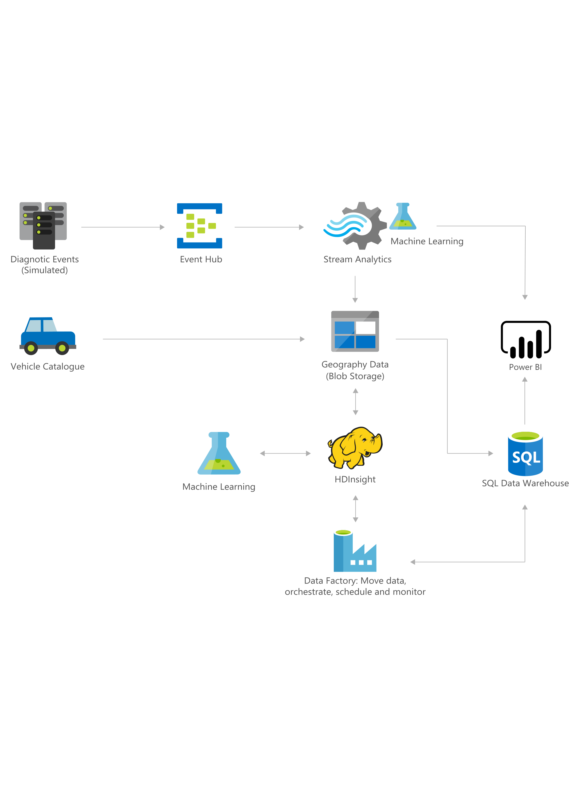

[!INCLUDE [header_file](../../../includes/sol-idea-header.md)]

Learn how car dealerships, manufacturers, and insurance companies can use Microsoft Azure to gain predictive insights on vehicle health and driving habits.

This solution is built on the Azure managed services: [Event Hubs](https://azure.microsoft.com/services/event-hubs), [Azure Stream Analytics](https://azure.microsoft.com/services/stream-analytics), [Azure Machine Learning](https://azure.microsoft.com/services/machine-learning), [Storage Accounts](https://azure.microsoft.com/services/storage), [HDInsight](https://azure.microsoft.com/services/hdinsight), [Data Factory](https://azure.microsoft.com/services/data-factory), [Azure Synapse Analytics](https://azure.microsoft.com/services/synapse-analytics/) and [Power BI](https://powerbi.microsoft.com). These services run in a high-availability environment, patched and supported, which allows you to focus on your solution instead of the environment it runs in.

## Architecture

*Download an [SVG](../media/predictive-insights-with-vehicle-telematics.svg) of this architecture.*

### Components

* [Event Hubs](/azure/event-hubs/event-hubs-about). Event Hubs ingests diagnostic events and passes them on to Stream Analytics and an Azure ML Web Service.
* [Azure Stream Analytics](/azure/stream-analytics/stream-analytics-introduction). Stream Analytics accepts the input stream from Event Hubs, calls an Azure ML Web Service to do predictions, and sends the stream to Azure Storage and Power BI.
* [Azure Machine Learning](/azure/machine-learning/overview-what-is-azure-ml). Machine Learning helps you design, test, operationalize, and manage predictive analytics solutions in the cloud and deploy web services that can be called by Stream Analytics and Azure Data Factory.
* [Storage Accounts](/azure/storage/common/storage-introduction). Azure Storage stores diagnostic events stream data from Stream Analytics.
* [HDInsight](/azure/hdinsight/hdinsight-overview). HDInsight helps you process massive amounts of data in an easy, fast, and cost-effective way. This solution has Azure Data Factory using HDInsight to run Hive queries to process data and load it into Azure SQL Database, but others can also use Azure Databricks.
* [Data Factory](/azure/data-factory/introduction). Data Factory uses HDInsight to process data and load it into Azure SQL Database.
* [Azure Synapse Analytics](/azure/synapse-analytics/overview-what-is). Azure Synapse Analytics is used to store and data processed by Data Factory and HDInsight and is accessed by Power BI for analysis of the telemetry data.
* [Power BI](/power-bi/fundamentals/power-bi-overview). Power BI is used to create data visualizations for reporting needs. This solution uses Power BI, but others use [Power BI Embedded](https://azure.microsoft.com/en-us/services/power-bi-embedded/) to analyze the telemetry data.

## Next steps

* [Learn more about Event Hubs](/azure/event-hubs)
* [Learn more about Azure Stream Analytics](/azure/stream-analytics)
* [Learn more about Azure Machine Learning](/azure/machine-learning)
* [Learn more about Azure Storage](/azure/storage/common/storage-introduction)
* [Learn more about HDInsight](/azure/hdinsight)
* [Learn more about Azure Data Factory](/azure/data-factory)
* [Learn more about Azure Synapse Analytics](/azure/synapse-analytics)
* [Learn more about Power BI](https://powerbi.microsoft.com/documentation/powerbi-landing-page)
