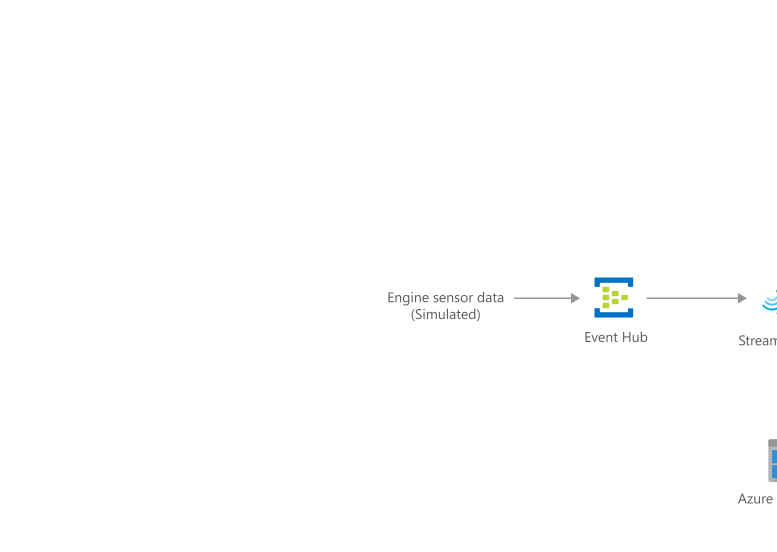

[!INCLUDE [header_file](../../../includes/sol-idea-header.md)]

This predictive maintenance solution monitors aircraft and predicts the remaining useful life of aircraft engine components.

## Architecture

*Download a [Visio file](https://arch-center.azureedge.net/predictive-maintenance.vsdx) of this architecture.*

### Dataflow

  1. The simulation data is streamed by a newly deployed Azure Web Job, AeroDataGenerator. Alternatively, it could process offline data by periodically importing sensor log files or data into the solution.
  1. This synthetic data feeds into the [Azure Event Hubs](/azure/event-hubs) service as data points.
  1. Two [Azure Stream Analytics](/azure/stream-analytics) jobs analyze the data to provide near real-time analytics on the input stream from the event hub. One of the Stream Analytics jobs archives all raw incoming events to the Azure Storage service for later processing by the [Azure Data Factory](/azure/data-factory) service, and the other publishes results onto a Power BI dashboard.
  1. The [HDInsight](/azure/hdinsight) service is used to run Hive scripts orchestrated by Azure Data Factory. The scripts provide aggregations on the raw events that were archived by the Stream Analytics job.
  1. [Azure Machine Learning](/azure/machine-learning) is used (orchestrated by Azure Data Factory) to make predictions on the remaining useful life (RUL) of particular aircraft engine given the inputs received.
  1. [Azure SQL Database](/azure/azure-sql) is used (managed by Azure Data Factory) to store the prediction results received from Azure Machine Learning. These results are then consumed in the Power BI dashboard. A stored procedure is deployed in the SQL Database and later invoked in Azure Data Factory pipeline to store the ML prediction results into the scoring result table.
  1. Azure Data Factory handles orchestration, scheduling, and monitoring of the batch processing pipeline.
  1. Finally, [Power BI](/power-bi/create-reports) is used for visualizing results. Aircraft technicians can monitor the sensor data from an airplane or across the fleet in real time and use visualizations to schedule engine maintenance.

### Components

* [Azure Data Factory](https://azure.microsoft.com/services/data-factory)
* [Azure Event Hub](https://azure.microsoft.com/services/event-hubs)
* [Azure HDInsight](https://azure.microsoft.com/free/hdinsight)
* [Azure Machine Learning](https://azure.microsoft.com/services/machine-learning)
* [Azure SQL Database](https://azure.microsoft.com/services/sql-database)
* [Azure Stream Analytics](https://azure.microsoft.com/services/stream-analytics)
* [Power BI Dashboard](https://powerbi.microsoft.com)

## Scenario details

This solution demonstrates how to combine real-time data from sensors with advanced analytics to monitor aircraft parts in real time. It predicts the remaining useful life of aircraft engine components.

Air travel is central to modern life, however, aircraft engines are expensive and keeping them up and running requires frequent maintenance by highly skilled technicians. Modern aircraft engines are equipped with highly sophisticated sensors to track their functioning. With data from these sensors combined with advanced analytics, it's possible to both monitor the aircraft in real time, and predict the remaining useful life of an engine component. These predictions enable maintenance to be scheduled quickly to prevent mechanical failures.

## Potential use cases

While it's customized for aircraft monitoring and the aerospace industry, it can easily be generalized for other predictive maintenance scenarios.

## Deploy this scenario

The [Azure AI Gallery Solution](https://gallery.azure.ai/Solution/Predictive-Maintenance-10) is an implementation of this solution idea. The predictive maintenance solution monitors aircraft and predicts the remaining useful life of aircraft engine components. It's an end-to-end solution that includes data ingestion, data storage, data processing, and advanced analytics - all essential for building a predictive maintenance solution. The data source of this solution is derived from publicly available data from the NASA data repository using the Turbofan Engine Degradation Simulation Data Set.

This solution uses multiple Azure services (described below) along with a web job that simulates data. After deployment of the solution, you'll have a complete working demo.

## Next steps

See product documentation:

* [What is Azure Machine Learning?](/azure/machine-learning/overview-what-is-azure-ml)
* [Welcome to Azure Stream Analytics](/azure/stream-analytics/stream-analytics-introduction)
* [What is Azure HDInsight?](/azure/hdinsight/hdinsight-overview)
* [What is Azure Data Factory?](/azure/data-factory/introduction)
* [Azure Event Hubs](/azure/event-hubs/event-hubs-about)

Try out the code:

* [Azure AI Gallery Solution - Predictive Maintenance](https://gallery.azure.ai/Solution/Predictive-Maintenance-10)
* [Creating and configuring a HDInsight cluster](/training/modules/creating-and-configuring-hdinsight-cluster)

## Related resources

Read other Azure Architecture Center articles:

* [Artificial intelligence (AI) - Architectural overview](../../data-guide/big-data/ai-overview.md)
* [Defect prevention with predictive maintenance](./defect-prevention-with-predictive-maintenance.yml)
* [Predictive Marketing with Machine Learning](./predictive-marketing-campaigns-with-machine-learning-and-spark.yml)
* [Azure AI guide for predictive maintenance solutions](./predictive-maintenance.yml)
