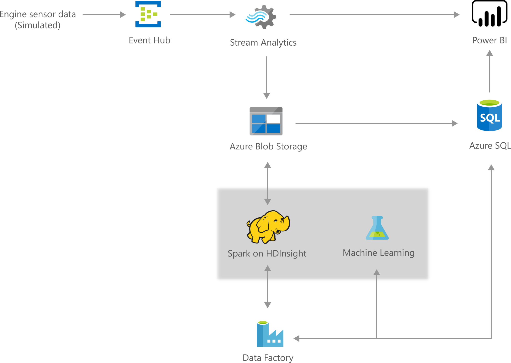

[!INCLUDE [header_file](../../../includes/sol-idea-header.md)]

This predictive maintenance solution monitors aircraft and predicts the remaining useful life of aircraft engine components. While it is customized for aircraft monitoring, it can easily be generalized for other predictive maintenance scenarios.

## Architecture

*Download an [SVG](../media/predictive-maintenance.svg) of this architecture.*

## Overview

This solution demonstrates how to combine real-time data from sensors with advanced analytics to monitor aircraft parts in real time and also predict the parts' remaining useful life.

## Details

Air travel is central to modern life, however, aircraft engines are expensive and keeping them up and running requires frequent maintenance by highly skilled technicians. Modern aircraft engines are equipped with highly sophisticated sensors to track the functioning of these machines. By combining the data from these sensors with advanced analytics, it's possible to both monitor the aircraft in real time, and predict the remaining useful life of an engine component so that maintenance can be scheduled in a timely manner to prevent mechanical failures. 

The [Azure AI Gallery Solution](https://gallery.azure.ai/Solution/Predictive-Maintenance-10) is an implementation of this solution idea. The predictive maintenance solution monitors aircraft and predicts the remaining useful life of aircraft engine components. It is an end-to-end solution that includes data ingestion, data storage, data processing, and advanced analytics - all essential for building a predictive maintenance solution. The data source of this solution is derived from publicly available data from the NASA data repository using the Turbofan Engine Degradation Simulation Data Set.

The [Azure AI Gallery Solution](https://gallery.azure.ai/Solution/Predictive-Maintenance-10) includes multiple Azure services (described below) along with a web job that simulates data so that immediately after deployment you have a working end-to-end demo.

## Technical details and workflow

  1. The simulation data is streamed by a newly deployed Azure Web Job, AeroDataGenerator.
  2. This synthetic data feeds into the Azure Event Hubs service as data points.
  3. Two Azure Stream Analytics jobs analyze the data to provide near real-time analytics on the input stream from the event hub. One of the Stream Analytics jobs archives all raw incoming events to the Azure Storage service for later processing by the Azure Data Factory service, and the other publishes results onto a Power BI dashboard.
  4. The HDInsight service is used to run Hive scripts (orchestrated by Azure Data Factory) to provide aggregations on the raw events that were archived by the aforementioned Stream Analytics job.
  5. Azure Machine Learning is used (orchestrated by Azure Data Factory) to make predictions on the remaining useful life (RUL) of particular aircraft engine given the inputs received.
  6. Azure SQL Database is used (managed by Azure Data Factory) to store the prediction results received from Azure Machine Learning. These results are then consumed in the Power BI dashboard. A stored procedure is deployed in the SQL Database and later invoked in Azure Data Factory pipeline to store the ML prediction results into the scoring result table.
  7. Azure Data Factory handles orchestration, scheduling, and monitoring of the batch processing pipeline.
  8. Finally, Power BI is used for results visualization, so that aircraft technicians can monitor the sensor data from an airplane or across the fleet in real time and use visualizations to schedule engine maintenance.
  
## Components

* [Azure Data Factory](/azure/data-factory/)
* [Azure Event Hub](/azure/event-hubs/)
* [Azure HDInsight](/azure/hdinsight/)
* [Azure Machine Learning](https://azure.microsoft.com/services/machine-learning/)
* [Azure SQL Database](https://azure.microsoft.com/services/sql-database/)
* [Azure Stream Analytics](/azure/stream-analytics/)
* [Power BI Dashboard](/power-bi/create-reports/)

## Next steps

Read other Azure Architecture Center articles:

* [Artificial intelligence (AI) - Architectural overview](../../data-guide/big-data/ai-overview.md)
* [Defect prevention with predictive maintenance](./defect-prevention-with-predictive-maintenance.yml)
* [Predictive Marketing with Machine Learning](./predictive-marketing-campaigns-with-machine-learning-and-spark.yml)

See product documentation:

* [Azure Machine Learning documentation](/azure/machine-learning/overview-what-is-azure-ml)
* [Welcome to Azure Stream Analytics](/azure/stream-analytics/stream-analytics-introduction)
* [What is Azure HDInsight](/azure/hdinsight/hdinsight-overview)

Try out code:

* [Azure AI Gallery Solution](https://gallery.azure.ai/Solution/Predictive-Maintenance-10)
