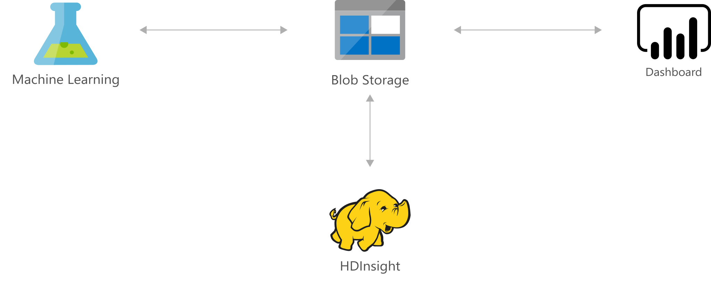

[!INCLUDE [header_file](../../../includes/sol-idea-header.md)]

Marketing campaigns are about more than the message being delivered; when and how that message is delivered is as important. Without a data-driven, analytical approach, campaigns can easily miss opportunities or struggle to gain traction.

This solution architecture uses machine learning with historical campaign data to predict customer responses and recommend an optimized plan for connecting with your leads. Recommendations include the best channel to use (email, SMS, cold call, and so on), the best day of the week, and the best time of the day.

Optimizing your campaigns with predictive marketing helps improve both sales leads and revenue generation and can provide strong ROI for your marketing investment.

## Architecture

*Download an [SVG](../media/predictive-marketing-campaigns-with-machine-learning-and-spark.svg) of this architecture.*

### Components

* [Power BI](https://powerbi.microsoft.com) provides an interactive dashboard with visualization that uses data stored in SQL Server to drive decisions on the predictions.
* [Storage Accounts](https://azure.microsoft.com/services/storage): Azure Storage stores campaign and lead data.
* [Azure Machine Learning](https://azure.microsoft.com/services/machine-learning): Machine Learning helps you design, test, operationalize, and manage predictive analytics solutions in the cloud.

## Next steps

See product documentation:

* [Spark on HDInsight](/azure/hdinsight/hdinsight-apache-spark-overview)
* [Power BI](https://powerbi.microsoft.com/documentation/powerbi-landing-page)
* [Azure storage](/azure/storage/common/storage-introduction)
* [Azure Machine Learning](/azure/machine-learning/overview-what-is-azure-ml)

## Related resources

Read other Azure Architecture Center articles about predictive machine learning:

* [Predictive aircraft engine monitoring](./aircraft-engine-monitoring-for-predictive-maintenance-in-aerospace.yml)
* [Predictive maintenance for industrial IoT](./iot-predictive-maintenance.yml)
* [Predict length of stay and patient flow for healthcare](./predict-length-of-stay-and-patient-flow-with-healthcare-analytics.yml)
