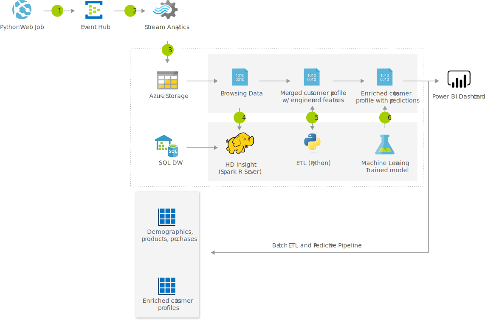

[!INCLUDE [header_file](../../../includes/sol-idea-header.md)]

This solution idea implements a process of aggregating customer data into a complete profile.

## Architecture

*Download a [Visio file](https://arch-center.azureedge.net/product-recommendations.vsdx) of this architecture.*

### Dataflow

1. A data generator pipes simulated customer events to Azure Event Hubs.
1. An Azure Stream Analytics job reads from Event Hubs and performs aggregations.
1. Stream Analytics persists time-grouped data to Azure Blob Storage.
1. A Spark job that runs in Azure HDInsight merges the latest customer browsing data with historical purchase and demographic data, to build a combined user profile.
1. A second Spark job scores each customer profile against a machine learning model. This process predicts future purchasing patterns. These predictions suggest whether a given customer is likely to make a purchase in the next 30 days. If so, the system determines the likely product category of the purchase.
1. Predictions and other profile data are visualized and shared as charts and tables in the Power BI service.

### Components

- [Blob Storage](https://azure.microsoft.com/services/storage/blobs) is a service that's part of [Azure Storage](https://azure.microsoft.com/products/category/storage). Blob Storage offers optimized cloud object storage for large amounts of unstructured data.
- [Event Hubs](https://azure.microsoft.com/services/event-hubs) is a fully managed streaming platform.
- [Azure Machine Learning](https://azure.microsoft.com/services/machine-learning) is a cloud-based environment that you can use to train, deploy, automate, manage, and track machine learning models.
- [Azure SQL Database](https://azure.microsoft.com/services/sql-database) is a fully managed platform as a service (PaaS) database engine. SQL Database runs on the latest stable version of SQL Server and a patched operating system.
- [Stream Analytics](https://azure.microsoft.com/services/stream-analytics) offers real-time serverless stream processing. This service provides a way to run queries in the cloud and on edge devices.
- [Power BI](https://powerbi.microsoft.com) is a business analytics service that provides interactive visualizations and business intelligence capabilities. Its easy-to-use interface makes it possible for you to create your own reports and dashboards.
- [HDInsight](https://azure.microsoft.com/services/hdinsight) is a managed, full-spectrum, open-source, cloud-based analytics service for enterprises.

## Scenario details

A deep understanding between customer interests and purchasing patterns is a critical component of any retail business intelligence operation. This solution idea aggregates customer data into a complete profile. Advanced machine learning models are backed by the reliability and processing power of Azure to provide predictive insights on simulated customers.

### Potential use cases

This solution is typically employed by retailers.

## Deploy this scenario

For more details on how this solution is built, see the [solution guide in GitHub](https://github.com/Azure/cortana-intelligence-customer360).

A typical retail business collects customer data through various channels. These channels include web-browsing patterns, purchase behaviors, demographics, and other session-based web data. Some of the data originates from core business operations. However, other data must be pulled and joined from external sources, such as partners, manufacturers, the public domain, and so on.

Many businesses apply only a small portion of the available data, but to maximize ROI, a business must integrate relevant data from all sources. Traditionally, the integration of external, heterogeneous data sources into a shared data processing engine requires significant effort and resources to set up. This solution describes a simple, scalable approach to integrating analytics and machine learning to predict customer purchasing activity.

### Solution features

This solution addresses the problems that the previous section pointed out:

- By uniformly accessing data from multiple data sources, while minimizing data movement and system complexity, which boosts performance.
- By performing extract-transfer-load (ETL) operations and the feature engineering that's needed to use a predictive machine learning model.
- By creating a comprehensive customer 360 profile, which is enriched by predictive analytics that run across a distributed system. This analysis is backed by Microsoft R Server and HDInsight.

## Next steps

- [What is Azure Machine Learning?](/azure/machine-learning/overview-what-is-azure-machine-learning)
- [What is Azure Blob storage?](/azure/storage/blobs/storage-blobs-overview)
- [Azure Event Hubs—a big data streaming platform and event ingestion service](/azure/event-hubs/event-hubs-about)
- [Welcome to Azure Stream Analytics](/azure/stream-analytics/stream-analytics-introduction)
- [Create reports and dashboards in Power BI - documentation](/power-bi/create-reports)
- [What is Azure HDInsight?](/azure/hdinsight/hdinsight-overview)

## Related resources

- [Artificial intelligence (AI) - Architectural overview](../../data-guide/big-data/ai-overview.md)
- [Movie recommendations on Azure](../../example-scenario/ai/movie-recommendations-with-machine-learning.yml)
- [Personalized marketing solutions](./personalized-marketing.yml)
- [Personalized offers](./personalized-offers.yml)
- [Build a real-time recommendation API on Azure](../../reference-architectures/ai/real-time-recommendation.yml)
