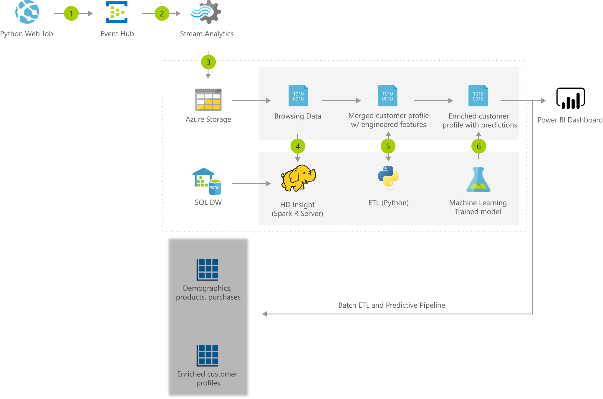

[!INCLUDE [header_file](../../../includes/sol-idea-header.md)]

A deep understanding between customer interests and purchasing patterns is a critical component of any retail business intelligence operation. This solution implements a process of aggregating customer data into a complete profile. Advanced machine learning models are backed by the reliability and processing power of Azure to provide predictive insights on simulated customers.

## Architecture

*Download an [SVG](../media/product-recommendations.svg) of this architecture.*

### Dataflow

1. A data generator pipes simulated customer events to an Event Hub.
1. A Stream Analytics job reads from the Event Hub and performs aggregations.
1. Stream Analytics persists time-grouped data to an Azure Storage Blob
1. A Spark job running in HDInsight merges the latest customer browsing data with historical purchase and demographic data, to build a combined user profile.
1. A second Spark job scores each customer profile against a machine learning model. This process predicts future purchasing patterns, which determines whether a given customer likely to make a purchase in the next 30 days. If so, it's able to determine in which product category the purchase would be made.
1. Predictions and other profile data are visualized and shared as charts and tables in Power BI Online.

### Components

* [Azure Blob Storage](/azure/storage/blobs)
* [Azure Event Hub](/azure/event-hubs)
* [Azure Machine Learning](https://azure.microsoft.com/en-us/services/machine-learning)
* [Azure SQL Database](https://azure.microsoft.com/services/sql-database)
* [Azure Stream Analytics](/azure/stream-analytics)
* [Power BI Dashboard](/power-bi/create-reports)

## Deploy this scenario

For more details on how this solution is built, visit the solution guide in [GitHub](https://github.com/Azure/cortana-intelligence-customer360).

A typical retail business collects customer data through a variety of channels. These channels include web-browsing patterns, purchase behaviors, demographics, and other session-based web data. Some of the data originates from core business operations. However, other data must be pulled and joined from external sources, such as partners, manufacturers, public domain, and so on.

Many businesses leverage only a small portion of the available data, but to maximize ROI, a business must integrate relevant data from all sources. Traditionally, the integration of external, heterogeneous data sources into a shared data processing engine has required significant effort and resources to set up. This solution describes a simple, scalable approach to integrating analytics and machine learning to predict customer purchasing activity.

### Solution features

This solution addresses the above problems by:

* Uniformly accessing data from multiple data sources, while minimizing data movement and system complexity, which boosts performance.
* Performing ETL and feature engineering needed to use a predictive Machine Learning model.
* Creating a comprehensive customer 360 profile, which is enriched by predictive analytics that runs across a distributed system. This analysis is backed by Microsoft R Server and Azure HDInsight.

## Next steps

Explore the product documentation:

* [Azure Machine Learning documentation](/azure/machine-learning)
* [Azure Blob Storage](/azure/storage/blobs)
* [Azure Event Hub](/azure/event-hubs)
* [Azure Stream Analytics](/azure/stream-analytics)
* [Power BI Dashboard](/power-bi/create-reports)

## Related resources

* [Artificial intelligence (AI) - Architectural overview](../../data-guide/big-data/ai-overview.md)
* [Movie recommendations on Azure](../../example-scenario/ai/movie-recommendations-with-machine-learning.yml)
* [Personalized marketing solutions](./personalized-marketing.yml)
* [Personalized offers](./personalized-offers.yml)
* [Build a real-time recommendation API on Azure](../../reference-architectures/ai/real-time-recommendation.yml)
