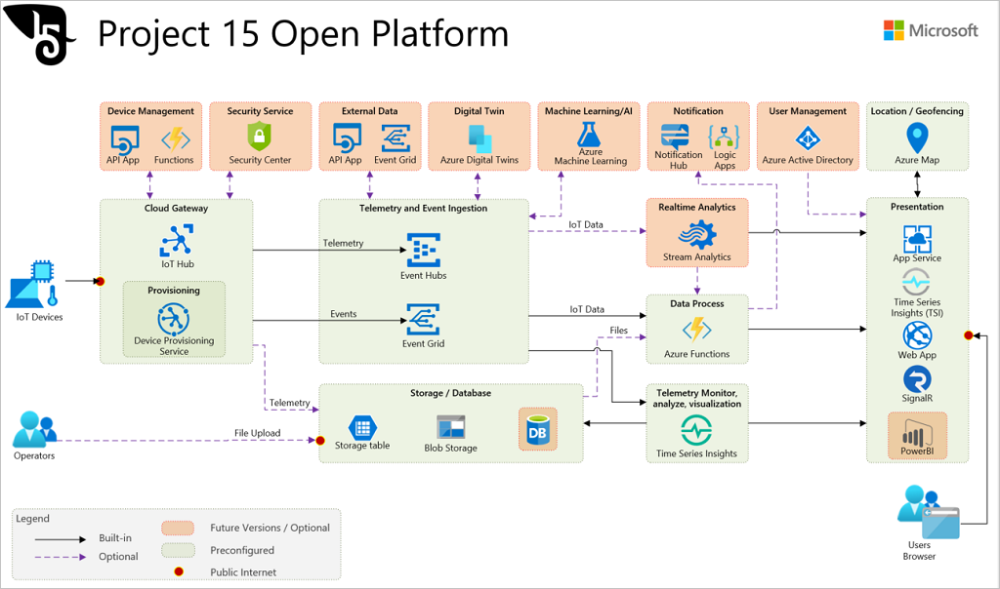

# Project 15 Open Platform for Conservation and Ecological Sustainability Solutions

Project 15 from Microsoft mission is to empower scientists and conservationists around the world to capture and analyze the data they need to preserve critical species and ecosystems. 

Project 15 approach is to pair a community of developers, students and partners with conservation teams around the world, backed with the power of the Microsoft cloud and our IoT Open Platform.Part of this approach is the Project 15 Open Platform, which is an open source software designed and built by Microsoft to connect to the cloud, manage and secure devices used in conservation projects.

The Project 15 Open Platform will get teams roughly 80% of the way to a finished solution.

This article showcases how to get started with deploying the IoT solutions. Goals were to:

1. **Close the Skill Gap**  
    Boost innovation with a ready-made platform, allowing the scientific developer to expand into specific use cases.
1. **Increase Speed to Deployment**  
    Open Platform get teams 80% of the way with their projects, dramatically reducing the time to start building crucial insights.
1. **Lower the development cost**  
    The Open Platform lowers the cost of overall development and reduces complexity. Opens up opportunities for partnering with the Open Source developer community and universities.

With deployment to Azure in a **push of a button**, the main components of the infrastructure for a standard IoT Solution will be up and running.  We have documented some of the common scenarios for simulation of device data, connection of a device, and we will be working over time to create more enablement content through our [Project 15 YouTube Channel](https://aka.ms/project15video) and other Microsoft Learning channels.   If you have a specific scenario you need help with, please submit an [issue ticket](https://docs.github.com/en/desktop/contributing-and-collaborating-using-github-desktop/creating-an-issue-or-pull-request).  

If you would like to contribute a feature or module to the Project 15 repo, submit a [pull request](https://docs.github.com/en/desktop/contributing-and-collaborating-using-github-desktop/creating-an-issue-or-pull-request).  
We are in the process of creating a list of known use cases with our scientific partners, a list of problems to be solved. Coming soon!

## Potential Solutions

Project 15's goal with a conservation and ecosystem sustainability open platform is to bring the latest Microsoft cloud and Internet of Things (IoT) technologies to accelerate scientific teams building solutions like species tracking & observation, poaching prevention, ecosystem monitoring, pollution detection, etc.

## Solution Overview

1. **Components that are full included**  
    These are Azure services that if someone was standing up the solution these parts of the infrastructure only need to be deployed once and then expanded as devices get added to the solution. To learn all the ins and outs of these services is a lift and would take time. Our theory here is that by this method, the technologist doesn't need to know every nitty-gritty detail and can expand their learning as needed. For learning about building an IoT Solution, a great resource to ramp up quickly on the concepts with real world examples and labs is available at [Internet of Things Learning Path](https://aka.ms/iotlp). Of course, if one wants to learn all the details, Microsoft Learn's [Introduction to Azure IoT](https://docs.microsoft.com/learn/paths/introduction-to-azure-iot/) has all you need. All our learning resources here, are free to you.  

1. **Included Components but needs customization**  
    Here the solution will deploy these services for you, but you will start to modify and add to them based on your use case. The details of the services here are all explained in our [Project 15 Open Platform Developer Guide](Developer-Guide/DeveloperGuide.md). The high level architecture of what services are involved, see blow.  

1. **Not Included, requires full customization**  
    This is the part where your IP will reside.  How this works is once you Deploy the solution to your own Azure account, **it is yours to build out**. Think of how you use a word processor. The word processor is a tool and the book you write, is yours. Meaning the story you publish is yours, the revenue generated is yours. Same idea. This solution is a tool for you to use to write your own solutions. We are here to help enable you to use it and we will evolve new features over time and let you know so you can bring them in to your solution if you like. We are creating instructions and best practices around "How do I fork this repo to make my own solution but keep getting any updates from the main repo?"  

## Architecture

Open Platform is consist of multiple Azure services and configurations/settings to :

- Enable Ready to go solution
- Provision devices using Device Provisioning Service
- Connect provisioned IoT Devices to IoT Hub
- Ingest telemetry and events from IoT devices
- Build a data pipeline necessary for basic telemetry and events processing
- Visualize IoT devices, telemetry, device events, and device management events in a web site
- Enable real time visualization using SignalR messaging
- Store and visualize IoT data using Time Series Insights
- Enable location based services using Azure Maps
- Build publish-subscribe model using Event Grid
- Secure the solution by setting security policies and access controls
- Exhibit examples of IoT Data visualization and basic device management

## Technical Goals and Requirements

- Ready to go solution  
    A solution is ready to accept data from devices right after deployment
- Minimize manual operations  
    Automate deployment as much as possible to avoid manual operations
- Pre-configure as much as possible  
    Pre-configure all settings to avoid post deployment configurations

## Components

-[Azure IoT Hub](https://azure.microsoft.com/services/iot-hub/) connects devices to Azure cloud resources, and can use queries to filter data to be sent to the cloud.

- [Azure Stream Analytics (ASA)](https://azure.microsoft.com/services/stream-analytics) provides real-time serverless stream processing that can run the same queries in the cloud and on the edge. ASA on IoT Edge can filter or aggregate data that needs to be sent to the cloud for further processing or storage.

## Next step

Please visit the [Project 15 on GitHub](https://aka.ms/project15code) to deploy to Azure and learn more about how to customize to different Conservation and Ecological Sustainability Solutions.

## Related resources

- [Microsoft & Sustainability](https://www.microsoft.com/sustainability)
- [AI for Earth](https://www.microsoft.com/ai/ai-for-earth)
