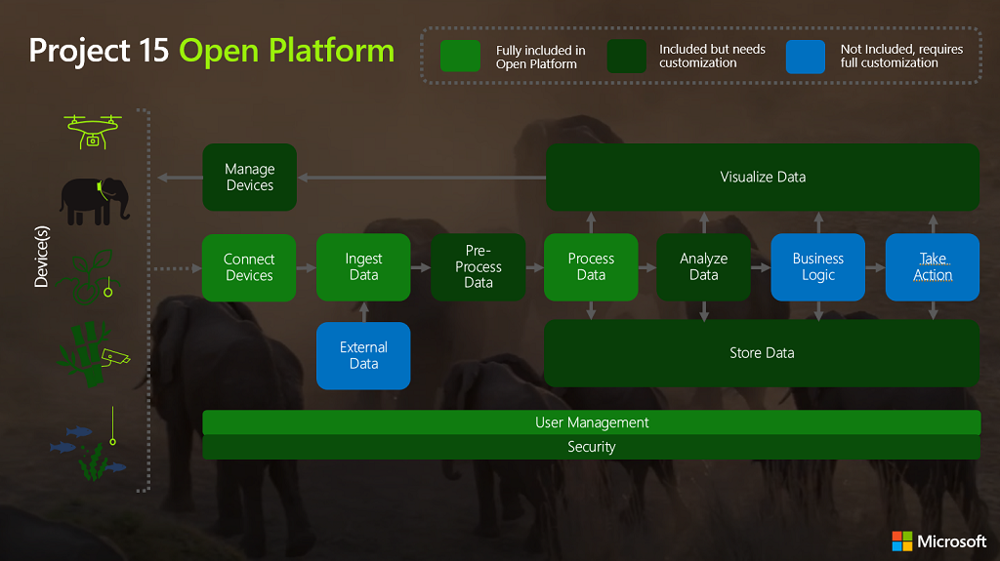
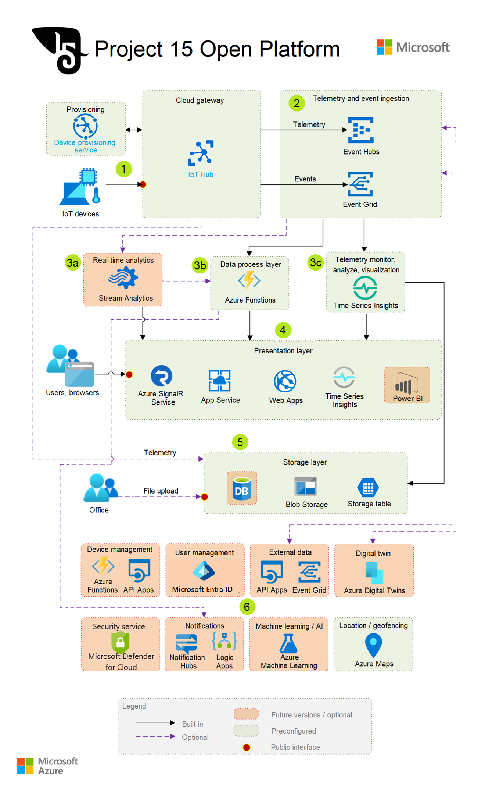

# Project 15 Open Platform for Conservation and Ecological Sustainability Solutions

[Project 15 from Microsoft's](https://aka.ms/project15) mission is to empower scientists and conservationists around the world to capture and analyze the data they need to preserve critical species and ecosystems. 

Project 15's approach is to pair a community of developers, students, and partners with conservation teams around the world, backed with the power of the Microsoft cloud and our IoT Open Platform. Part of this approach is the Project 15 Open Platform, which is an open-source software designed and built by Microsoft to connect to the cloud, manage and secure devices used in conservation projects. The Project 15 Open Platform will get teams roughly 80% of the way to a finished solution and the architecture can be used as a reference in your building-related end to end IoT solutions. Project 15 Open Platform can help teams with the following:

1. **Close the Skill Gap**  
    Boost innovation with a ready-made platform, allowing the scientific developer to expand into specific use cases.
1. **Increase Speed to Deployment**  
    The Open Platform gets teams 80% of the way with their projects, dramatically reducing the time to start building crucial insights.
1. **Lower the development cost**  
    The Open Platform lowers the cost of overall development and reduces complexity. Opens up opportunities for partnering with the Open Source developer community and universities.

With deployment to Azure in a **push of a button**, the main components of the infrastructure for a standard IoT Solution will be up and running. There is documentation of the common scenarios for simulation of device data, connection of a device, and over time the Project 15 team will grow enablement on the [Project 15 YouTube Channel](https://aka.ms/project15video) and other Microsoft Learning channels.

## Potential Solutions

Project 15's goal with a conservation and ecosystem sustainability open platform is to bring the latest Microsoft cloud and Internet of Things (IoT) technologies to accelerate scientific teams building solutions like species tracking & observation, poaching prevention, ecosystem monitoring, pollution detection, etc.

## Solution Overview

1. **Components that are fully included:** These components are Azure Services that only need to be deployed once and then expanded as devices get added to the solution.

1. **Included Components, but needs customization:** The solution will deploy services, but services will need to be modify based on different use cases. The details of the services here are all explained in the [Project 15 Open Platform Developer Guide](https://microsoft.github.io/project15/Developer-Guide/DeveloperGuide.html). The high level architecture of what services are involved, see below.  

1. **Not Included, requires full customization:** This is the part where intellectual property will reside. Once you deploy the solution to your own Azure account, **it is yours to build out**. Think of how you use a word processor. The word processor is a tool and the book you write, is yours. Meaning the story you publish is yours, the revenue generated is yours. Same idea. This solution is a tool for you to use to write your own solutions.

## Reference architecture

Open Platform consists of multiple Azure services and configurations/settings to:

- Provision devices using Device Provisioning Service
- Connect provisioned IoT Devices to IoT Hub
- Ingest telemetry and events from IoT devices
- Build a data pipeline necessary for basic telemetry and events processing
- Visualize IoT devices, telemetry, device events, and device management events in a website
- Enable real time visualization using SignalR messaging
- Store and visualize IoT data using Time Series Insights
- Enable location-based services using Azure Maps
- Build publish-subscribe model using Event Grid
- Secure the solution by setting security policies and access controls
- Show examples of IoT Data visualization and basic device management

## Components

- [Azure IoT Hub](https://azure.microsoft.com/services/iot-hub/) connects devices to Azure cloud resources, and can use queries to filter data to be sent to the cloud.
- [Azure Stream Analytics (ASA)](https://azure.microsoft.com/services/stream-analytics) provides real-time serverless stream processing that can run the same queries in the cloud and on the edge. ASA on IoT Edge can filter or aggregate data that needs to be sent to the cloud for further processing or storage.
- [Azure Functions](https://azure.microsoft.com/services/functions/) lets you build and debug locally without additional setup, deploy and operate at scale in the cloud, and integrate services using triggers and bindings.
- [Time Series Insights](https://azure.microsoft.com/services/time-series-insights/) store and visualize time series data for the solution.
- [Azure Maps](https://azure.microsoft.com/services/azure-maps/) provides tracking location for the solution.

## Next step

Visit the [Project 15 on GitHub](https://aka.ms/project15code) to deploy to Azure and learn more about how to customize to different Conservation and Ecological Sustainability Solutions.

## Related resources

- [Microsoft & Sustainability](https://www.microsoft.com/sustainability)
- [AI for Earth](https://www.microsoft.com/ai/ai-for-earth)
