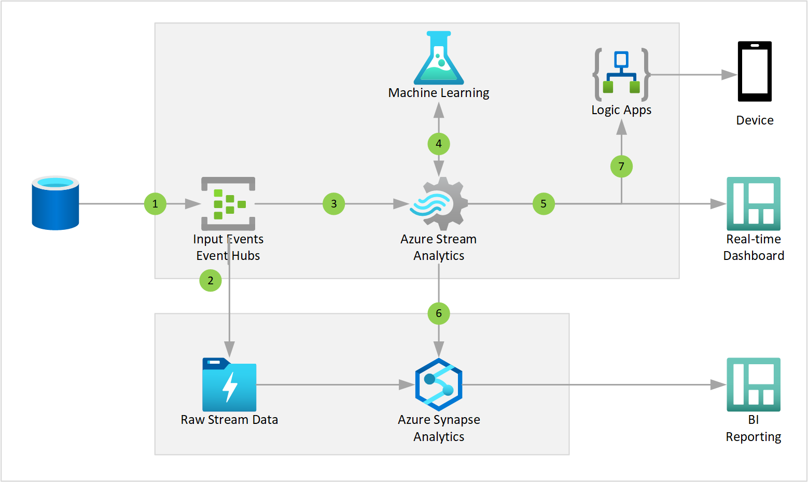

Quality assurance systems allow businesses to prevent defects throughout their processes of delivering goods or services to customers. Building such a system that collects data and identifies potential problems along a pipeline can provide enormous advantages. For example, in digital manufacturing, quality assurance across the assembly line is imperative. Identifying slowdowns and potential failures before they occur rather than after they are detected can help companies reduce costs for scrap and rework while improving productivity.

## Potential use cases

This solution shows how to predict failures using the example of manufacturing pipelines (assembly lines). This is done by leveraging test systems already in place and failure data, specifically looking at returns and functional failures at the end of assembly line. By combining these with domain knowledge and root cause analysis within a modular design that encapsulates main processing steps, we provide a generic advanced analytics solution that uses machine learning to predict failures before they happen. Early prediction of future failures allows for less expensive repairs or even discarding, which are usually more cost efficient than going through recall and warranty cost.

## Architecture

*Download an [SVG](../media/quality-assurance.svg) of this architecture.*

### Data flow

1. Source system event generator streams data into Azure Event Hub.
2. Event Hub uses Capture to send raw event to Data Lake.
3. A Stream Analytics Job read real-time data from Event Hub.
4. A Stream Analytics Job calls ML model in Azure Machine Learning to predict failure/defect.
5. A Stream Analytics Job sends stream aggregations to Power BI real-time dashboard for operations.
6. A Stream Analytics Job pushes the processed real-time data into Azure Synapse SQL Pool.
7. A Logic Apps sends alerts from streaming data to a mobile phone.
8. Power BI is used for results visualization.

### Components

* [Event Hubs](/azure/event-hubs/) ingests assembly line events and passes them on to Stream Analytics and an Azure ML Web Service.
* [Azure Stream Analytics](/azure/stream-analytics/): Stream Analytics accepts the input stream from Event Hubs, calls an Azure ML Web Service to do predictions, and sends the stream to Azure Synapse and Power BI and Logic Apps for alerts.
* [Azure Machine Learning](/azure/machine-learning/): Machine Learning helps you design, test, operationalize, and manage predictive analytics solutions in the cloud and deploy web services that can be called by Stream Analytics.
* [Storage Accounts](/azure/storage/): Azure Storage stores raw events stream data from Event Hub and serves for long-term data persistence.
* [Logic Apps](/azure/logic-apps/): Sends alerts generated from the streaming data into operator device
* [Synapse Analytics](/azure/synapse-analytics/): Store relational data for ad-hoc and planned analytical processing and user analytical queries
* [Power BI](/power-bi/create-reports/): visualizes real-time operational dashboards and also servers for analytical reports.

### Alternatives

* Depending on the scenario, the basic architecture can be simplified by removing batch layer - removing Storage for raw events and Azure Synapse for relational data
* [Azure SQL Database](/azure/sql-database/) is a managed relational database-as-a service. Depending on your data volumes and access patterns, you may choose Azure SQL Database.
* [Azure Functions](/azure/azure-functions/functions-overview) provides an effective serverless approach if the workload architecture is centered around fine grained distributed components, requiring minimal dependencies, where individual components are only required to run on demand (not continuously) and orchestration of components is not required.
* [IoT Hub](/azure/iot-hub/about-iot-hub) acts as a central message hub for secure bi-directional communication with per-device identity between the cloud platform and the construction equipment and other site elements. IoT Hub can rapidly collect data for each device for ingestion into the data analytics pipeline.

## Considerations

### Scalability

The majority of the components used in this example scenario are managed services that scaling based on your current scenario needs.

For general guidance on designing scalable solutions, see the [performance efficiency checklist][scalability] in the Azure Architecture Center.

### Security

[Managed identities for Azure resources][msi] are used to provide access to other resources internal to your account. Only allow access to the requisite resources in those identities to ensure that nothing extra is exposed to your functions (and potentially to your customers).

For general guidance on designing secure solutions, see the [Azure Security Documentation][security].

### Resiliency

All of the components in this scenario are managed, so at a regional level they are all resilient automatically.

For general guidance on designing resilient solutions, see [Designing resilient applications for Azure][resiliency].

## Next steps

* [Build a serverless web app in Azure][serverless]
* [Learn how to Create Predictive models on Azure](/learn/paths/create-no-code-predictive-models-azure-machine-learning/)
* [Learn how to Implement a Data Streaming Solution with Azure Streaming Analytics](/learn/paths/implement-data-streaming-with-asa/)
* [Quality Assurance Workshop](https://github.com/Azure/iot-workshop-quality-assurance)

## Related resources

* [Artificial intelligence (AI) - Architectural overview](../../data-guide/big-data/ai-overview.md)
* [Azure Machine Learning documentation](/azure/machine-learning/)
* [Defect prevention with predictive maintenance](./defect-prevention-with-predictive-maintenance.yml)
* [Predictive Maintenance](./predictive-maintenance.yml)

<!-- links -->
[architecture]: ./media/architecture-intelligent-apps-image-processing.png
[small-pricing]: https://azure.com/e/ee2cac4c69e84a328b578fcd3a398653
[medium-pricing]: https://azure.com/e/7c7fc474db344b87aae93bc29ae27108
[large-pricing]: https://azure.com/e/cbadbca30f8640d6a061f8457a74ba7d
[serverless]: /learn/paths/create-serverless-applications/
[cv-categories]: /azure/cognitive-services/computer-vision/category-taxonomy
[resiliency]: /azure/architecture/framework/resiliency/principles
[security]: /azure/security
[scalability]: /azure/architecture/framework/scalability/performance-efficiency
[functions-best-practices]: /azure/azure-functions/functions-best-practices
[msi]: /azure/app-service/app-service-managed-service-identity
