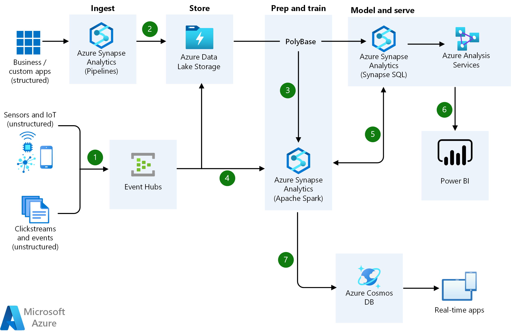

[!INCLUDE [header_file](../../../includes/sol-idea-header.md)]

Get insights from live streaming data with ease. Capture data continuously from any IoT device, or logs from website clickstreams, and process it in near-real time.

## Architecture

*Download an [SVG](../media/real-time-analytics.svg) of this architecture.*

## Data Flow

1. Easily ingest live streaming data for an application using Apache Kafka cluster in Azure HDInsight.
1. Bring together all your structured data using Azure Data Factory to Azure Blob Storage.
1. Take advantage of Azure Databricks to clean, transform, and analyze the streaming data, and combine it with structured data from operational databases or data warehouses.
1. Use scalable machine learning/deep learning techniques, to derive deeper insights from this data using Python, R or Scala, with inbuilt notebook experiences in Azure Databricks.
1. Leverage native connectors between Azure Databricks and Azure Synapse Analytics to access and move data at scale.
1. Build analytical dashboards and embedded reports on top of Azure Data Warehouse to share insights within your organization and use Azure Analysis Services to serve this data to thousands of users.
1. Power users take advantage of the inbuilt capabilities of Azure Databricks and Azure HDInsight to perform root cause determination and raw data analysis.
1. Take the insights from Azure Databricks to Cosmos DB to make them accessible through real time apps.

## Components

* [Azure Synapse Analytics](https://azure.microsoft.com/services/synapse-analytics) is the fast, flexible and trusted cloud data warehouse that lets you scale, compute and store elastically and independently, with a massively parallel processing architecture.
* Azure [Data Factory](https://azure.microsoft.com/services/data-factory) is a hybrid data integration service that allows you to create, schedule and orchestrate your ETL/ELT workflows.
* [Azure Data Lake Storage](https://azure.microsoft.com/services/storage/data-lake-storage): Massively scalable, secure data lake functionality built on Azure Blob Storage
* [Azure Databricks](https://azure.microsoft.com/services/databricks) is a fast, easy, and collaborative Apache Spark-based analytics platform.
* Azure [HDInsight](https://azure.microsoft.com/services/hdinsight) is a fully managed, full spectrum open-source analytics service for popular open-source frameworks such as Hadoop, Spark, Hive, LLAP, Kafka, Storm, R & more.
* [Azure Cosmos DB](https://azure.microsoft.com/services/cosmos-db) is a globally distributed, multi-model database service. Then learn how to replicate your data across any number of Azure regions and scale your throughput independent from your storage.
* [Azure Analysis Services](https://azure.microsoft.com/services/analysis-services) is an enterprise grade analytics as a service that lets you govern, deploy, test, and deliver your BI solution with confidence.
* [Power BI](https://powerbi.microsoft.com) is a suite of business analytics tools that deliver insights throughout your organization. Connect to hundreds of data sources, simplify data prep, and drive ad hoc analysis. Produce beautiful reports, then publish them for your organization to consume on the web and across mobile devices.

## Next steps

* [Synapse Analytics Documentation](/azure/sql-data-warehouse)
* [Azure Data Factory V2 Preview Documentation](/azure/data-factory)
* [Azure Data Lake Storage documentation](/azure/storage/blobs/data-lake-storage-introduction)
* [Azure Data Explorer](/azure/data-explorer/data-explorer-overview)
* [Azure Databricks Documentation](/azure/azure-databricks)
* [Azure HDInsight Documentation](/azure/hdinsight)
* [Azure Cosmos DB Documentation](/azure/cosmos-db)
* [Analysis Services Documentation](/azure/analysis-services)
* [Power BI Documentation](/power-bi)

## Pricing Calculator

* [Customize and get pricing estimates](https://azure.com/e/f8f5bc2de0b64aa0ae2dd154e7b6b462)