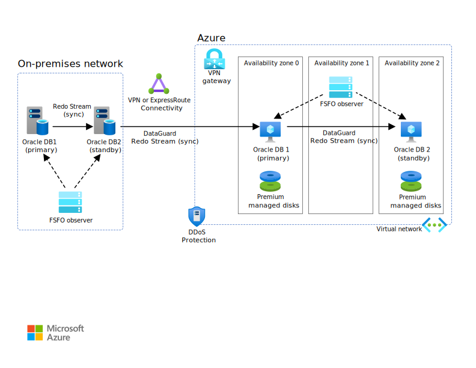

This solution migrates an Oracle database and its applications to Azure. We use Oracle Active Data Guard for the database, and we use Azure Load Balancer for the application tier.

## Architecture

*Download a [Visio file](https://arch-center.azureedge.net/oracle-database-migration-to-azure.vsdx) of this architecture.*

### Dataflow

1. Connect your Azure environment with your on-premises network via site-to-site VPN or ExpressRoute.
1. Use DataGuard to mark your OracleDB1 in Azure as your active stand-by.
1. Switch your OracleDB1 in Azure as primary and set up your OracleDB2 in Azure as your standby to finish your migration.

> [!Note]
>
> - This method works only when migrating to and from the same OS version and database version.
> - *Assumption*: You're using DataGuard on-premises.

### Components

* [Azure Virtual Network](https://azure.microsoft.com/services/virtual-network)
* [Azure VPN Gateway](https://azure.microsoft.com/services/vpn-gateway)
* [Azure ExpressRoute](https://azure.microsoft.com/services/expressroute)
* [Azure Virtual Machines](https://azure.microsoft.com/services/virtual-machines)
* [Azure Managed Disks](/azure/virtual-machines/disks-types)

### Alternatives

If your database is over 2 TB, you can use Oracle Data Guard with Oracle Recovery Manager (RMAN), or use Data Pump to replicate changes after an initial _bulk_ data transfer, which provides a minimal downtime migration.

#### SQL Server Migration Assistant for Oracle

[Microsoft SQL Server Migration Assistant (SSMA) for Oracle](/sql/ssma/oracle/sql-server-migration-assistant-for-oracle-oracletosql) is a tool for migrating Oracle databases to Microsoft SQL Server and Azure SQL Database. SSMA for Oracle converts Oracle database objects to SQL Server database objects, creates those objects in SQL Server, and then migrates data from Oracle to SQL Server or Azure SQL Database.

## Scenario details

Oracle DB migrations can be accomplished in multiple ways. This solution covers one of these options, wherein Oracle Active Data Guard is used to migrate the Database. It's assumed that Oracle Data Guard (or Active Data Guard) is used for HA/DR purposes. Depending on the application, either the application can be migrated first or the database. In this case, the application is migrated to Azure using Azure Load Balancer. This enables you to split your traffic between on-premises and Azure, allowing you to gradually migrate your application tier. The database migration is performed in multiple steps. As a first step, Oracle Data Guard is used to set up a Secondary/Standby Database in Azure. This allows you to migrate your data to Azure. Once the secondary in Azure is in-sync with the primary, you can flip the database in Azure to be your primary database while maintaining your secondary on-premises. As a next step, you may set up a secondary database in a different Availability Zone (or region) for HA/DR purposes. At this point, you can decommission your on-premises environment. All data traffic between on-premises and Azure flows over Azure ExpressRoute or Site-to-Site VPN connectivity.

### Potential use cases

This solution applies when migrating Oracle DB to Azure.

## Considerations

These considerations implement the pillars of the Azure Well-Architected Framework, which is a set of guiding tenets that can be used to improve the quality of a workload. For more information, see [Microsoft Azure Well-Architected Framework](/azure/architecture/framework).

### Migration

You can migrate your entire Oracle database from on-premises to Azure VM with minimal downtime by using Oracle Recovery Manager (RMAN) and Oracle Data Guard. Use RMAN to restore your database to the target standby Azure VM, using either backup/restore or the duplicate database method. You can then configure the target database as a physical standby database with Oracle Data Guard, allowing all the transaction/redo data changes from the primary on-premises database to the standby database. When the primary on-premises Oracle database is in sync with the target standby database on the Azure VM instance, you can switch over to the target database, which will convert it to a read-write database. You can then point your application connections to the new primary database. This option provides a minimum downtime while migrating your database to Azure.

The Oracle Data Pump utility is used to export and import data and metadata from or to Oracle databases. You can run Data Pump export/import on an entire database, selective schemas, tablespaces, or database objects. Data Pump is the recommended tool for migrating data to Azure, for large databases that range from 10 GB to 20 TB in size. It allows a high degree of parallelism, flexible data extraction options, and scalable operations, which enable high-speed movement of data and metadata from a source database to the target database. Oracle Data Pump also supports encryption and compression, when exporting your data to data dump files. You can use Oracle Data Pump with Oracle Data Guard or Golden Gate to handle the initial data transfer for large databases. Note that Data Pump is available only on Oracle Database 10g Release 1 (10.1) and later.

### Design considerations

#### VM sizing

Consider using a hyperthreaded memory-optimized virtual machine with constrained core vCPUs for your Oracle Database VM, to save on licensing costs and to maximize performance. Oracle has guaranteed license mobility from on-premises to Azure. See the Oracle-Azure FAQ.

#### Storage

Use multiple premium or ultra disks (managed disks) for performance and availability on your Oracle database. The disk/device name may change on reboots when using managed disks. It's recommended that you use the device UUID instead of the name, to ensure your mounts persist across reboots. Consider using Oracle Automatic Storage Management (ASM) for streamlined storage management for your database.

#### Testing and tuning

We recommend the following tests to validate your application against your new Oracle database:

* Run performance tests to ensure that they meet your business expectations.
* Test database failover, recovery, and restoration to make sure that you're meeting RPO and RTO requirements.
* List all critical jobs and reports, and run them on new Oracle instance to evaluate their performance against your service-level agreements (SLAs).
* Finally, when migrating or creating applications for the cloud, it's important to tweak your application code to add cloud-native patterns such as retry pattern and circuit breaker pattern. Other patterns defined in the Cloud Design Patterns guide could help your application be more resilient.

#### Oracle licensing

If you're using hyper-threading enabled technology in your Azure VMs, count two vCPUs as equivalent to one Oracle Processor license. See Licensing Oracle Software in the Cloud Computing Environment for details.

#### Backup strategy

One backup strategy is to use Oracle Recovery Manager (RMAN) and Azure Backup for application-consistent backups.  You can also use the Azure backup method.

Optionally use Azure Blob Fuse to mount a highly redundant Azure Blob Storage account and write your RMAN backups to it for added resiliency.

#### Security

[Azure DDoS Protection Standard](/azure/ddos-protection/ddos-protection-overview), combined with application-design best practices, provides enhanced DDoS mitigation features to provide more defense against DDoS attacks. You should enable [Azure DDOS Protection Standard](/azure/ddos-protection/ddos-protection-overview) on any perimeter virtual network.

### Business continuity and disaster recovery

For business continuity and disaster recovery, consider deploying the following software:

* Oracle Data Guard Fast-Start Failover (FSFO) for database availability
* Oracle Data Guard Far Sync for zero data loss protection.
* Oracle GoldenGate for multi-primary or active-active mode on Azure availability set or availability zone depends on SLA requirements.

Use Availability Zones to achieve high availability in-region. For more information, see the [Reference architectures for Oracle databases on Azure](/azure/virtual-machines/workloads/oracle/oracle-reference-architecture).

An uptime availability of 99.99% for your database tier can be achieved by using a combination of Azure Availability Zones and Oracle Active DataGuard with FSFO.

Consider using proximity placement groups to reduce the latency between your application and database tier.

### Monitoring

Set up Oracle Enterprise Manager for management, monitoring, and logging.

## Next steps

Refer to these articles for supporting information:

* [Implement Oracle Data Guard on an Azure Linux virtual machine](/azure/virtual-machines/workloads/oracle/configure-oracle-dataguard).
* [Implement Oracle Golden Gate on an Azure Linux VM](/azure/virtual-machines/workloads/oracle/configure-oracle-golden-gate).
* [Reference architectures for Oracle Database Enterprise Edition on Azure](/azure/virtual-machines/workloads/oracle/oracle-reference-architecture).

Learn more about the various architectural components:

* [Design and implement an Oracle database on Azure - Azure Virtual Machines](/azure/virtual-machines/workloads/oracle/oracle-design)
* [Introduction to Oracle Data Guard](https://docs.oracle.com/en/database/oracle/oracle-database/18/sbydb/introduction-to-oracle-data-guard-concepts.html#GUID-5E73667D-4A56-445E-911F-1E99092DD8D7)
* [Oracle Data Guard Broker Concepts](https://docs.oracle.com/en/database/oracle/oracle-database/12.2/dgbkr/oracle-data-guard-broker-concepts.html)
* [Configuring Oracle GoldenGate for Active-Active High Availability](https://docs.oracle.com/goldengate/1212/gg-winux/GWUAD/wu_bidirectional.htm#GWUAD282)
* [Oracle Active Data Guard Far Sync Zero Data Loss at Any Distance](https://www.oracle.com/technetwork/database/availability/farsync-2267608.pdf)
* [Oracle Enterprise Manager](https://docs.oracle.com/en/enterprise-manager)
* [Azure Proximity Placement Groups](/azure/virtual-machines/co-location#proximity-placement-groups)
* [Oracle Recovery Manager (RMAN)](https://www.oracle.com/database/technologies/high-availability/rman.html)
* [Licensing Oracle Software in the cloud](http://www.oracle.com/us/corporate/pricing/cloud-licensing-070579.pdf)

## Related resources

- [Firewall and Application Gateway for virtual networks](/azure/architecture/example-scenario/gateway/firewall-application-gateway)
- [Virtual network integrated serverless microservices](/azure/architecture/example-scenario/integrated-multiservices/virtual-network-integration)
- [Choose between virtual network peering and VPN gateways](/azure/architecture/reference-architectures/hybrid-networking/vnet-peering)
- [Spoke-to-spoke networking](/azure/architecture/networking/spoke-to-spoke-networking)
- [Add IP address spaces to peered virtual networks](/azure/architecture/networking/prefixes/add-ip-space-peered-vnet)
- [Hub-spoke network topology in Azure](/azure/architecture/reference-architectures/hybrid-networking/hub-spoke)
