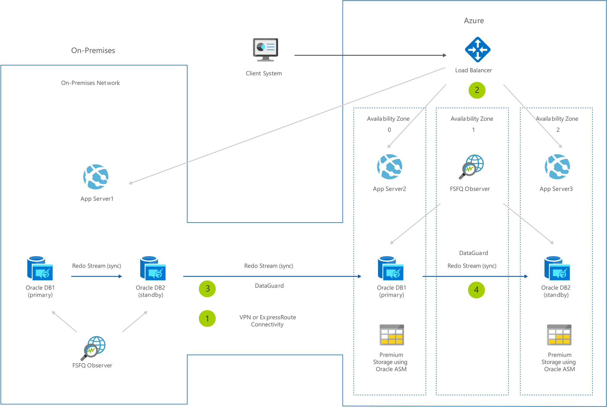

[!INCLUDE [header_file](../../../includes/sol-idea-header.md)]

Oracle DB migrations can be accomplished in multiple ways. This architecture covers one of these options wherein Oracle Active Data Guard is used to migrate the Database. It is assumed that Oracle Data Guard (or Active Data Guard) is used for HA/DR purposes. Depending on the application, either the application can be migrated first or the database. In this case, the application is migrated to Azure using Azure Load Balancer. This enables you to split your traffic between on-premises and Azure, allowing you to gradually migrate your application tier. The database migration is performed in multiple steps. As a first step, Oracle Data Guard is used to set up a Secondary/Standby Database in Azure. This allows you to migrate your data to Azure. Once the secondary in Azure is in-sync with the primary, you can flip the database in Azure to be your primary database while maintaining your secondary on-premises. As a next step, you may set up a secondary database in a different Availability Zone (or region) for HA/DR purposes. At this point, you can decommission your on-premises environment. All data traffic between on-premises and Azure flows over Azure ExpressRoute or Site-to-Site VPN connectivity.

## Architecture

*Download an [SVG](../media/reference-architecture-for-oracle-database-migration-to-azure.svg) of this architecture.*

## Data Flow

1. Connect your Azure environment with your on-premises network via site-to-site VPN or ExpressRoute.
1. Use Azure Load Balancer to migrate and balance traffic between the on-prem AppServer and your Azure AppServer.
1. Use DataGuard to mark your OracleDB1 in Azure as your active stand-by.
1. Switch your OracleDB1 in Azure as primary and set up your OracleDB2 in Azure as your standby to finish your migration. NOTE: This method only works when migrating to and from the same OS version and DB version. Assumption: customer is using DataGuard on-premises.
