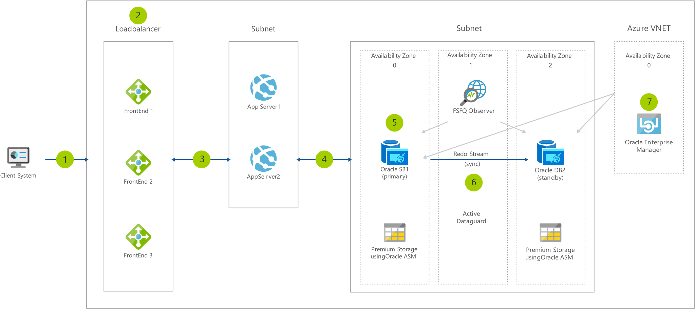

[!INCLUDE [header_file](../../../includes/sol-idea-header.md)]

This solution architecture illustrates a canonical architecture to achieve high availability for your Oracle Database Enterprise Edition in Azure. High availability for your front-end as well as the middle tier can be obtained by using Azure Load Balancers or Application Gateways. An uptime availability of 99.99% for your database tier can be achieved using a combination of Azure Availability Zones and Oracle Active DataGuard with FSFO. For additional availability and/or Disaster Recovery, consider deploying another Database VM in a different Azure region and schedule frequent RMAN backups.

## Architecture

*Download an [SVG](../media/reference-architecture-for-oracle-database-on-azure.svg) of this architecture.*

### Dataflow

1. The client system accesses a custom application with Oracle DB backend via the web.
1. Web front end is configured in a load balancer.
1. Web front end makes a call to the appropriate Application Server to handle the work.
1. Application server queries primary Oracle Database.
1. Oracle Database has been configured using a HyperThreaded Virtual Machine, with multiple Premium storage-based Managed Disks for performance and availability.
1. Oracle databases are replicated with Oracle DataGuard (or Active DataGuard) or Oracle GoldenGate for HA and DR purposes.
1. Oracle databases are monitored for uptime and performance by Oracle Enterprise Manager. OEM also allows you to generate various performance and usage reports.

### Components

Key technologies used to implement this architecture:

- [Application Gateway](https://azure.microsoft.com/services/application-gateway)
- [Load balancing](https://azure.microsoft.com/products/azure-load-balancing)
- [Virtual Network](https://azure.microsoft.com/services/virtual-network)

## Next steps

Product documentation:

- [Design and implement an Oracle database in Azure](/azure/virtual-machines/workloads/oracle/oracle-design)
- [Overview of Oracle Applications and solutions on Azure](/azure/virtual-machines/workloads/oracle/oracle-overview)
- [What is Azure Application Gateway?](/azure/application-gateway/overview)
- [What is Azure Load Balancer?](/azure/load-balancer/load-balancer-overview)
- [What is Azure Virtual Network?](/azure/virtual-network/virtual-networks-overview)

Microsoft Learn modules:

- [Configure Azure Application Gateway](/learn/modules/configure-azure-application-gateway)
- [Configure Azure Load Balancer](/learn/modules/configure-azure-load-balancer)
- [Introduction to Azure Virtual Networks](/learn/modules/introduction-to-azure-virtual-networks)

## Related resources

- [Architectures to deploy Oracle applications on Azure](/azure/virtual-machines/workloads/oracle/oracle-oci-applications)
- [Oracle application solutions integrating Microsoft Azure and Oracle Cloud Infrastructure](/azure/virtual-machines/workloads/oracle/oracle-oci-overview)
- [Oracle Database with Azure NetApp Files](../../example-scenario/file-storage/oracle-azure-netapp-files.yml)
- [Reference architectures for Oracle Database Enterprise Edition on Azure](/azure/virtual-machines/workloads/oracle/oracle-reference-architecture)
