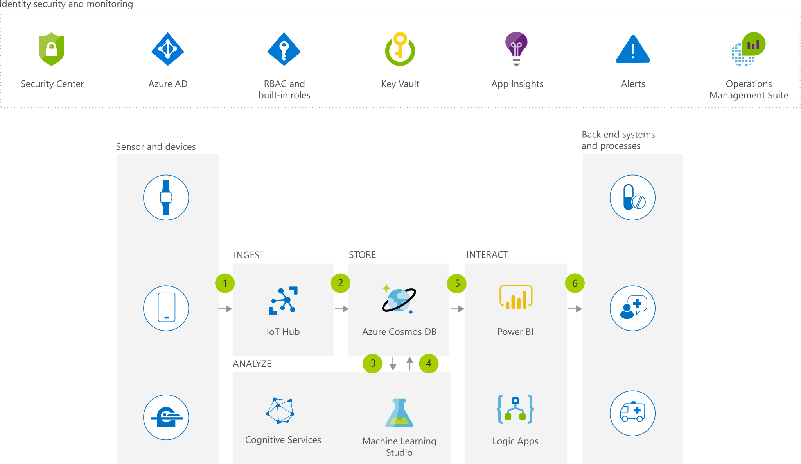

[!INCLUDE [header_file](../../../includes/sol-idea-header.md)]

Predict and prevent future incidents by combining IoT and intelligence to optimize treatments, using Azure to remotely monitor patients and analyze the massive amounts of data generated by medical devices.

## Architecture

*Download an [SVG](../media/remote-patient-monitoring.svg) of this architecture.*

### Dataflow

1. Securely ingest medical sensor and device data using Azure IoT Hub.
1. Securely store sensor and device data in Cosmos DB.
1. Analyze sensor and device data using a pre-trained Cognitive Services API or a custom developed Machine Learning model.
1. Store Artificial Intelligence (AI) and Machine Learning results in Cosmos DB.
1. Interact AI and Machine Learning results using Power BI, while preserving Azure role-based access control (Azure RBAC).
1. Integrate data insights with backend systems and processes using Logic Apps.

### Components

- [Azure IoT Hub](https://azure.microsoft.com/services/iot-hub): Connect, monitor and manage billions of IoT assets
- [Defender for Cloud](https://azure.microsoft.com/services/security-center): Unify security management and enable advanced threat protection across hybrid cloud workloads
- [Cognitive Services](https://azure.microsoft.com/services/cognitive-services): Get started with quickstarts, samples, and tutorials
- [Key Vault](https://azure.microsoft.com/services/key-vault): Safeguard and maintain control of keys and other secrets
- [Logic Apps](https://azure.microsoft.com/services/logic-apps): Automate the access and use of data across clouds without writing code
- [Power BI Embedded](https://azure.microsoft.com/services/power-bi-embedded): Embed fully interactive, stunning data visualizations in your applications
- [Azure Cosmos DB](https://azure.microsoft.com/services/cosmos-db): Globally distributed, multi-model database for any scale
- Application Insights: Detect, triage, and diagnose issues in your web apps and services
- [Azure Machine Learning](https://azure.microsoft.com/services/machine-learning): Build, deploy, and manage predictive analytics solutions
- [Azure Monitor](https://azure.microsoft.com/services/monitor): Full observability into your applications, infrastructure, and network

## Next steps

- [IoT Hub Documentation](/azure/iot-hub)
- [Microsoft Defender for Cloud Documentation](/azure/security-center)
- [Get Started with Azure](/azure/guides/developer/azure-developer-guide)
- [What is Azure Key Vault?](/azure/key-vault/key-vault-overview)
- [Azure Logic Apps Documentation](/azure/logic-apps)
- [Power BI Embedded Documentation](/azure/power-bi-embedded)
- [Azure Cosmos DB Documentation](/azure/cosmos-db)
- [Application Insights Documentation](/azure/application-insights)
- [Azure Machine Learning Documentation](/azure/machine-learning)
- [Azure Monitor Documentation](/azure/monitoring-and-diagnostics)
