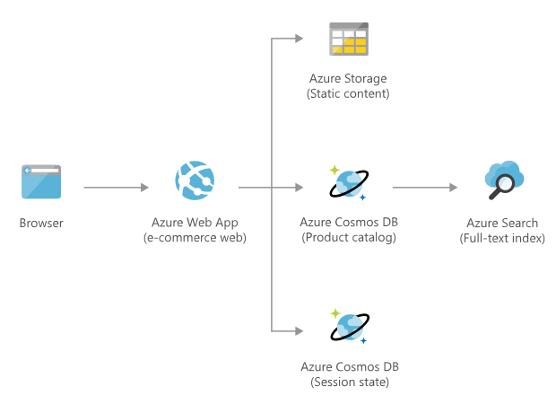

[!INCLUDE [header_file](../../../includes/sol-idea-header.md)]

This solution idea shows how to deploy an e-commerce web site on Azure.

## Architecture

*Download a [Visio file](https://arch-center.azureedge.net/retail-e-commerce-cosmos-db.vsdx) of this architecture.*

### Dataflow

1. The web application is hosted in an Azure Web App.
1. The data (products and session state) gets stored in Azure Cosmos DB.
1. Static content and product images are stored in an Azure Storage account.
1. Azure Cognitive Search is used to search across all the products.

### Components

This architecture includes the following components:

* [Azure Web App](https://azure.microsoft.com/services/app-service/web) is used to host the e-commerce web application.
* [Azure Cosmos DB](https://azure.microsoft.com/services/cosmos-db) stores the products and the session state.
* [Azure Storage](https://azure.microsoft.com/services/storage): Static product images and other static contents are stored in an Azure Storage account.
* [Azure Cognitive Search](https://azure.microsoft.com/services/search) provides a search capability over all the products.

## Scenario details

The e-commerce web site is hosted on Azure Web App and uses Azure Cosmos DB as data store for  product information and session state. Azure Search provides search functionality over diverse product catalogs, traffic spikes, and rapidly changing inventory.

### Potential use cases

This solution is ideal for the retail industry.

## Contributors

*This article is maintained by Microsoft. It was originally written by the following contributors.*

Principal author:

* [Prabhjot Kaur](https://www.linkedin.com/in/kaur-profile) | Senior Cloud Solution Architect

*To see non-public LinkedIn profiles, sign in to LinkedIn.*

## Next steps

Explore the related services:

* [App Service overview](/azure/app-service/overview)
* [Welcome to Azure Cosmos DB](/azure/cosmos-db/introduction)
* [Introduction to the core Azure Storage services](/azure/storage/common/storage-introduction)
* [What is Azure Cognitive Search?](/azure/search/search-what-is-azure-search)

## Related resources

Explore related data architectures:

* [Azure Data Architecture Guide](../../data-guide/index.md)
* [Non-relational data and NoSQL](../../data-guide/big-data/non-relational-data.yml)
* [Choose an analytical data store in Azure](../../data-guide/technology-choices/analytical-data-stores.md)
* [Choose a big data storage technology in Azure](../../data-guide/technology-choices/data-storage.md)
* [Understand data store models](../../guide/technology-choices/data-store-overview.md)
* [Choose a stream processing technology in Azure](../../data-guide/technology-choices/stream-processing.md)

Fully deployable architectures:

* [DataOps for the modern data warehouse](../../example-scenario/data-warehouse/dataops-mdw.yml)
* [Master Data Management powered by CluedIn](../../reference-architectures/data/cluedin.yml)
* [Profisee master data management with Azure Data Factory](../../reference-architectures/data/profisee-master-data-management-data-factory.yml)
* [N-tier application with Apache Cassandra](../../reference-architectures/n-tier/n-tier-cassandra.yml)
* [Windows N-tier application on Azure](../../reference-architectures/n-tier/n-tier-sql-server.yml)
