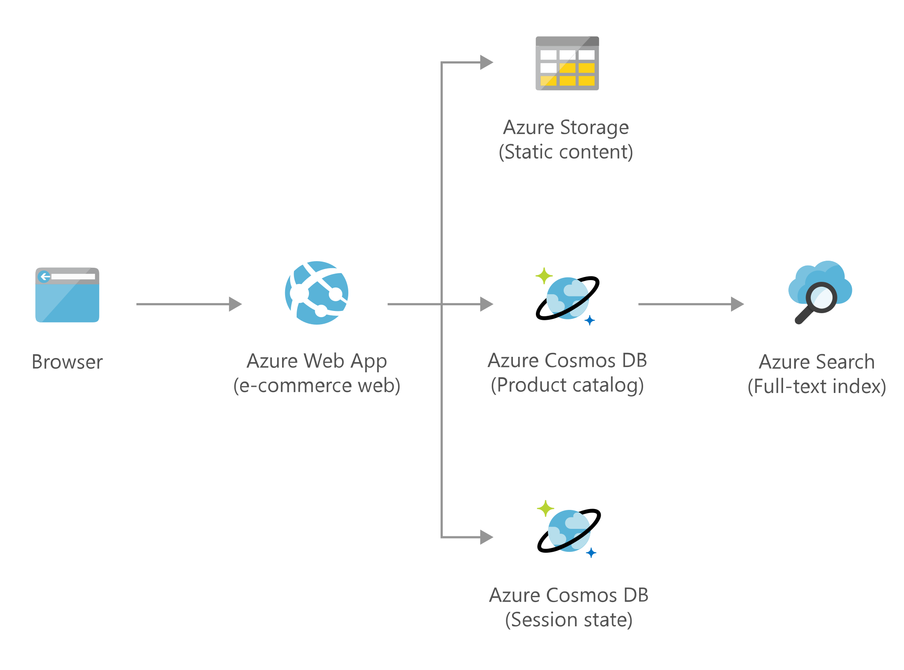

[!INCLUDE [header_file](../../../includes/sol-idea-header.md)]

This solution idea shows how to deploy an e-commerce web site on Azure. The e-commerce web site is hosted on Azure Web App and uses Azure Cosmos DB as data store for  product information and session state. Azure Search provides search functionality over diverse product catalogs, traffic spikes, and rapidly changing inventory.

## Architecture

*Download an [SVG](../media/retail-and-e-commerce-using-cosmos-db.svg) of this architecture.*

## Components

This architecture includes the following components:

* [Azure Web App](https://azure.microsoft.com/services/app-service/web) is used to host the e-commerce web application.
* [Azure Cosmos DB](https://azure.microsoft.com/services/cosmos-db) stores the products and the session state.
* [Azure Storage](https://azure.microsoft.com/services/storage): Static product images and other static contents are stored in an Azure Storage account.
* [Azure Cognitive Search](https://azure.microsoft.com/services/search) provides a search capability over all the products.

## Next steps

Explore the related services:

* [App Service overview](/azure/app-service/overview)
* [Welcome to Azure Cosmos DB](/azure/cosmos-db/introduction)
* [Introduction to the core Azure Storage services](/azure/storage/common/storage-introduction)
* [What is Azure Cognitive Search?](/azure/search/search-what-is-azure-search)

Explore related data architecture:

* [Azure Data Architecture Guide](/azure/architecture/data-guide)
* [Non-relational data and NoSQL](/azure/architecture/data-guide/big-data/non-relational-data)
* [Choosing an analytical data store in Azure](/azure/architecture/data-guide/technology-choices/analytical-data-stores)
* [Choosing a big data storage technology in Azure](/azure/architecture/data-guide/technology-choices/data-storage)
* [Understand data store models](/azure/architecture/guide/technology-choices/data-store-overview)
* [Choosing a stream processing technology in Azure](/azure/architecture/data-guide/technology-choices/stream-processing)

Fully deployable architectures:

* [DataOps for the modern data warehouse](/azure/architecture/example-scenario/data-warehouse/dataops-mdw)
* [Master Data Management powered by CluedIn](/azure/architecture/reference-architectures/data/cluedin)
* [Profisee master data management with Azure Data Factory](/azure/architecture/reference-architectures/data/profisee-master-data-management-data-factory)
* [N-tier application with Apache Cassandra](/azure/architecture/reference-architectures/n-tier/n-tier-cassandra)
* [SQL Server 2008 R2 failover cluster in Azure](/azure/architecture/example-scenario/sql-failover/sql-failover-2008r2)
* [Windows N-tier application on Azure](/azure/architecture/reference-architectures/n-tier/n-tier-sql-server)
