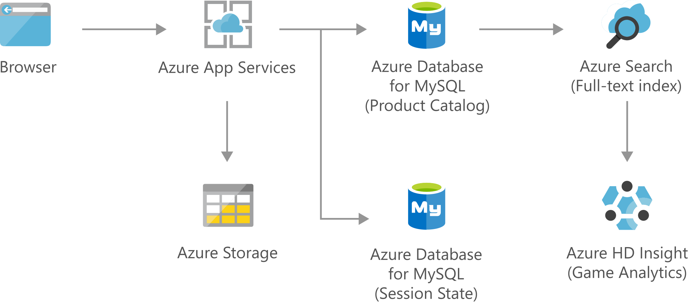

[!INCLUDE [header_file](../../../includes/sol-idea-header.md)]

Build secure and scalable e-commerce solutions that meet the demands of both customers and business. Engage customers through customized products and offers, process transactions quickly and securely, and focus on fulfillment and customer service.

## Architecture

*Download an [SVG](../media/retail-and-ecommerce-using-azure-database-for-mysql.svg) of this architecture.*

### Components

Key technologies used to implement this architecture:

- [App Service](https://azure.microsoft.com/services/app-service)
- [Azure Cognitive Search](https://azure.microsoft.com/services/search)
- [Azure Database for MySQL](https://azure.microsoft.com/services/mysql)
- [Azure HDInsight](https://azure.microsoft.com/services/hdinsight)
- [Azure Storage](https://azure.microsoft.com/product-categories/storage)

## Next steps

Product documentation:

- [App Service overview](/azure/app-service/overview)
- [What is Azure Cognitive Search?](/azure/cloud-adoption-framework/innovate/best-practices/cognitive-search)
- [What is Azure Database for MySQL?](/azure/mysql/overview)
- [What is Azure HDInsight?](/azure/hdinsight/hdinsight-overview)
- [What is Azure Blob storage?](/azure/storage/blobs/storage-blobs-overview)

Microsoft Learn modules:

- [Configure app service plans](/learn/modules/configure-app-service-plans)
- [Create an Azure Cognitive Search solution](/learn/modules/create-azure-cognitive-search-solution)
- [Deploy MariaDB, MySQL, and PostgreSQL on Azure](/learn/modules/deploy-mariadb-mysql-postgresql-azure)
- [Explore Azure Blob storage](/learn/modules/explore-azure-blob-storage)
- [Introduction to Azure HDInsight](/learn/modules/intro-to-azure-hdinsight)

## Related resources

- [Finance management apps using Azure Database for MySQL](finance-management-apps-using-azure-database-for-mysql.yml)
- [Intelligent apps using Azure Database for MySQL](intelligent-apps-using-azure-database-for-mysql.yml)
- [Retail and e-commerce using Azure PostgreSQL](retail-and-ecommerce-using-azure-database-for-postgresql.yml)
- [Retail and e-commerce using Cosmos DB](retail-and-e-commerce-using-cosmos-db.yml)
