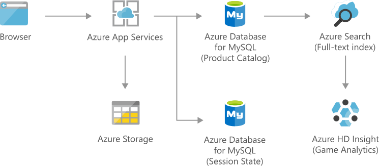

[!INCLUDE [header_file](../../../includes/sol-idea-header.md)]

This article outlines an e-commerce solution that engages customers by using Azure Cognitive Search to provide customized products and offers. The solution uses Azure Database for MySQL for secure, scalable storage of product and transactional data.

## Architecture

*Download a [Visio file](https://arch-center.azureedge.net/retail-ecommerce-azure-database-for-mysql.vsdx) of this architecture.*

### Dataflow

1. The Web Apps feature of Azure App Service hosts a web application.
1. Azure Database for MySQL stores session state data and data about products.
1. An Azure Storage account stores static content and product images.
1. Azure Cognitive Search is used to search across all products.

### Components

- [App Service](https://azure.microsoft.com/services/app-service)
- [Azure Cognitive Search](https://azure.microsoft.com/services/search)
- [Azure Database for MySQL](https://azure.microsoft.com/services/mysql)
- [Azure HDInsight](https://azure.microsoft.com/services/hdinsight)
- [Storage](https://azure.microsoft.com/product-categories/storage)

## Scenario details

E-commerce customers discover products through searches. As a result, intelligent search engines that provide the following features are essential for e-commerce apps:

- Relevant results
- Near-instant results
- Linguistic analysis
- Geo-location matching
- Autocomplete capabilities

This secure and scalable e-commerce solution uses Azure Cognitive Search to provide intelligent search results to customers. This cloud search service, which was formerly called Azure Search, offers infrastructure, APIs, and tools for building a rich search experience over private, heterogeneous content. When you use this platform as a service (PaaS) component, you can provide customized products and offers to your customers. You also don't have to run search queries inside your database, and you don't have to manage infrastructure or become a search expert.

The solution uses Storage to store unstructured data like images, videos, and documents. This service offers highly available, massively scalable, durable, and secure storage in the cloud. For transactional processing, the solution uses Azure Database for MySQL. This fully managed relational database service offers dynamic scalability through its flexible server deployment mode. Scaling capabilities of App Service also help ensure the solution responds to changing resource requirements.

### Potential use cases

This solution is ideal for the retail industry.

## Next steps

Product documentation:

- [App Service overview](/azure/app-service/overview)
- [What is Azure Cognitive Search?](/azure/cloud-adoption-framework/innovate/best-practices/cognitive-search)
- [What is Azure Database for MySQL?](/azure/mysql/overview)
- [What is Azure HDInsight?](/azure/hdinsight/hdinsight-overview)
- [What is Azure Blob Storage?](/azure/storage/blobs/storage-blobs-overview)

Microsoft Training modules:

- [Configure Azure App Service plans](/training/modules/configure-app-service-plans)
- [Create an Azure Cognitive Search solution](/training/modules/create-azure-cognitive-search-solution)
- [Introduction to Azure Database for MySQL](/training/modules/intro-to-azure-database-for-mysql)
- [Work with MySQL Databases on Azure](/training/paths/work-mysql-databases-azure)
- [Explore Azure Blob Storage](/training/modules/explore-azure-blob-storage)
- [Introduction to Azure HDInsight](/training/modules/intro-to-azure-hdinsight)

## Related resources

- [Finance management apps using Azure Database for MySQL](finance-management-apps-using-azure-database-for-mysql.yml)
- [Intelligent apps using Azure Database for MySQL](intelligent-apps-using-azure-database-for-mysql.yml)
- [Retail and e-commerce using Azure PostgreSQL](retail-and-ecommerce-using-azure-database-for-postgresql.yml)
- [Retail and e-commerce using Azure Cosmos DB](retail-and-e-commerce-using-cosmos-db.yml)
