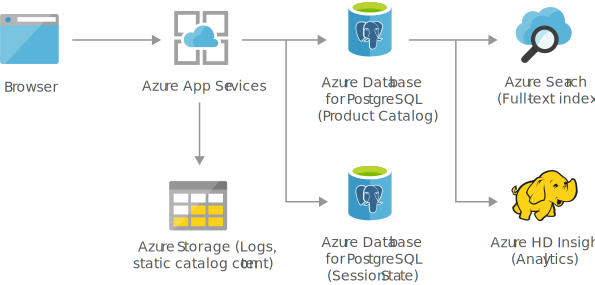

[!INCLUDE [header_file](../../../includes/sol-idea-header.md)]

Build secure and scalable e-commerce solutions that meet the demands of both customers and business. Engage customers through customized products and offers, process transactions quickly and securely, and focus on fulfillment and customer service.

## Potential use cases

This solution is ideal for the retail industry.

## Architecture

### Dataflow

1. The web application is hosted in an Azure Web App.
1. The data (products and session state) gets stored in Azure PostgreSQL DB.
1. Static content and product images are stored in an Azure Storage account.
1. Azure Cognitive Search is used to search across all the products.

### Components

Key technologies used to implement this architecture:

- [App Service](https://azure.microsoft.com/services/app-service)
- [Azure Cognitive Search](https://azure.microsoft.com/services/search)
- [Azure Database for PostgreSQL](https://azure.microsoft.com/services/postgresql)
- [Azure HDInsight](https://azure.microsoft.com/services/hdinsight)
- [Azure Storage](https://azure.microsoft.com/product-categories/storage)

## Next steps

Product documentation:

- [App Service overview](/azure/app-service/overview)
- [What is Azure Cognitive Search?](/azure/cloud-adoption-framework/innovate/best-practices/cognitive-search)
- [What is Azure Database for PostgreSQL?](/azure/postgresql/overview)
- [What is Azure HDInsight?](/azure/hdinsight/hdinsight-overview)
- [What is Azure Blob storage?](/azure/storage/blobs/storage-blobs-overview)

Microsoft Learn modules:

- [Configure app service plans](/training/modules/configure-app-service-plans)
- [Create an Azure Cognitive Search solution](/training/modules/create-azure-cognitive-search-solution)
- [Deploy MariaDB, MySQL, and PostgreSQL on Azure](/training/modules/deploy-mariadb-mysql-postgresql-azure)
- [Explore Azure Blob storage](/training/modules/explore-azure-blob-storage)
- [Introduction to Azure HDInsight](/training/modules/intro-to-azure-hdinsight)

## Related resources

- [Finance management apps using Azure Database for MySQL](finance-management-apps-using-azure-database-for-mysql.yml)
- [Intelligent apps using Azure Database for MySQL](intelligent-apps-using-azure-database-for-mysql.yml)
- [Retail and e-commerce using Azure MySQL](retail-and-ecommerce-using-azure-database-for-mysql.yml)
- [Retail and e-commerce using Azure Cosmos DB](retail-and-e-commerce-using-cosmos-db.yml)
