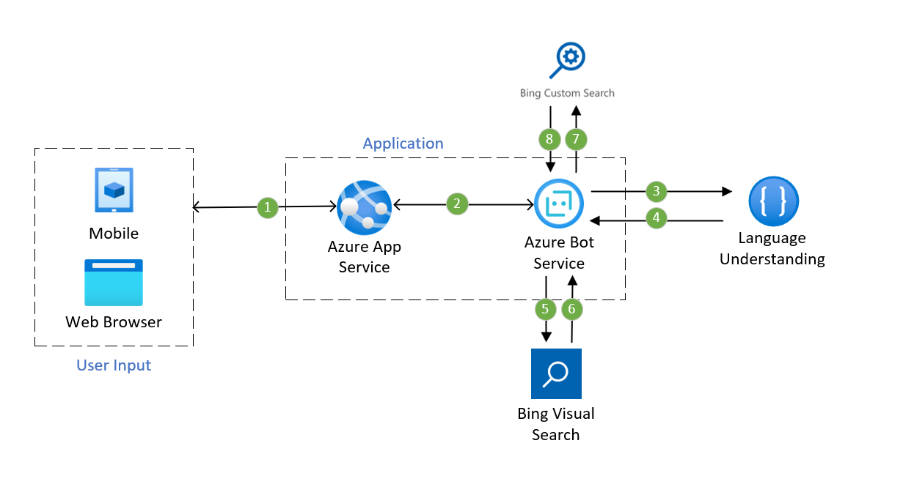

[!INCLUDE [header_file](../../../includes/sol-idea-header.md)]

The bot assistant with search integration can help your customers have interactions with your business application and provide suggestions based on the visual information.

## Potential use cases

This solution can be used broadly but is ideal for the retail industry, as well as the travel and hospitality industries.

## Architecture

### Dataflow

1. The user uses the application, which is hosted on [Azure App Service](/azure/app-service/), either via web browser or mobile device
1. Azure App Service communicates with [Azure Bot Service](/azure/bot-service/) in order to facilitate the user/application interaction
1. Azure Bot Service leverages [Azure Cognitive Services Language Understanding](/azure/cognitive-services/luis/what-is-luis) in order to understand the user natural by identifying user intents and entities
1. Language Understanding (LUIS) returns back to the Azure Bot the identified user intent based on conversation made
1. Azure Bot passes a kind of visual context input (e.g image) to the [Azure Bing Visual Search API](/azure/cognitive-services/bing-visual-search)
1. Visual Search returns output back to Azure Bot Service
1. Optionally, the Azure Bot receives more information for user queries exclusively from the user's domain using the [Azure Custom Search API](/azure/cognitive-services/bing-custom-search)
1. Custom Search API returns output back to Bot Service

### Components

* [Azure App Service](/azure/app-service)
* [Azure Bot Service](/azure/bot-service)
* [Azure Cognitive Services Language Understanding](/azure/cognitive-services/luis/what-is-luis)
* [Azure Bing Visual Search API](/azure/cognitive-services/bing-visual-search)
* [Azure Custom Search API](/azure/cognitive-services/bing-custom-search)

## Next steps

* [What are Azure Cognitive Services?](/azure/cognitive-services/what-are-cognitive-services)
* [What is Language Understanding (LUIS)?](/azure/cognitive-services/luis/what-is-luis)
* [What is the Azure Bing Search API?](/azure/cognitive-services/bing-web-search)
* [Introduction to Bot Framework Composer](/composer/introduction)

## Related resources

* [Commerce chatbot](./commerce-chatbot.yml)
* [Product recommendations for retail using Azure](./product-recommendations.yml)
* [Visual assistant](./visual-assistant.yml)
* [Artificial intelligence (AI) - Architectural overview](../../data-guide/big-data/ai-overview.md)
* [Choose a Microsoft Cognitive Services technology](../../data-guide/technology-choices/cognitive-services.md)
