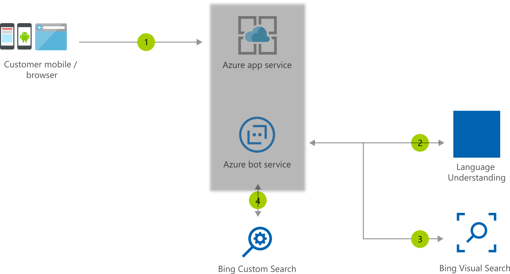

[!INCLUDE [header_file](../../../includes/sol-idea-header.md)]

The retail assistant or vacation planner can help your customers have interactions with your business bot and provide suggestions based on the visual information.

## Architecture

*Download an [SVG](../media/retail-assistant-or-vacation-planner-with-visual-capabilities.svg) of this architecture.*

## Data Flow

1. Users interact with your business assistant
1. Assistant understands context from LUIS
1. Assistant passes visual context to the Bing Visual Search API
1. Optionally Bot gets more information for user queries exclusively from your domain using the Bing Custom Search API

## Components

* [Azure App Service](/azure/app-service/)
* [Azure Bot Service](/azure/bot-service/)
* [Azure Cognitive Services Language Understanding](/azure/cognitive-services/luis/what-is-luis)
* [Azure Bing Visual Search API](/azure/cognitive-services/bing-visual-search)
* [Azure Custom Search API](/azure/cognitive-services/bing-custom-search)

## Next steps

* [Artificial intelligence (AI) - Architectural overview](../../data-guide/big-data/ai-overview.md)
* [Choosing a Microsoft cognitive services technology](../../data-guide/technology-choices/cognitive-services.md)

## Related resources

* [Commerce Chatbot](/azure/architecture/reference-architectures/ai/commerce-chatbot)
* [Product recommendations for retail using Azure](/azure/architecture/reference-architectures/ai/product-recommendations)
* [Visual Assistant](/azure/architecture/reference-architectures/ai/visual-assistant)
* [What are Azure Cognitive Services?](/azure/cognitive-services/what-are-cognitive-services)
* [What is Language Understanding (LUIS)?](/azure/cognitive-services/luis/what-is-luis)
* [What is the Azure Bing Search API?](/azure/cognitive-services/bing-web-search)
* [Introduction to Bot Framework Composer](/composer/introduction)
